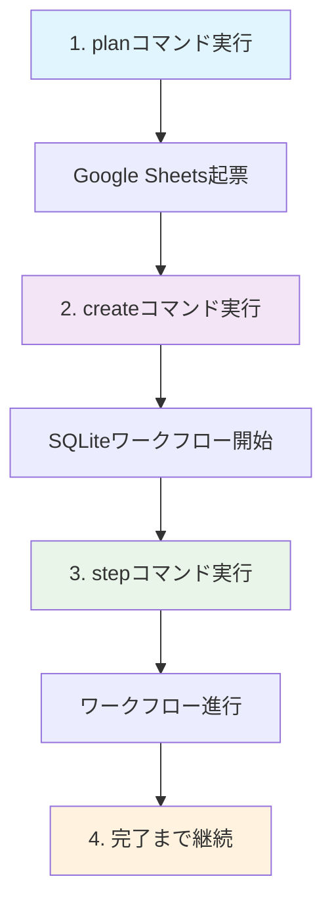

# ワークフロー計画・起票システム統合ガイド

**作成日**: 2025-01-06  
**対象**: KIRO-006 Phase 2  
**目的**: planコマンドとcreateコマンドの統合ワークフロー使用方法

---

## 📋 概要

KIRO-006 Phase 2で実装されたワークフロー計画・起票システムは、Google Sheetsへの起票とSQLiteベースのワークフロー状態管理を分離・統合したシステムです。

### 🔄 設計思想

- **関心の分離**: 起票（plan）と状態管理（create）を明確に分離
- **統合ワークフロー**: plan→createの順序で実行する推奨フロー
- **後方互換性**: 既存機能を維持しながら新機能を追加
- **エラーハンドリング**: 各段階での適切なエラー処理とガイダンス

---

## 🚀 基本的な使用方法

### 1. Google Sheetsへの起票（planコマンド）

```bash
python tools/workflow/workflow_cli.py plan <TRACKER_ID> <概要> <詳細> [優先度]
```

#### 引数説明
- **TRACKER_ID**: トラッカーID（必須）
  - 形式: `PREFIX-NUMBER`（例: `TRACKER-001`, `KIRO-006`）
- **概要**: プロジェクトの概要（必須、200文字以内推奨）
- **詳細**: 詳細な説明（必須、20,000文字以内）
- **優先度**: タスクの優先度（オプション）
  - `highest`: 優先度最高
  - `high`: 優先度高
  - `medium`: 優先度中（デフォルト）
  - `low`: 優先度低

#### 使用例

```bash
# 基本的な起票
python tools/workflow/workflow_cli.py plan KIRO-007 "新機能実装" "ユーザー認証システムの実装を行います。OAuth2.0を使用し、セキュリティを強化します。"

# 高優先度での起票
python tools/workflow/workflow_cli.py plan URGENT-001 "緊急修正" "セキュリティ脆弱性の修正が必要です。" --priority highest

# 長い詳細を含む起票
python tools/workflow/workflow_cli.py plan FEATURE-123 "UI改善" "$(cat requirements.txt)"
```

### 2. ワークフロー状態管理開始（createコマンド）

```bash
python tools/workflow/workflow_cli.py create <TRACKER_ID>
```

#### 機能説明
- SQLiteベースのローカルワークフロー状態管理を開始
- Google Sheets機能は含まれない（planコマンドで事前実行）
- 既存ワークフロー状態の確認と重複防止

#### 使用例

```bash
# ワークフロー状態管理開始
python tools/workflow/workflow_cli.py create KIRO-007

# 状態確認
python tools/workflow/workflow_cli.py status KIRO-007
```

---

## 🔄 統合ワークフロー手順

### 推奨フロー



### 詳細手順

#### Step 1: Google Sheetsへの起票
```bash
python tools/workflow/workflow_cli.py plan TRACKER-001 "概要" "詳細説明"
```

**実行内容**:
- 入力検証（トラッカーID形式、文字数制限）
- 既存トラッカー確認
- Google Sheetsへの起票
- 優先度設定
- 確認メッセージ表示

#### Step 2: ワークフロー状態管理開始
```bash
python tools/workflow/workflow_cli.py create TRACKER-001
```

**実行内容**:
- トラッカーID検証
- 既存ワークフロー状態確認
- SQLiteデータベースへの状態作成
- 初期ステップ設定
- 次アクション案内

#### Step 3: ワークフロー実行
```bash
# 現在のステップ指示確認
python tools/workflow/workflow_cli.py instructions TRACKER-001

# ステップ実行
python tools/workflow/workflow_cli.py step TRACKER-001

# 状態確認
python tools/workflow/workflow_cli.py status TRACKER-001
```

#### Step 4: 継続的な進行管理
```bash
# 承認待ち確認
python tools/workflow/workflow_cli.py approvals

# Google Sheets状態確認
python tools/workflow/workflow_cli.py sheets TRACKER-001

# 統合テンプレート生成
python tools/workflow/workflow_cli.py template TRACKER-001
```

---

## 📊 機能比較表

| 機能 | planコマンド | createコマンド |
|------|-------------|---------------|
| **目的** | Google Sheets起票 | SQLiteワークフロー状態管理 |
| **必須引数** | tracker_id, summary, details | tracker_id |
| **オプション引数** | priority | なし |
| **文字数制限** | 詳細20,000文字以内 | なし |
| **既存確認** | Google Sheetsトラッカー | SQLiteワークフロー状態 |
| **エラーハンドリング** | リトライ機能付き | 詳細なトラブルシューティング |
| **出力** | 起票確認メッセージ | ワークフロー開始メッセージ |

---

## 🚨 重要な注意事項

### 実行順序

1. **必ずplanコマンドから開始**: Google Sheets起票を先に実行
2. **createコマンドで状態管理開始**: SQLiteベースのワークフロー管理
3. **stepコマンドで進行**: 段階的なワークフロー実行

### エラーハンドリング

#### planコマンドのエラー
- **既存トラッカー**: 別のトラッカーIDを使用するか、既存を更新
- **文字数制限**: 詳細を20,000文字以内に調整
- **Google Sheets接続エラー**: 設定確認とリトライ

#### createコマンドのエラー
- **既存ワークフロー**: 既存状態の確認と継続
- **SQLite接続エラー**: データベースファイルの権限確認
- **コントローラー初期化エラー**: 依存関係の確認

### 設定要件

#### Google Sheets連携
- `config/google_sheets_auth.json`: 認証情報ファイル
- Google Sheets API有効化
- 適切な共有設定

#### SQLite設定
- データベースファイルの書き込み権限
- 十分なディスク容量
- 依存関係の正しいインストール

---

## 🔧 トラブルシューティング

### よくある問題と解決方法

#### 1. planコマンドでGoogle Sheets接続エラー

```bash
# 設定確認
python tools/progress_tracker/cli.py check-config

# 接続テスト
python tools/progress_tracker/test_connection.py

# 手動作成
python tools/progress_tracker/cli.py create TRACKER-001 "概要"
```

#### 2. createコマンドでSQLite接続エラー

```bash
# ワークフローコントローラーテスト
python tools/interface/workflow_controller.py --test

# 権限確認
ls -la .workflow_state/

# 手動デバッグ
python -c "from tools.interface.workflow_controller import get_workflow_controller; print(get_workflow_controller())"
```

#### 3. 既存トラッカー・ワークフローの競合

```bash
# Google Sheets状態確認
python tools/workflow/workflow_cli.py sheets TRACKER-001

# SQLite状態確認
python tools/workflow/workflow_cli.py status TRACKER-001

# 別のトラッカーIDを使用
python tools/workflow/workflow_cli.py plan TRACKER-001-v2 "概要" "詳細"
```

---

## 📚 関連ドキュメント

- 統合テンプレート: `docs/workflows/templates/unified_tracker_template.md`
- 13ステップチェックリスト: `docs/workflows/checklists/tracker_workflow_checklist.md`
- [CLI統合ガイド](./cli_integration_guide.md)
- ワークフロー強制実行システム仕様: `.kiro/specs/workflow-enforcement-system/`

---

## 🎯 まとめ

ワークフロー計画・起票システムは、以下の利点を提供します：

### ✅ 利点
- **明確な分離**: 起票と状態管理の責任分離
- **統合管理**: 一貫した進捗管理とトラッキング
- **エラー処理**: 各段階での適切なエラーハンドリング
- **後方互換性**: 既存機能を維持しながらの機能拡張
- **使いやすさ**: 直感的なコマンド構造と詳細なヘルプ

### 🔄 推奨ワークフロー
1. `plan` → Google Sheets起票
2. `create` → ワークフロー状態管理開始
3. `step` → 段階的実行
4. `status` → 進捗確認
5. 完了まで継続

このシステムにより、プロジェクト管理の効率性と一貫性が大幅に向上します。