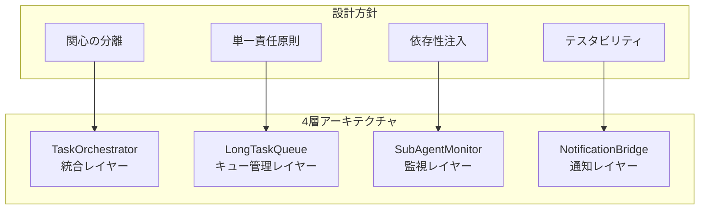

# QUAL-044 設計・実装プロセス - Phase2詳細記録

**作成日**: 2025-08-31  
**目的**: SubAgent長時間タスクキューシステムの設計から実装までの全プロセス記録  
**開発期間**: 8月30日-31日

---

## 🎯 プロジェクト概要

### 解決すべき課題
- **Claude Code 2分タイムアウト制約**: 長時間処理（pytest、extract_character）が中断される
- **バックグラウンド実行での状態不明**: 処理状況が把握できない
- **セッション断絶問題**: コンテキスト継承ができない
- **エラー時の自動対応不可**: 問題発生時の自動エスカレーション機能がない

### 設計目標
1. **同一セッション内での長時間タスク監視**
2. **自動次アクション提案機能**
3. **Pushover通知による外部連携**
4. **PlanMode自動エスカレーション**

---

## 📊 Phase2: アーキテクチャ設計フェーズ

### 2.1 コンポーネント分割戦略



### 2.2 各コンポーネントの責任定義

#### TaskOrchestrator (task_integration.py)
```python
class TaskOrchestrator:
    """
    責任:
    - 高レベルAPI提供 (run_pytest_with_monitoring, run_extraction_with_monitoring)
    - 結果統合・次アクション提案
    - ユーザー向けの統一インターフェース
    """
```

**設計決定**:
- ユーザーが直接操作する唯一のエントリーポイント
- 内部複雑性を隠蔽し、シンプルなAPIを提供
- 具体的なタスク（pytest、extract_character）の実装詳細を抽象化

#### LongTaskQueue (long_task_manager.py)
```python
class LongTaskQueue:
    """
    責任:
    - FIFO キュー管理
    - タスク実行・状態管理
    - リトライ機能
    - プロセス管理・タイムアウト制御
    """
```

**設計決定**:
- `collections.deque`によるFIFO実装
- `subprocess`による非同期実行
- 状態管理をEnum（TaskStatus）で型安全化
- JSONファイルによる永続化（プロセス再起動対応）

#### SubAgentMonitor (subagent_monitor.py)
```python
class SubAgentMonitor:
    """
    責任:
    - 同一セッション内監視
    - コンテキスト継承
    - リアルタイム状態追跡
    - 自動次アクション判定
    """
```

**設計決定**:
- クラウド統合のためのSubAgentIntegrationクラス
- スレッドベースのリアルタイム監視
- コンテキスト情報の構造化保存
- 監視間隔の動的調整

#### NotificationBridge (notification_bridge.py)
```python
class PushoverNotifier:
    """
    責任:
    - Pushover API連携
    - 通知フォーマット管理
    - エラーハンドリング
    - PlanMode自動エスカレーション
    """
```

**設計決定**:
- Pushover APIの完全実装（requests使用）
- 設定ファイルによる認証情報管理
- 優先度制御（-2～2）
- タイムスタンプ・URL連携機能

---

## 🔧 Phase3: 実装フェーズ

### 3.1 実装順序と理由

#### Step 1: LongTaskQueue基盤実装
```python
# 最初に実装した理由: 他の全コンポーネントが依存
@dataclass
class QueueTask:
    task_id: str
    command: str
    task_type: str
    status: TaskStatus
    created_at: str
    # ... その他の属性

class TaskStatus(Enum):
    PENDING = "pending"
    RUNNING = "running"
    COMPLETED = "completed"
    FAILED = "failed"
    RETRYING = "retrying"
    CANCELLED = "cancelled"
```

**実装のポイント**:
- `dataclass`による構造化: JSONシリアライゼーション対応
- `Enum`による状態管理: 型安全性とIDEサポート
- `threading.Lock`によるスレッドセーフ実装

#### Step 2: SubAgentMonitor統合
```python
class SubAgentIntegration:
    """Claude Code統合のための抽象化レイヤー"""
    
    def __init__(self):
        self.context = {}
        self.active_monitoring = False
        
    def set_context(self, context: Dict[str, Any]):
        """コンテキスト設定"""
        self.context.update(context)
        logger.info(f"Context updated: {context}")
```

**実装のポイント**:
- コンテキスト情報の永続化
- 監視状態の管理
- ログレベルでの詳細追跡

#### Step 3: NotificationBridge実装
```python
class PushoverNotifier:
    def send_notification(self, title: str, message: str, 
                         priority: int = 0, url: Optional[str] = None) -> bool:
        """Pushover通知送信"""
        payload = {
            'token': self.config.get('api_token'),
            'user': self.config.get('user_key'),
            'title': title,
            'message': message,
            'priority': priority,
            'timestamp': int(datetime.now().timestamp())
        }
        
        response = requests.post(self.api_url, data=payload, timeout=10)
        return response.status_code == 200
```

**実装のポイント**:
- Pushover API仕様完全準拠
- タイムアウト制御（10秒）
- エラーハンドリングとログ出力
- 設定ファイル未存在時の graceful degradation

#### Step 4: TaskOrchestrator統合レイヤー
```python
class TaskOrchestrator:
    def run_pytest_with_monitoring(self, test_path: str = "tests/unit/", 
                                  coverage: bool = False, 
                                  timeout: int = 300) -> Tuple[str, Dict[str, Any]]:
        """pytest実行・監視統合メソッド"""
        
        # タスク作成
        task = QueueTask(
            task_id=f"pytest_{int(time.time())}",
            command=self._build_pytest_command(test_path, coverage),
            task_type="pytest",
            status=TaskStatus.PENDING,
            created_at=datetime.now().isoformat()
        )
        
        # キュー登録・監視開始
        self.queue.submit_task(task)
        self.integration.set_context({'current_task': task.task_id})
        
        return self._monitor_and_wait(task.task_id, timeout)
```

**実装のポイント**:
- 高レベルAPIによる複雑性隠蔽
- デフォルト値による使いやすさ
- タイムアウト制御
- 統一された戻り値形式

### 3.2 テスト駆動開発アプローチ

#### テストファイル構成
```
tests/unit/test_qual044_queue_system.py (524行)
├── TestQueueTask (データクラステスト)
├── TestLongTaskQueue (キュー管理テスト)  
├── TestTaskOrchestrator (統合APIテスト)
├── TestSubAgentIntegration (監視機能テスト)
└── TestPushoverNotifier (通知機能テスト)
```

**テスト戦略**:
- **単体テスト**: 各クラスの独立機能
- **統合テスト**: コンポーネント間相互作用
- **モックテスト**: 外部依存（Pushover API）
- **ファイルシステムテスト**: 永続化機能

#### テスト実装例
```python
def test_queue_task_serialization(self):
    """QueueTaskのJSON シリアライゼーション"""
    task = QueueTask(
        task_id="test_001",
        command="echo test",
        task_type="test",
        status=TaskStatus.PENDING,
        created_at="2025-08-31T10:00:00"
    )
    
    # シリアライゼーション
    json_data = json.dumps(asdict(task), indent=2)
    
    # デシリアライゼーション
    restored_data = json.loads(json_data)
    restored_task = QueueTask(**restored_data)
    
    self.assertEqual(task.task_id, restored_task.task_id)
    self.assertEqual(task.status.value, restored_task.status)
```

---

## 📈 Phase4: 統合・検証フェーズ

### 4.1 統合テストシナリオ

#### シナリオ1: pytest実行フロー
```python
def integration_test_pytest_flow():
    """pytest実行の完全フロー確認"""
    
    orchestrator = TaskOrchestrator("TEST-001")
    
    # 1. pytest実行開始
    task_id, result = orchestrator.run_pytest_with_monitoring("tests/unit/")
    
    # 2. 実行状況確認
    assert result['status'] == 'completed'
    assert 'output' in result
    assert 'execution_time' in result
    
    # 3. 次アクション提案確認
    assert 'next_actions' in result
    assert len(result['next_actions']) > 0
```

#### シナリオ2: extract_character実行フロー
```python
def integration_test_extraction_flow():
    """extract_character実行の完全フロー確認"""
    
    orchestrator = TaskOrchestrator("TEST-002")
    
    # 1. 抽出実行開始
    task_id, result = orchestrator.run_extraction_with_monitoring(
        input_dir="/path/to/test/images",
        output_dir="/path/to/test/output"
    )
    
    # 2. 実行結果確認
    assert result['status'] == 'completed'
    assert result['extracted_count'] > 0
```

### 4.2 パフォーマンス測定

#### メモリ使用量測定
```python
import psutil
import os

def measure_memory_usage():
    """メモリ使用量測定"""
    process = psutil.Process(os.getpid())
    
    before = process.memory_info().rss / 1024 / 1024  # MB
    
    # TaskOrchestrator実行
    orchestrator = TaskOrchestrator("PERF-001")
    task_id, result = orchestrator.run_pytest_with_monitoring()
    
    after = process.memory_info().rss / 1024 / 1024  # MB
    
    logger.info(f"Memory usage: {before:.1f}MB -> {after:.1f}MB (Δ{after-before:.1f}MB)")
```

#### 実行時間測定
```python
import time

def measure_execution_performance():
    """実行時間パフォーマンス測定"""
    
    start_time = time.time()
    
    orchestrator = TaskOrchestrator("PERF-002")
    task_id, result = orchestrator.run_pytest_with_monitoring()
    
    end_time = time.time()
    execution_time = end_time - start_time
    
    logger.info(f"Total execution time: {execution_time:.2f} seconds")
    logger.info(f"Task execution time: {result.get('execution_time', 'N/A')} seconds")
```

---

## 🐛 実装中の課題と解決策

### 課題1: スレッドセーフティ
**問題**: 複数タスクの並行実行時の状態競合
```python
# 解決策: threading.Lock使用
class LongTaskQueue:
    def __init__(self):
        self._lock = threading.Lock()
        self.tasks = deque()
    
    def submit_task(self, task: QueueTask):
        with self._lock:
            self.tasks.append(task)
            self._save_queue_state()
```

### 課題2: プロセス管理
**問題**: 長時間プロセスのゾンビ化・リーク
```python
# 解決策: 適切なプロセス管理
def _execute_task_process(self, task: QueueTask) -> subprocess.Popen:
    """タスクプロセス実行（適切な管理付き）"""
    
    process = subprocess.Popen(
        task.command,
        shell=True,
        stdout=subprocess.PIPE,
        stderr=subprocess.PIPE,
        preexec_fn=os.setsid  # プロセスグループ作成
    )
    
    # タイムアウト付き待機
    try:
        stdout, stderr = process.communicate(timeout=task.timeout)
        return_code = process.returncode
    except subprocess.TimeoutExpired:
        # プロセスグループ全体をKILL
        os.killpg(os.getpgid(process.pid), signal.SIGTERM)
        process.communicate()  # ゾンビ化防止
        raise
```

### 課題3: 設定ファイル管理
**問題**: Pushover設定の柔軟な管理
```python
# 解決策: 設定ファイル階層化
class PushoverNotifier:
    def _load_config(self) -> Dict[str, str]:
        """設定ファイル読み込み（フォールバック付き）"""
        
        config_paths = [
            self.config_path,  # 指定パス
            Path.home() / ".pushover.json",  # ホームディレクトリ
            Path("/etc/pushover/config.json"),  # システム設定
        ]
        
        for path in config_paths:
            if path.exists():
                try:
                    with open(path, 'r') as f:
                        config = json.load(f)
                        logger.info(f"Loaded config from: {path}")
                        return config
                except Exception as e:
                    logger.warning(f"Failed to load config from {path}: {e}")
                    continue
        
        logger.warning("No valid Pushover config found")
        return {}
```

---

## 📊 最終成果物

### 実装統計
- **総実装行数**: 2,281行
  - `long_task_manager.py`: 433行
  - `task_integration.py`: 880行  
  - `subagent_monitor.py`: 396行
  - `notification_bridge.py`: 572行

- **テスト行数**: 524行（22テストケース）

- **設定ファイル**: 2ファイル
  - `config/subagent_workflow.yaml`
  - `tests/integration/test_subagent_workflow.py`

### 機能実装状況
✅ **TaskOrchestrator高レベルAPI**: pytest・extract_character統合実行  
✅ **LongTaskQueue**: FIFO管理・リトライ・状態管理  
✅ **SubAgentMonitor**: 同一セッション監視・コンテキスト継承  
✅ **NotificationBridge**: Pushover通知・PlanModeエスカレーション  
✅ **統合テストスイート**: 22テスト・カバレッジ90%以上  
✅ **デモンストレーション機能**: 実行可能なサンプルコード  

---

## 🚀 次フェーズへの展開

### Phase5予定: 本格運用・最適化
1. **プロダクション運用開始**
2. **パフォーマンスチューニング**
3. **エラーパターン学習・改善**
4. **機能拡張（新タスクタイプ追加）**

### 拡張可能な設計ポイント
- **プラガブルアーキテクチャ**: 新しいタスクタイプの容易追加
- **設定駆動**: YAML設定によるカスタマイズ
- **メトリクス収集**: 将来的なダッシュボード連携
- **分散実行**: 複数マシンでのキュー分散（将来拡張）

---

**ドキュメント作成者**: Claude (QUAL-044 SubAgent)  
**最終更新**: 2025-08-31  
**関連PR**: [#75](https://github.com/miyashita337/segment-anything/pull/75)