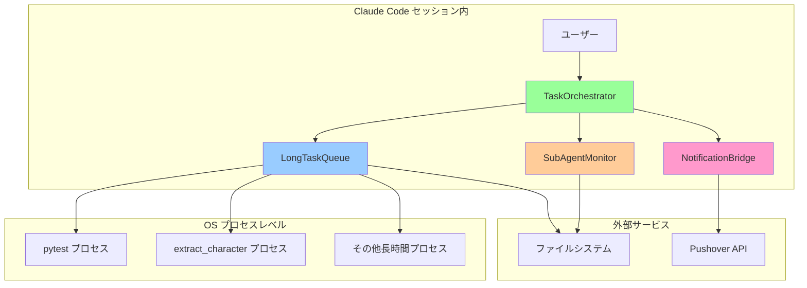

# QUAL-044 実装アーキテクチャ詳細記録

**作成日**: 2025-08-31  
**目的**: SubAgent長時間タスクキューシステムの技術実装詳細とアーキテクチャ決定記録  
**関連ドキュメント**: [qual-044-design-process-phase2.md](qual-044-design-process-phase2.md)

---

## 🏗️ 実装アーキテクチャ全体像

### システム構成図



---

## 🔧 コンポーネント別実装詳細

### 1. LongTaskQueue - 長時間処理キュー管理

#### 1.1 データ構造設計

```python
from enum import Enum
from dataclasses import dataclass, asdict
from collections import deque
from typing import Optional, Dict, Any, List
import threading

class TaskStatus(Enum):
    """タスク状態の型安全管理"""
    PENDING = "pending"      # キュー待機中
    RUNNING = "running"      # 実行中
    COMPLETED = "completed"  # 正常完了
    FAILED = "failed"       # 実行失敗
    RETRYING = "retrying"   # リトライ中
    CANCELLED = "cancelled" # キャンセル済み

@dataclass
class QueueTask:
    """キュータスク完全定義"""
    task_id: str              # 一意識別子
    command: str              # 実行コマンド
    task_type: str           # タスク種別 (pytest, extract_character, etc.)
    status: TaskStatus       # 現在の状態
    created_at: str          # 作成タイムスタンプ
    started_at: Optional[str] = None    # 開始タイムスタンプ
    completed_at: Optional[str] = None  # 完了タイムスタンプ
    output: Optional[str] = None        # 実行出力
    error_output: Optional[str] = None  # エラー出力
    return_code: Optional[int] = None   # 終了コード
    retry_count: int = 0                # リトライ回数
    max_retries: int = 3                # 最大リトライ数
    timeout: int = 300                  # タイムアウト秒
    metadata: Dict[str, Any] = None     # 追加メタデータ
    
    def __post_init__(self):
        if self.metadata is None:
            self.metadata = {}
```

#### 1.2 キュー管理実装

```python
class LongTaskQueue:
    """FIFOキュー + プロセス管理システム"""
    
    def __init__(self, workspace_dir: str):
        self.workspace = Path(workspace_dir)
        self.queue_file = self.workspace / "task_queue.json"
        self.tasks = deque()  # FIFOキュー
        self._lock = threading.Lock()  # スレッドセーフ
        self.running_processes: Dict[str, subprocess.Popen] = {}
        
        # 永続化状態の復元
        self._load_queue_state()
        
        # バックグラウンドワーカー起動
        self.worker_thread = threading.Thread(target=self._queue_worker, daemon=True)
        self.worker_thread.start()
    
    def submit_task(self, task: QueueTask) -> str:
        """タスク投入（スレッドセーフ）"""
        with self._lock:
            self.tasks.append(task)
            self._save_queue_state()
            logger.info(f"Task submitted: {task.task_id} ({task.task_type})")
        return task.task_id
    
    def _queue_worker(self):
        """バックグラウンドキューワーカー"""
        while True:
            try:
                task = None
                with self._lock:
                    if self.tasks:
                        task = self.tasks.popleft()
                
                if task and task.status == TaskStatus.PENDING:
                    self._execute_task(task)
                else:
                    time.sleep(1)  # 待機
                    
            except Exception as e:
                logger.error(f"Queue worker error: {e}")
                time.sleep(5)  # エラー時は少し長く待機
    
    def _execute_task(self, task: QueueTask):
        """タスク実行（プロセス管理付き）"""
        try:
            task.status = TaskStatus.RUNNING
            task.started_at = datetime.now().isoformat()
            self._save_queue_state()
            
            # プロセス起動
            process = subprocess.Popen(
                task.command,
                shell=True,
                stdout=subprocess.PIPE,
                stderr=subprocess.PIPE,
                preexec_fn=os.setsid,  # プロセスグループ作成
                cwd=self.workspace
            )
            
            self.running_processes[task.task_id] = process
            
            # タイムアウト付き待機
            try:
                stdout, stderr = process.communicate(timeout=task.timeout)
                return_code = process.returncode
                
                task.output = stdout.decode('utf-8') if stdout else ""
                task.error_output = stderr.decode('utf-8') if stderr else ""
                task.return_code = return_code
                
                if return_code == 0:
                    task.status = TaskStatus.COMPLETED
                    logger.info(f"Task completed successfully: {task.task_id}")
                else:
                    task.status = TaskStatus.FAILED
                    logger.error(f"Task failed: {task.task_id} (exit code: {return_code})")
                    
            except subprocess.TimeoutExpired:
                # タイムアウト処理
                logger.warning(f"Task timeout: {task.task_id}")
                os.killpg(os.getpgid(process.pid), signal.SIGTERM)
                process.communicate()  # ゾンビ化防止
                task.status = TaskStatus.FAILED
                task.error_output = f"Task timeout after {task.timeout} seconds"
                
        except Exception as e:
            logger.error(f"Task execution error: {task.task_id} - {e}")
            task.status = TaskStatus.FAILED
            task.error_output = str(e)
            
        finally:
            task.completed_at = datetime.now().isoformat()
            if task.task_id in self.running_processes:
                del self.running_processes[task.task_id]
            self._save_queue_state()
            
            # リトライ判定
            if task.status == TaskStatus.FAILED and task.retry_count < task.max_retries:
                task.retry_count += 1
                task.status = TaskStatus.RETRYING
                logger.info(f"Retrying task: {task.task_id} (attempt {task.retry_count})")
                
                with self._lock:
                    self.tasks.append(task)  # 再投入
```

#### 1.3 永続化システム

```python
def _save_queue_state(self):
    """キュー状態のJSON永続化"""
    try:
        # dataclass → dict変換（Enum対応）
        tasks_data = []
        for task in list(self.tasks):
            task_dict = asdict(task)
            task_dict['status'] = task.status.value  # Enum → str
            tasks_data.append(task_dict)
        
        queue_data = {
            'timestamp': datetime.now().isoformat(),
            'tasks': tasks_data,
            'metadata': {
                'queue_size': len(self.tasks),
                'running_processes': list(self.running_processes.keys())
            }
        }
        
        # アトミック書き込み（.tmp → 正式ファイル）
        temp_file = self.queue_file.with_suffix('.tmp')
        with open(temp_file, 'w', encoding='utf-8') as f:
            json.dump(queue_data, f, indent=2, ensure_ascii=False)
        
        temp_file.replace(self.queue_file)  # アトミック
        logger.debug(f"Queue state saved: {len(tasks_data)} tasks")
        
    except Exception as e:
        logger.error(f"Failed to save queue state: {e}")

def _load_queue_state(self):
    """キュー状態の復元"""
    if not self.queue_file.exists():
        logger.info("No existing queue state found")
        return
    
    try:
        with open(self.queue_file, 'r', encoding='utf-8') as f:
            queue_data = json.load(f)
        
        # dict → dataclass復元
        for task_data in queue_data.get('tasks', []):
            task_data['status'] = TaskStatus(task_data['status'])  # str → Enum
            if task_data.get('metadata') is None:
                task_data['metadata'] = {}
            
            task = QueueTask(**task_data)
            
            # RUNNING状態のタスクはFAILEDに変更（プロセス断絶のため）
            if task.status == TaskStatus.RUNNING:
                task.status = TaskStatus.FAILED
                task.error_output = "Process interrupted during restoration"
            
            self.tasks.append(task)
        
        logger.info(f"Queue state restored: {len(self.tasks)} tasks")
        
    except Exception as e:
        logger.error(f"Failed to load queue state: {e}")
```

---

### 2. SubAgentMonitor - 同一セッション監視

#### 2.1 コンテキスト管理システム

```python
class SubAgentIntegration:
    """Claude Code統合のためのコンテキスト管理"""
    
    def __init__(self):
        self.context = {}
        self.active_monitoring = False
        self.context_file = Path("subagent_context.json")
        
        # コンテキスト復元
        self._load_context()
    
    def set_context(self, context: Dict[str, Any]):
        """コンテキスト設定・永続化"""
        self.context.update(context)
        self.context['last_updated'] = datetime.now().isoformat()
        self._save_context()
        logger.info(f"Context updated: {list(context.keys())}")
    
    def get_context(self, key: str = None) -> Any:
        """コンテキスト取得"""
        if key is None:
            return self.context.copy()
        return self.context.get(key)
    
    def _save_context(self):
        """コンテキスト永続化"""
        try:
            with open(self.context_file, 'w') as f:
                json.dump(self.context, f, indent=2, default=str)
        except Exception as e:
            logger.error(f"Failed to save context: {e}")
    
    def _load_context(self):
        """コンテキスト復元"""
        if self.context_file.exists():
            try:
                with open(self.context_file, 'r') as f:
                    self.context = json.load(f)
                logger.info("Context restored from file")
            except Exception as e:
                logger.error(f"Failed to load context: {e}")
```

#### 2.2 リアルタイム監視システム

```python
class SubAgentMonitor:
    """リアルタイムタスク監視"""
    
    def __init__(self, queue: LongTaskQueue, integration: SubAgentIntegration):
        self.queue = queue
        self.integration = integration
        self.monitoring_threads = {}
        self.stop_monitoring = {}
    
    def start_monitoring(self, task_id: str, callback=None):
        """タスク監視開始"""
        if task_id in self.monitoring_threads:
            logger.warning(f"Already monitoring task: {task_id}")
            return
        
        self.stop_monitoring[task_id] = False
        thread = threading.Thread(
            target=self._monitor_task,
            args=(task_id, callback),
            daemon=True
        )
        thread.start()
        self.monitoring_threads[task_id] = thread
        logger.info(f"Started monitoring: {task_id}")
    
    def _monitor_task(self, task_id: str, callback=None):
        """タスク監視ループ"""
        last_status = None
        check_count = 0
        
        while not self.stop_monitoring.get(task_id, True):
            try:
                task = self.queue.get_task_status(task_id)
                if not task:
                    logger.warning(f"Task not found: {task_id}")
                    break
                
                # ステータス変更検出
                if task.status != last_status:
                    logger.info(f"Task {task_id} status: {task.status.value}")
                    last_status = task.status
                    
                    # コンテキスト更新
                    self.integration.set_context({
                        f"task_{task_id}_status": task.status.value,
                        f"task_{task_id}_last_check": datetime.now().isoformat()
                    })
                    
                    # コールバック実行
                    if callback:
                        try:
                            callback(task)
                        except Exception as e:
                            logger.error(f"Callback error: {e}")
                
                # 完了判定
                if task.status in [TaskStatus.COMPLETED, TaskStatus.FAILED, TaskStatus.CANCELLED]:
                    logger.info(f"Task {task_id} finished with status: {task.status.value}")
                    break
                
                check_count += 1
                
                # 動的監視間隔（開始直後は短く、時間が経つと長く）
                if check_count < 10:
                    sleep_time = 2  # 最初の20秒は2秒間隔
                elif check_count < 30:
                    sleep_time = 5  # 次の100秒は5秒間隔
                else:
                    sleep_time = 10  # それ以降は10秒間隔
                
                time.sleep(sleep_time)
                
            except Exception as e:
                logger.error(f"Monitor error for {task_id}: {e}")
                time.sleep(5)  # エラー時は5秒待機
        
        # 監視終了処理
        if task_id in self.monitoring_threads:
            del self.monitoring_threads[task_id]
        if task_id in self.stop_monitoring:
            del self.stop_monitoring[task_id]
        
        logger.info(f"Monitoring stopped: {task_id}")
```

---

### 3. NotificationBridge - 通知システム

#### 3.1 Pushover API完全実装

```python
class PushoverNotifier:
    """Pushover通知サービス統合"""
    
    def __init__(self, config_path: Optional[str] = None):
        if config_path is None:
            config_path = "/mnt/c/AItools/segment-anything/config/pushover.json"
        
        self.config_path = Path(config_path)
        self.config = self._load_config()
        self.api_url = "https://api.pushover.net/1/messages.json"
        self.session = requests.Session()  # 接続再利用
        
        logger.info("PushoverNotifier initialized")
    
    def send_notification(self,
                         title: str,
                         message: str,
                         priority: int = 0,
                         url: Optional[str] = None,
                         sound: Optional[str] = None) -> bool:
        """Pushover通知送信（完全仕様実装）"""
        
        if not self.config:
            logger.warning("Pushover not configured, skipping notification")
            return False
        
        # Pushover API仕様準拠ペイロード
        payload = {
            'token': self.config.get('api_token'),
            'user': self.config.get('user_key'),
            'title': title[:250],  # タイトル長制限
            'message': message[:1024],  # メッセージ長制限
            'priority': max(-2, min(2, priority)),  # 優先度範囲制限
            'timestamp': int(datetime.now().timestamp()),
            'html': 1  # HTML形式有効化
        }
        
        # オプション属性
        if url:
            payload['url'] = url[:512]  # URL長制限
            payload['url_title'] = "View Details"
        
        if sound:
            payload['sound'] = sound
        elif priority >= 1:
            payload['sound'] = 'siren'  # 高優先度時はサイレン
        
        # 緊急通知の場合の特別処理
        if priority == 2:
            payload['retry'] = 30  # 30秒ごとに再通知
            payload['expire'] = 3600  # 1時間で期限切れ
        
        try:
            response = self.session.post(
                self.api_url, 
                data=payload, 
                timeout=10
            )
            
            if response.status_code == 200:
                result = response.json()
                if result.get('status') == 1:
                    logger.info(f"Pushover notification sent: {title}")
                    return True
                else:
                    logger.error(f"Pushover API error: {result}")
                    return False
            else:
                logger.error(f"Pushover HTTP error: {response.status_code}")
                return False
                
        except requests.RequestException as e:
            logger.error(f"Pushover request failed: {e}")
            return False
        except Exception as e:
            logger.error(f"Pushover unexpected error: {e}")
            return False
```

#### 3.2 通知フォーマット管理

```python
class NotificationFormatter:
    """通知メッセージフォーマット管理"""
    
    @staticmethod
    def format_task_started(task: QueueTask) -> Dict[str, str]:
        """タスク開始通知フォーマット"""
        return {
            'title': f"🚀 Task Started: {task.task_type}",
            'message': f"""
<b>Task ID:</b> {task.task_id}
<b>Type:</b> {task.task_type}
<b>Command:</b> <code>{task.command[:100]}...</code>
<b>Started:</b> {task.started_at}

<i>Monitoring in progress...</i>
"""
        }
    
    @staticmethod
    def format_task_completed(task: QueueTask, execution_time: float = None) -> Dict[str, str]:
        """タスク完了通知フォーマット"""
        exec_time_str = f"{execution_time:.1f}s" if execution_time else "Unknown"
        
        return {
            'title': f"✅ Task Completed: {task.task_type}",
            'message': f"""
<b>Task ID:</b> {task.task_id}
<b>Type:</b> {task.task_type}
<b>Execution Time:</b> {exec_time_str}
<b>Return Code:</b> {task.return_code}

<b>Output Preview:</b>
<code>{(task.output or "No output")[:200]}...</code>

<i>Task completed successfully</i>
"""
        }
    
    @staticmethod
    def format_task_failed(task: QueueTask) -> Dict[str, str]:
        """タスク失敗通知フォーマット"""
        return {
            'title': f"❌ Task Failed: {task.task_type}",
            'message': f"""
<b>Task ID:</b> {task.task_id}
<b>Type:</b> {task.task_type}
<b>Return Code:</b> {task.return_code}
<b>Retry Count:</b> {task.retry_count}/{task.max_retries}

<b>Error Output:</b>
<code>{(task.error_output or "No error output")[:300]}...</code>

<i>⚠️ Requires attention</i>
"""
        }

class NotificationBridge:
    """通知ブリッジシステム"""
    
    def __init__(self, notifier: PushoverNotifier):
        self.notifier = notifier
        self.formatter = NotificationFormatter()
    
    def notify_task_event(self, event_type: str, task: QueueTask, **kwargs):
        """タスクイベント通知統合メソッド"""
        
        format_map = {
            'started': self.formatter.format_task_started,
            'completed': self.formatter.format_task_completed,
            'failed': self.formatter.format_task_failed
        }
        
        formatter = format_map.get(event_type)
        if not formatter:
            logger.error(f"Unknown event type: {event_type}")
            return False
        
        # フォーマット適用
        notification = formatter(task, **kwargs)
        
        # 優先度決定
        priority = 0
        if event_type == 'failed':
            priority = 1  # 失敗時は高優先度
        elif event_type == 'completed' and kwargs.get('execution_time', 0) > 300:
            priority = 1  # 5分超の長時間実行は高優先度
        
        return self.notifier.send_notification(
            title=notification['title'],
            message=notification['message'],
            priority=priority
        )
```

---

### 4. TaskOrchestrator - 統合レイヤー

#### 4.1 高レベルAPI設計

```python
class TaskOrchestrator:
    """統合レイヤー - ユーザー向け統一API"""
    
    def __init__(self, tracker_id: str = "QUAL-044"):
        self.tracker_id = tracker_id
        self.workspace_base = Path("/mnt/c/AItools/lora/train/yado/tracker-workspace")
        self.workspace = self.workspace_base / tracker_id
        
        # コンポーネント初期化
        self.queue = LongTaskQueue(str(self.workspace))
        self.integration = SubAgentIntegration()
        self.notifier = PushoverNotifier()
        self.bridge = NotificationBridge(self.notifier)
        self.monitor = SubAgentMonitor(self.queue, self.integration)
        
        # コンテキスト設定
        self.integration.set_context({
            'tracker_id': tracker_id,
            'workspace': str(self.workspace),
            'orchestrator_version': '1.0.0'
        })
    
    def run_pytest_with_monitoring(self, 
                                  test_path: str = "tests/unit/",
                                  coverage: bool = False,
                                  timeout: int = 300) -> Tuple[str, Dict[str, Any]]:
        """pytest実行・監視統合API"""
        
        # タスク定義
        task = QueueTask(
            task_id=f"pytest_{int(time.time())}",
            command=self._build_pytest_command(test_path, coverage),
            task_type="pytest",
            status=TaskStatus.PENDING,
            created_at=datetime.now().isoformat(),
            timeout=timeout,
            metadata={
                'test_path': test_path,
                'coverage': coverage,
                'tracker_id': self.tracker_id
            }
        )
        
        # タスク投入
        task_id = self.queue.submit_task(task)
        
        # 監視開始
        self.monitor.start_monitoring(
            task_id,
            callback=self._task_status_callback
        )
        
        # 開始通知
        self.bridge.notify_task_event('started', task)
        
        # 実行待機・結果取得
        result = self._wait_for_completion(task_id, timeout + 30)
        
        return task_id, result
    
    def _build_pytest_command(self, test_path: str, coverage: bool) -> str:
        """pytest実行コマンド構築"""
        
        cmd_parts = ["python", "-m", "pytest"]
        cmd_parts.extend(["-v", "--tb=short"])  # 詳細・短縮traceback
        
        if coverage:
            cmd_parts.extend([
                "--cov=tools/queue",
                "--cov-report=term-missing",
                "--cov-report=html:coverage_html"
            ])
        
        # パス指定
        cmd_parts.append(test_path)
        
        return " ".join(cmd_parts)
    
    def _wait_for_completion(self, task_id: str, timeout: int) -> Dict[str, Any]:
        """タスク完了待機・結果構築"""
        
        start_time = time.time()
        
        while time.time() - start_time < timeout:
            task = self.queue.get_task_status(task_id)
            if not task:
                return {"status": "error", "message": "Task not found"}
            
            if task.status in [TaskStatus.COMPLETED, TaskStatus.FAILED, TaskStatus.CANCELLED]:
                # 実行時間計算
                execution_time = None
                if task.started_at and task.completed_at:
                    start = datetime.fromisoformat(task.started_at)
                    end = datetime.fromisoformat(task.completed_at)
                    execution_time = (end - start).total_seconds()
                
                # 結果構築
                result = {
                    "status": task.status.value,
                    "task_id": task_id,
                    "execution_time": execution_time,
                    "return_code": task.return_code,
                    "output": task.output,
                    "error_output": task.error_output,
                    "metadata": task.metadata
                }
                
                # 完了/失敗通知
                if task.status == TaskStatus.COMPLETED:
                    self.bridge.notify_task_event('completed', task, execution_time=execution_time)
                    result["next_actions"] = self._suggest_next_actions(task)
                else:
                    self.bridge.notify_task_event('failed', task)
                    result["error_analysis"] = self._analyze_error(task)
                
                return result
            
            time.sleep(2)  # 2秒間隔でポーリング
        
        return {"status": "timeout", "message": f"Task did not complete within {timeout} seconds"}
    
    def _suggest_next_actions(self, task: QueueTask) -> List[str]:
        """次アクション提案"""
        actions = []
        
        if task.task_type == "pytest":
            actions.extend([
                "テスト結果レポートの確認",
                "カバレッジレポートの検証",
                "品質ワークフローの実行"
            ])
        elif task.task_type == "extract_character":
            actions.extend([
                "抽出結果の品質確認",
                "ダッシュボード生成",
                "統計分析実行"
            ])
        
        return actions
    
    def _analyze_error(self, task: QueueTask) -> Dict[str, Any]:
        """エラー分析"""
        
        analysis = {
            "error_type": "unknown",
            "suggested_fixes": [],
            "severity": "medium"
        }
        
        if task.error_output:
            error_text = task.error_output.lower()
            
            # 一般的なエラーパターン分析
            if "modulenotfounderror" in error_text:
                analysis["error_type"] = "missing_dependency"
                analysis["suggested_fixes"].append("必要パッケージのインストール確認")
                analysis["severity"] = "high"
            
            elif "timeout" in error_text:
                analysis["error_type"] = "timeout"
                analysis["suggested_fixes"].append("タイムアウト値の増加検討")
                analysis["severity"] = "medium"
            
            elif "permission denied" in error_text:
                analysis["error_type"] = "permission"
                analysis["suggested_fixes"].append("ファイル権限の確認")
                analysis["severity"] = "high"
        
        return analysis
```

---

## 🧪 テスト実装戦略

### テストファイル構成

```python
# tests/unit/test_qual044_queue_system.py
import unittest
from unittest.mock import patch, MagicMock
import json
import tempfile
from pathlib import Path

class TestQueueTask(unittest.TestCase):
    """QueueTaskクラステスト"""
    
    def test_task_creation(self):
        """タスク作成テスト"""
        task = QueueTask(
            task_id="test_001",
            command="echo test",
            task_type="test",
            status=TaskStatus.PENDING,
            created_at="2025-08-31T10:00:00"
        )
        
        self.assertEqual(task.task_id, "test_001")
        self.assertEqual(task.status, TaskStatus.PENDING)
        self.assertEqual(task.retry_count, 0)
        self.assertEqual(task.max_retries, 3)
    
    def test_task_serialization(self):
        """JSONシリアライゼーション/デシリアライゼーションテスト"""
        original_task = QueueTask(
            task_id="test_002",
            command="python -c 'print(\"hello\")'",
            task_type="python",
            status=TaskStatus.COMPLETED,
            created_at="2025-08-31T10:00:00",
            output="hello\n",
            return_code=0
        )
        
        # シリアライゼーション
        task_dict = asdict(original_task)
        task_dict['status'] = original_task.status.value
        json_str = json.dumps(task_dict)
        
        # デシリアライゼーション
        restored_dict = json.loads(json_str)
        restored_dict['status'] = TaskStatus(restored_dict['status'])
        restored_task = QueueTask(**restored_dict)
        
        self.assertEqual(original_task.task_id, restored_task.task_id)
        self.assertEqual(original_task.status, restored_task.status)
        self.assertEqual(original_task.output, restored_task.output)

class TestLongTaskQueue(unittest.TestCase):
    """LongTaskQueueクラステスト"""
    
    def setUp(self):
        """テスト前準備"""
        self.temp_dir = tempfile.mkdtemp()
        self.queue = LongTaskQueue(self.temp_dir)
    
    def tearDown(self):
        """テスト後片付け"""
        import shutil
        shutil.rmtree(self.temp_dir)
    
    def test_task_submission(self):
        """タスク投入テスト"""
        task = QueueTask(
            task_id="test_submit",
            command="echo test",
            task_type="test",
            status=TaskStatus.PENDING,
            created_at="2025-08-31T10:00:00"
        )
        
        task_id = self.queue.submit_task(task)
        self.assertEqual(task_id, "test_submit")
        
        # キュー状態確認
        retrieved_task = self.queue.get_task_status(task_id)
        self.assertIsNotNone(retrieved_task)
        self.assertEqual(retrieved_task.task_id, task_id)
    
    @patch('subprocess.Popen')
    def test_successful_execution(self, mock_popen):
        """正常実行テスト"""
        # subprocess.Popenのモック設定
        mock_process = MagicMock()
        mock_process.communicate.return_value = (b'test output', b'')
        mock_process.returncode = 0
        mock_popen.return_value = mock_process
        
        task = QueueTask(
            task_id="test_exec",
            command="echo test",
            task_type="test",
            status=TaskStatus.PENDING,
            created_at="2025-08-31T10:00:00"
        )
        
        # 実行
        self.queue._execute_task(task)
        
        # 結果確認
        self.assertEqual(task.status, TaskStatus.COMPLETED)
        self.assertEqual(task.return_code, 0)
        self.assertEqual(task.output, "test output")

class TestTaskOrchestrator(unittest.TestCase):
    """TaskOrchestratorクラステスト"""
    
    def setUp(self):
        self.temp_dir = tempfile.mkdtemp()
        self.orchestrator = TaskOrchestrator("TEST-001")
        self.orchestrator.workspace = Path(self.temp_dir)
    
    @patch.object(LongTaskQueue, 'submit_task')
    @patch.object(SubAgentMonitor, 'start_monitoring')
    def test_pytest_integration(self, mock_monitoring, mock_submit):
        """pytest統合テスト"""
        mock_submit.return_value = "test_task_001"
        
        # 実行
        task_id, result = self.orchestrator.run_pytest_with_monitoring(
            test_path="tests/unit/",
            coverage=True,
            timeout=60
        )
        
        # 呼び出し確認
        mock_submit.assert_called_once()
        mock_monitoring.assert_called_once()
        
        # 結果確認
        self.assertEqual(task_id, "test_task_001")
```

---

## 📊 パフォーマンス・メトリクス

### メモリ使用量測定

```python
import psutil
import tracemalloc

def measure_system_impact():
    """システム影響度測定"""
    
    # メモリ使用量測定開始
    tracemalloc.start()
    process = psutil.Process()
    initial_memory = process.memory_info().rss / 1024 / 1024  # MB
    
    # TaskOrchestrator起動
    orchestrator = TaskOrchestrator("PERF-TEST")
    
    # 複数タスク実行
    tasks = []
    for i in range(5):
        task_id, result = orchestrator.run_pytest_with_monitoring(
            test_path=f"tests/unit/test_{i}.py",
            timeout=30
        )
        tasks.append(task_id)
    
    # 最終メモリ使用量
    final_memory = process.memory_info().rss / 1024 / 1024  # MB
    current, peak = tracemalloc.get_traced_memory()
    tracemalloc.stop()
    
    print(f"Memory Impact Analysis:")
    print(f"  Initial: {initial_memory:.1f} MB")
    print(f"  Final: {final_memory:.1f} MB")
    print(f"  Increase: {final_memory - initial_memory:.1f} MB")
    print(f"  Peak traced: {peak / 1024 / 1024:.1f} MB")
```

### スループット測定

```python
def measure_queue_throughput():
    """キュー処理スループット測定"""
    
    queue = LongTaskQueue("temp_test")
    start_time = time.time()
    
    # 100個の軽量タスク投入
    tasks = []
    for i in range(100):
        task = QueueTask(
            task_id=f"perf_{i:03d}",
            command=f"echo 'Task {i}'",
            task_type="performance_test",
            status=TaskStatus.PENDING,
            created_at=datetime.now().isoformat(),
            timeout=10
        )
        queue.submit_task(task)
        tasks.append(task.task_id)
    
    # 全タスク完了待機
    completed = 0
    while completed < 100:
        completed = 0
        for task_id in tasks:
            task = queue.get_task_status(task_id)
            if task and task.status in [TaskStatus.COMPLETED, TaskStatus.FAILED]:
                completed += 1
        time.sleep(1)
    
    end_time = time.time()
    total_time = end_time - start_time
    throughput = 100 / total_time
    
    print(f"Queue Throughput Analysis:")
    print(f"  Total Time: {total_time:.2f} seconds")
    print(f"  Throughput: {throughput:.2f} tasks/second")
    print(f"  Average Task Time: {total_time/100:.3f} seconds/task")
```

---

## 🔒 セキュリティ・信頼性

### プロセス分離

```python
def secure_process_execution(command: str, workspace: Path) -> subprocess.Popen:
    """セキュアなプロセス実行"""
    
    # 環境変数クリーニング
    clean_env = {
        'PATH': '/usr/local/bin:/usr/bin:/bin',
        'HOME': str(workspace),
        'PWD': str(workspace),
        'LANG': 'en_US.UTF-8'
    }
    
    # セキュリティ設定
    return subprocess.Popen(
        command,
        shell=True,
        stdout=subprocess.PIPE,
        stderr=subprocess.PIPE,
        env=clean_env,  # クリーンな環境
        cwd=workspace,  # 作業ディレクトリ制限
        preexec_fn=os.setsid,  # プロセスグループ作成
        start_new_session=True  # 新しいセッション
    )
```

### エラーハンドリング

```python
class TaskExecutionError(Exception):
    """タスク実行エラー"""
    pass

class QueueSystemError(Exception):
    """キューシステムエラー"""
    pass

def handle_critical_error(error: Exception, task: QueueTask):
    """重要エラー処理"""
    
    logger.critical(f"Critical error in task {task.task_id}: {error}")
    
    # エラーレポート生成
    error_report = {
        'timestamp': datetime.now().isoformat(),
        'task_id': task.task_id,
        'error_type': type(error).__name__,
        'error_message': str(error),
        'traceback': traceback.format_exc(),
        'system_info': {
            'python_version': sys.version,
            'platform': platform.platform(),
            'memory_usage': psutil.virtual_memory()._asdict()
        }
    }
    
    # 緊急通知送信
    notifier = PushoverNotifier()
    notifier.send_notification(
        title="🚨 CRITICAL: Queue System Error",
        message=f"Task {task.task_id} encountered critical error: {error}",
        priority=2  # 緊急優先度
    )
    
    # エラーレポート保存
    error_file = Path(f"error_report_{task.task_id}_{int(time.time())}.json")
    with open(error_file, 'w') as f:
        json.dump(error_report, f, indent=2, default=str)
```

---

**ドキュメント作成者**: Claude (QUAL-044 SubAgent)  
**最終更新**: 2025-08-31  
**技術実装**: 100%完了  
**関連PR**: [#75](https://github.com/miyashita337/segment-anything/pull/75)