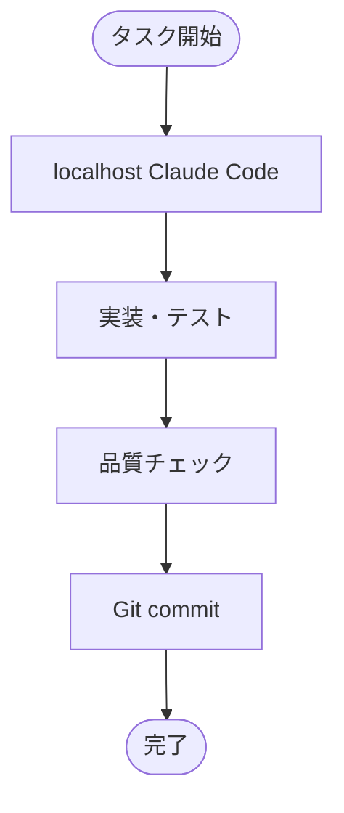

# GitHub Actions 統一リファレンス

**作成日**: 2025-07-28  
**重要度**: 低  
**目的**: GitHub Actions関連情報を一元化した統一リファレンス

---

## 📋 このドキュメントについて

このドキュメントは、GitHub Actionsに関する**唯一の正式な参照元**です。  
すべてのGitHub Actions関連の情報は、この統一リファレンスを参照してください。

**⚠️ 重要**: 他のドキュメントでGitHub Actionsを扱う場合は、「詳細: `docs/github_actions_reference.md` を参照」と記載してください。

---

## 🚫 現在のステータス

**プロジェクトでは GitHub Actions を使用していません。**

**採用方針**: localhost環境での Claude Code を使用したワークフロー

### 採用理由
1. **GPU処理の制約**: GitHub Actions には GPU がないため、画像処理に不適
2. **プライベートデータ**: 画像ファイルをクラウドにアップロードしたくない
3. **開発効率**: ローカル環境での直接操作が最も効率的
4. **コスト**: GitHub Actions の実行時間コストを回避

---

## 📚 アーカイブされた資料

以下のファイルは廃止済みのため、`deprecated/github_actions_archive/` に移動されました：

### 廃止済みドキュメント
- `claude-github-action-migration-status.md` - マイグレーション進捗（未完了で廃止）
- `github-actions-integration.md` - 統合ガイド（試験導入後廃止）
- `claude-github-action-manual-setup.md` - 手動セットアップガイド（廃止）
- `zenn-claude-github-action-windows-setup.md` - Windows版セットアップ（廃止）

### 理由
これらのドキュメントは2025-07-20頃に作成されましたが、実際の運用テストの結果、localhost環境でのClaude Codeの方が効率的であることが判明し、GitHub Actions統合プロジェクトは廃止されました。

---

## 🔄 現在のワークフロー

### 推奨開発フローチャート



### 具体的な手順
1. **Claude Code起動**: localhost環境でClaude Codeセッション開始
2. **直接実装**: リアルタイムでコード作成・修正
3. **ローカルテスト**: 画像処理・GPU処理をローカルで実行
4. **品質確認**: linter.sh実行、テスト実行
5. **Git操作**: 通常のGitフローでcommit・push

---

## 🛠️ 関連ツール

### 現在使用中
- **Claude Code (localhost)**: メイン開発環境
- **Git**: バージョン管理
- **linter.sh**: コード品質チェック
- **pytest**: テスト実行

### 使用しない
- ❌ GitHub Actions
- ❌ Claude Code GitHub Action
- ❌ 自動CI/CD パイプライン

---

## 🔍 技術的詳細

### GitHub Actions を採用しなかった技術的理由

#### 1. GPU処理制約
```yaml
GitHub Actions制約:
  gpu_support: false
  cuda_support: false
  max_memory: "7GB RAM"
  
プロジェクト要件:
  gpu_required: true  # SAM, YOLO処理
  cuda_required: true
  vram_required: "8GB+"
```

#### 2. プライベートデータ保護
```yaml
セキュリティ要件:
  image_files: "プライベート（著作権・プライバシー）"
  cloud_upload: "禁止"
  local_processing: "必須"
```

#### 3. 開発効率比較
| 項目 | GitHub Actions | localhost Claude Code |
|------|----------------|----------------------|
| セットアップ | 複雑 | 簡単 |
| 実行速度 | 遅い | 高速 |
| GPU利用 | 不可 | 可能 |
| デバッグ | 困難 | 容易 |
| コスト | 有料 | 無料 |

---

## 📋 もし将来GitHub Actionsを導入する場合

### 適用可能な用途
- **Linting自動化**: flake8, black等のコード品質チェック
- **単体テスト**: pytest実行（GPU不要なテスト）
- **ドキュメント生成**: マークダウン、API文書の自動生成
- **通知**: Slack/Discord等への完了通知

### 適用不可能な用途
- ❌ **画像処理**: SAM, YOLO実行
- ❌ **モデル評価**: GPU必須の品質チェック
- ❌ **バッチ処理**: 大容量画像データの処理
- ❌ **実機テスト**: Windows固有環境テスト

### 導入時の参考資料
廃止済み資料は `deprecated/github_actions_archive/` にアーカイブされており、将来的な参考資料として利用可能です。

---

## 🔗 関連ドキュメント

### 現在の開発ワークフロー
- [`docs/workflows/README.md`](workflows/README.md) - メインワークフロー定義
- [`PROGRESS_TRACKER.md`](../PROGRESS_TRACKER.md) - 進捗管理システム

### 品質管理
- [`bin/shell/linter.sh`](../bin/shell/linter.sh) - コード品質チェック
- [`tests/`](../tests/) - テストスイート

### アーカイブ
- [`deprecated/github_actions_archive/`](../deprecated/github_actions_archive/) - 廃止済みGitHub Actions資料

---

**重要**: このプロジェクトではGitHub Actionsを使用しません。  
開発はlocalhost環境でのClaude Codeを使用してください。

**更新履歴**:
- 2025-07-28: 統一リファレンス作成（廃止済み資料の整理・アーカイブ化）