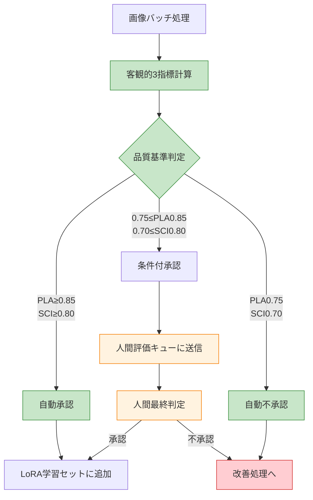

# 人間評価統合方針

**作成日**: 2025-07-24  
**目的**: 客観的3指標システムと人間評価の適切な統合

## 🎯 統合アプローチ

### 基本方針：「客観評価＋人間検証」

```yaml
evaluation_hierarchy:
  primary: "客観的3指標システム（PLA/SCI/PLE）"
  secondary: "人間評価（最終品質検証）"
  
  ratio: "客観90% : 人間10%"
  
  human_role: "最終品質保証・学習データ妥当性確認"
  objective_role: "日常品質監視・継続改善追跡"
```

## 📊 客観評価と人間評価の分担

### 🤖 客観的評価システムの担当領域

#### 日常運用・監視
```yaml
objective_evaluation_scope:
  daily_monitoring:
    - "PLA（IoU）による抽出精度測定"
    - "SCI（MediaPipe）による構造完全性評価"
    - "PLE（時系列）による学習効率追跡"
    
  continuous_improvement:
    - "性能トレンドの自動検出"
    - "退行・停滞アラートの自動発行"
    - "マイルストーン達成度の定量追跡"
    
  batch_processing:
    - "大量画像の一括品質評価"
    - "統計的傾向分析"
    - "システム性能ベンチマーク"
```

### 👤 人間評価の担当領域

#### LoRA学習品質保証
```yaml
human_evaluation_scope:
  final_quality_assurance:
    - "LoRA学習用データセットの最終検証"
    - "学習効果の視覚的確認"
    - "生成画像品質の主観評価"
    
  edge_cases:
    - "客観評価で判定困難なケース"
    - "芸術的・美的品質の評価"
    - "文脈的妥当性の確認"
    
  system_validation:
    - "新機能導入時の感覚的品質確認"
    - "客観指標と実用品質の相関検証"
    - "ユーザー体験の総合評価"
```

## 🔄 統合ワークフロー

### Phase 1: 客観評価主導フロー



### Phase 2: 人間評価の効率化

#### サンプリング戦略
```python
def select_human_evaluation_samples(batch_results: List[ObjectiveResult]) -> List[ObjectiveResult]:
    """効率的な人間評価サンプル選択"""
    
    # 1. 必須評価対象（全て人間確認）
    mandatory_samples = []
    
    # 境界値付近の結果
    boundary_samples = [r for r in batch_results 
                       if 0.75 <= r.pla_score < 0.85 or 0.70 <= r.sci_score < 0.80]
    
    # 客観評価で高スコアだが不自然な結果
    suspicious_high_scores = [r for r in batch_results 
                             if r.pla_score >= 0.90 and r.sci_score >= 0.85 
                             and detect_anomaly(r)]
    
    # 2. 統計的サンプリング（品質保証用）
    # 高品質結果の10%をランダムサンプリング
    high_quality = [r for r in batch_results if r.pla_score >= 0.85 and r.sci_score >= 0.80]
    random_samples = random.sample(high_quality, max(1, len(high_quality) // 10))
    
    return mandatory_samples + boundary_samples + suspicious_high_scores + random_samples

def detect_anomaly(result: ObjectiveResult) -> bool:
    """客観的に高スコアだが人間確認が必要な異常を検出"""
    # 例：PLA高いが視覚的に不自然（背景混入等）
    return (result.pla_score >= 0.90 and 
            result.background_contamination_score > 0.3)
```

#### 人間評価インターフェース
```python
class HumanEvaluationInterface:
    """効率的な人間評価インターフェース"""
    
    def __init__(self):
        self.evaluation_queue = deque()
        self.results_cache = {}
    
    def present_for_evaluation(self, sample: ObjectiveResult) -> HumanEvaluationResult:
        """人間評価用のインターフェース表示"""
        
        # 客観的指標の事前表示
        context = {
            "pla_score": sample.pla_score,
            "sci_score": sample.sci_score,
            "objective_recommendation": self._get_objective_recommendation(sample),
            "similar_cases_history": self._get_similar_evaluations(sample)
        }
        
        # 効率的な評価質問（Yes/No形式中心）
        questions = [
            "LoRA学習に適した品質ですか？ [Y/n]",
            "キャラクターの重要部位は完全に含まれていますか？ [Y/n]", 
            "背景の混入は許容範囲内ですか？ [Y/n]"
        ]
        
        return self._collect_human_input(sample, context, questions)
    
    def _get_objective_recommendation(self, sample: ObjectiveResult) -> str:
        """客観評価に基づく推奨判定を表示"""
        if sample.pla_score >= 0.85 and sample.sci_score >= 0.80:
            return "客観評価：承認推奨（高品質）"
        elif sample.pla_score >= 0.75 and sample.sci_score >= 0.70:
            return "客観評価：条件付承認（標準品質）"
        else:
            return "客観評価：不承認推奨（品質不足）"
```

## 📈 人間評価と客観評価の相関分析

### 相関性監視システム
```python
class ObjectiveHumanCorrelationAnalyzer:
    """客観評価と人間評価の相関分析"""
    
    def analyze_correlation(self, evaluation_history: List[CombinedEvaluation]) -> CorrelationReport:
        """相関分析の実行"""
        
        # PLA vs 人間評価の相関
        pla_scores = [e.objective.pla_score for e in evaluation_history]
        human_scores = [e.human.overall_quality for e in evaluation_history]
        pla_correlation = scipy.stats.pearsonr(pla_scores, human_scores)
        
        # SCI vs 人間評価の相関
        sci_scores = [e.objective.sci_score for e in evaluation_history]
        sci_correlation = scipy.stats.pearsonr(sci_scores, human_scores)
        
        # 不一致ケースの分析
        disagreement_cases = self._analyze_disagreements(evaluation_history)
        
        return CorrelationReport(
            pla_human_correlation=pla_correlation.statistic,
            sci_human_correlation=sci_correlation.statistic,
            disagreement_analysis=disagreement_cases,
            recommendations=self._generate_calibration_recommendations(pla_correlation, sci_correlation)
        )
    
    def _analyze_disagreements(self, history: List[CombinedEvaluation]) -> List[DisagreementCase]:
        """客観評価と人間評価の不一致ケース分析"""
        disagreements = []
        
        for eval_case in history:
            obj_quality = self._categorize_objective_quality(eval_case.objective)
            human_quality = eval_case.human.overall_quality
            
            # 大きな不一致の検出
            if abs(obj_quality - human_quality) >= 2:  # 2段階以上の差
                disagreements.append(DisagreementCase(
                    case=eval_case,
                    objective_prediction=obj_quality,
                    human_judgment=human_quality,
                    possible_reasons=self._analyze_disagreement_reasons(eval_case)
                ))
        
        return disagreements
```

## 🎯 LoRA学習特化の人間評価

### LoRA学習品質基準
```yaml
lora_specific_criteria:
  character_consistency:
    weight: 40%
    description: "キャラクターの一貫した特徴が保持されているか"
    evaluation: "主観的判定が必要（客観評価では測定困難）"
    
  artistic_quality:
    weight: 30%
    description: "芸術的・美的な魅力があるか"
    evaluation: "完全に主観的判定"
    
  training_suitability:
    weight: 30%
    description: "LoRA学習に適したデータ形式・品質か"
    evaluation: "経験に基づく判定"
```

### LoRA学習結果の検証ワークフロー
```python
def validate_lora_training_quality(trained_model, test_prompts: List[str]) -> LoRAValidationReport:
    """LoRA学習結果の品質検証"""
    
    # 1. 客観的測定
    objective_metrics = {
        'feature_preservation': calculate_feature_preservation(trained_model),
        'generation_consistency': calculate_consistency_score(trained_model, test_prompts),
        'overfitting_degree': detect_overfitting_indicators(trained_model)
    }
    
    # 2. 人間による最終品質判定
    human_evaluation = {
        'character_likeness': human_evaluate_character_similarity(trained_model, test_prompts),
        'artistic_improvement': human_evaluate_artistic_quality(trained_model, test_prompts),
        'practical_usability': human_evaluate_practical_use(trained_model, test_prompts)
    }
    
    # 3. 統合判定
    final_quality = integrate_objective_human_evaluation(objective_metrics, human_evaluation)
    
    return LoRAValidationReport(
        objective_metrics=objective_metrics,
        human_evaluation=human_evaluation,
        final_quality_score=final_quality,
        recommendations=generate_improvement_recommendations(objective_metrics, human_evaluation)
    )
```

## 📋 統合評価の実装手順

### Step 1: 現在の客観評価システム確立（進行中）
```bash
# 客観的3指標システムの完成
python tools/objective_evaluation_system.py --validate-implementation

# ベースライン品質データの蓄積
python tools/accumulate_baseline_data.py --duration 2weeks
```

### Step 2: 人間評価サンプリングシステム実装
```bash
# 効率的サンプリングシステムの構築
python tools/setup_human_evaluation_sampling.py

# 人間評価インターフェースの実装
python tools/create_human_evaluation_interface.py --mode efficient
```

### Step 3: 相関分析・キャリブレーション
```bash
# 客観評価と人間評価の相関分析
python tools/analyze_objective_human_correlation.py --period 1month

# 閾値キャリブレーション
python tools/calibrate_quality_thresholds.py --based-on-correlation
```

## 🔄 継続改善サイクル

### 月次キャリブレーション
```python
def monthly_calibration_cycle():
    """月次での評価システムキャリブレーション"""
    
    # 1. 相関分析実行
    correlation_report = analyze_objective_human_correlation()
    
    # 2. 閾値調整
    if correlation_report.pla_human_correlation < 0.8:
        adjust_pla_thresholds()
    
    if correlation_report.sci_human_correlation < 0.8:
        adjust_sci_thresholds()
    
    # 3. サンプリング戦略最適化
    optimize_sampling_strategy(correlation_report)
    
    # 4. 人間評価負荷の最適化
    reduce_human_evaluation_load_if_possible()
```

---

**結論**: 客観的3指標システムを主軸とし、人間評価を戦略的に統合することで、  
効率的かつ高品質なLoRA学習データ生成システムを実現します。