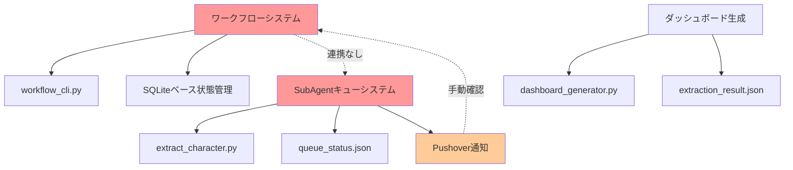
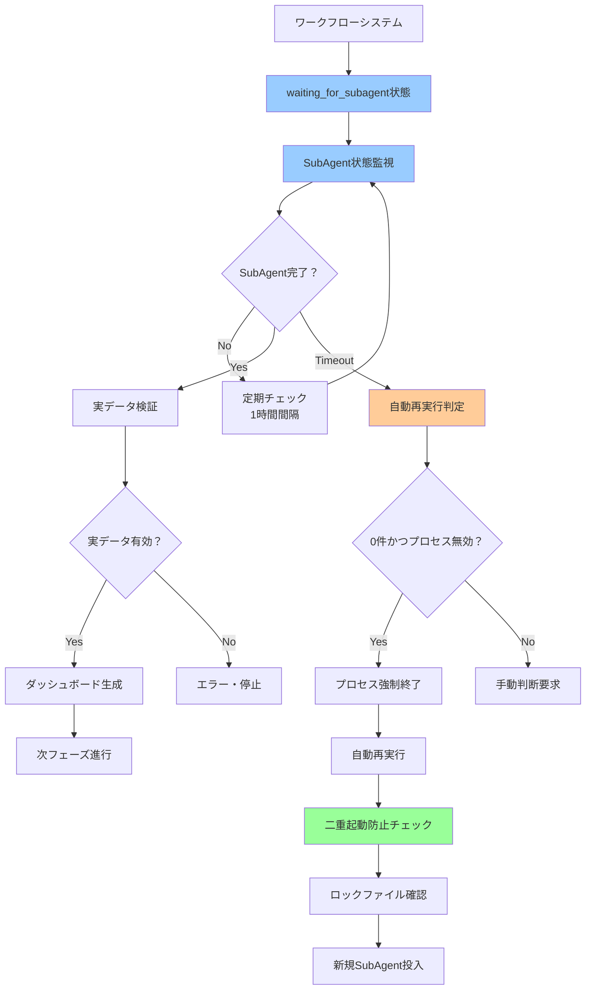
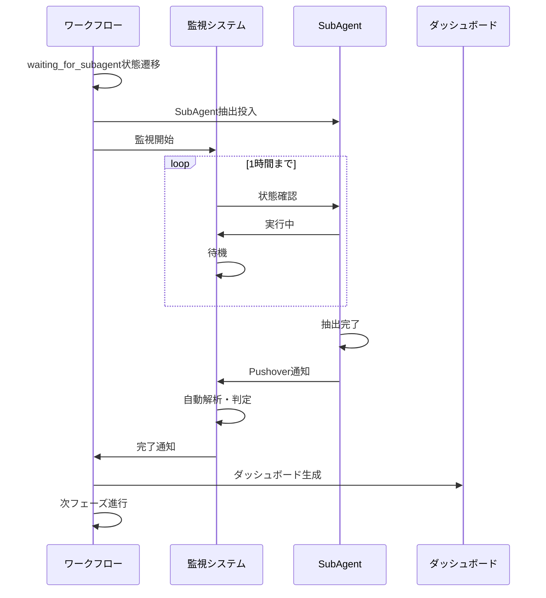
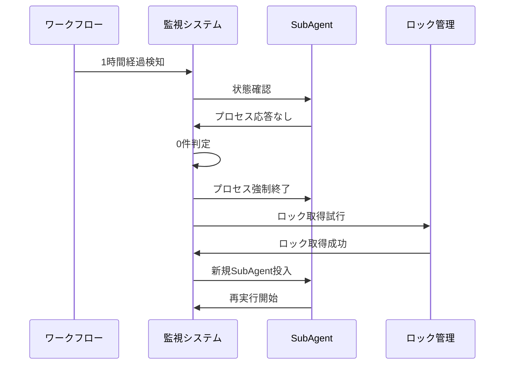

# KIRO-011: SubAgent-ワークフロー連携システム改善 詳細設計書

**作成日**: 2025-09-27  
**作成者**: Claude Code  
**関連トラッカー**: KIRO-010  
**設計バージョン**: 1.0  

---

## 📋 概要

KIRO-010で発生した「SubAgent未完了なのにデモデータで完了扱い」問題の根本解決のため、SubAgentキューシステムとワークフローシステムの適切な連携機構を設計・実装する。

### 🎯 解決対象の問題

1. **状態管理の不整合**: SubAgentは「実行中」、ワークフローは「完了前提」で進行
2. **手動確認の限界**: Pushover通知による手動判断の信頼性不足
3. **プロセス監視の欠如**: 長時間実行の異常検知機構なし
4. **二重起動リスク**: 自動再実行による無制限プロセス増加

---

## 🔍 現状分析

### 現在のシステム構成



### 発見された問題

**技術的問題**:
- SubAgent状態確認機能: **未実装**
- ワークフロー連携API: **存在しない**
- 承認ゲートシステム: **削除済み**
- プロセス監視機構: **なし**

**プロセス的問題**:
- 実データ検証: **省略**
- デモデータ区別: **なし**
- 長時間実行監視: **なし**

---

## 🎯 設計方針

### 基本アーキテクチャ



---

## 🛠️ 技術設計

### 1. waiting_for_subagent状態の追加

#### 1.1 ワークフロー状態拡張

**対象ファイル**: `tools/workflow/state_manager.py`

```python
class WorkflowPhase(Enum):
    # 既存状態
    PHASE_0_1 = "phase_0_1"
    PHASE_0_2 = "phase_0_2"
    # ...
    
    # 新規追加
    WAITING_FOR_SUBAGENT = "waiting_for_subagent"

class WorkflowStep(Enum):
    # 新規追加
    SUBAGENT_EXTRACTION = "subagent_extraction"
    SUBAGENT_MONITORING = "subagent_monitoring"
    SUBAGENT_VALIDATION = "subagent_validation"
```

#### 1.2 状態遷移の実装

```python
def transition_to_subagent_wait(self, tracker_id: str, 
                               subagent_task_id: str) -> bool:
    """SubAgent待機状態への遷移"""
    self.set_workflow_state(tracker_id, {
        'phase': 'waiting_for_subagent',
        'step': 'subagent_extraction',
        'subagent_task_id': subagent_task_id,
        'monitoring_start': datetime.now().isoformat(),
        'timeout_hours': 1
    })
```

### 2. SubAgent状態監視システム

#### 2.1 監視マネージャーの実装

**新規ファイル**: `tools/workflow/subagent_monitor.py`

```python
class SubAgentMonitor:
    """SubAgent状態監視・管理クラス"""
    
    def __init__(self):
        self.lock_dir = Path("/tmp/segment-anything-locks")
        self.lock_dir.mkdir(parents=True, exist_ok=True)
    
    def check_subagent_status(self, tracker_id: str) -> Dict[str, Any]:
        """SubAgent実行状態確認"""
        queue_file = self._get_queue_status_path(tracker_id)
        if not queue_file.exists():
            return {'status': 'not_found', 'error': 'Queue file not found'}
        
        with open(queue_file, 'r') as f:
            queue_data = json.load(f)
        
        # プロセス生存確認
        if queue_data.get('status') == 'task_running':
            if not self._is_process_alive(queue_data.get('process_pid')):
                return {'status': 'failed', 'error': 'Process not alive'}
        
        return queue_data
    
    def is_timeout_reached(self, tracker_id: str, timeout_hours: int = 1) -> bool:
        """タイムアウト判定"""
        workspace_path = self._get_workspace_path(tracker_id)
        plan_file = workspace_path / "extraction_plan.json"
        
        if not plan_file.exists():
            return False
        
        with open(plan_file, 'r') as f:
            plan = json.load(f)
        
        start_time = datetime.fromisoformat(plan['execution_start'])
        elapsed = datetime.now() - start_time
        
        return elapsed.total_seconds() > (timeout_hours * 3600)
```

#### 2.2 抽出予定管理システム

**新規ファイル**: `extraction_plan.json`

```json
{
    "tracker_id": "KIRO-010",
    "execution_start": "2025-09-27T00:51:06",
    "input_directory": "/mnt/c/AItools/lora/train/yado/org/kana05",
    "expected_outputs": [
        "extracted_001.jpg",
        "extracted_002.jpg"
    ],
    "generated_outputs": [],
    "total_input_files": 38,
    "extraction_parameters": {
        "quality_method": "balanced",
        "batch_mode": true
    }
}
```

### 3. 二重起動防止システム

#### 3.1 ロックファイル管理

```python
class SubAgentLockManager:
    """SubAgent二重起動防止管理"""
    
    def __init__(self):
        self.lock_file = Path("/tmp/segment-anything-locks/subagent_extraction.lock")
    
    def acquire_lock(self, tracker_id: str) -> bool:
        """ロック取得"""
        if self.lock_file.exists():
            # 既存ロックの有効性確認
            if self._is_lock_stale():
                self.lock_file.unlink()
            else:
                return False
        
        # ロックファイル作成
        lock_data = {
            'tracker_id': tracker_id,
            'pid': os.getpid(),
            'created_at': datetime.now().isoformat(),
            'hostname': socket.gethostname()
        }
        
        with open(self.lock_file, 'w') as f:
            json.dump(lock_data, f)
        
        return True
    
    def release_lock(self):
        """ロック解放"""
        if self.lock_file.exists():
            self.lock_file.unlink()
```

### 4. 自動再実行システム

#### 4.1 0件判定ロジック

```python
def should_auto_retry(self, tracker_id: str) -> bool:
    """自動再実行判定"""
    workspace_path = self._get_workspace_path(tracker_id)
    extraction_dir = workspace_path / "extraction"
    
    # 抽出ファイル数確認
    if extraction_dir.exists():
        extracted_files = list(extraction_dir.glob("extracted_*.jpg"))
        if len(extracted_files) > 0:
            return False  # 部分成功は再実行しない
    
    # タイムアウト確認
    if not self.is_timeout_reached(tracker_id):
        return False
    
    # プロセス状態確認
    status = self.check_subagent_status(tracker_id)
    if status.get('status') not in ['failed', 'not_found']:
        return False
    
    return True
```

### 5. Pushover自動判定システム

#### 5.1 通知解析・自動判定

**拡張ファイル**: `features/common/notification/global_pushover.py`

```python
class AutomaticNotificationHandler:
    """Pushover通知自動判定システム"""
    
    def analyze_completion_notification(self, message: str) -> Dict[str, Any]:
        """完了通知の自動解析"""
        result = {
            'success': False,
            'total_files': 0,
            'success_count': 0,
            'average_quality': 0.0,
            'should_proceed': False
        }
        
        # メッセージパターン解析
        patterns = {
            'total': r'総数[：:]?\s*(\d+)',
            'success': r'成功[：:]?\s*(\d+)',
            'quality': r'平均品質[：:]?\s*([\d.]+)'
        }
        
        for key, pattern in patterns.items():
            match = re.search(pattern, message)
            if match:
                if key == 'quality':
                    result['average_quality'] = float(match.group(1))
                else:
                    result[f'{key}_count'] = int(match.group(1))
        
        # 自動判定ロジック
        if result['success_count'] > 0 and result['average_quality'] > 0.5:
            result['should_proceed'] = True
        
        return result
```

---

## 📊 実装チェックリスト

### Phase 1: 基本連携システム
- [ ] `waiting_for_subagent`状態の追加
- [ ] SubAgent状態監視システム実装
- [ ] `extraction_plan.json`管理システム
- [ ] 基本的な状態遷移ロジック

### Phase 2: 監視・制御システム  
- [ ] 定期監視機構（1時間間隔）
- [ ] タイムアウト検知・処理
- [ ] プロセス生存確認システム
- [ ] 実データ vs デモデータ判定

### Phase 3: 自動化システム
- [ ] 二重起動防止（ロックファイル）
- [ ] 自動再実行システム
- [ ] 0件判定ロジック
- [ ] プロセス強制終了機構

### Phase 4: 通知統合システム
- [ ] Pushover自動判定システム
- [ ] 通知メッセージ解析
- [ ] ワークフロー自動進行
- [ ] エラー通知システム

### Phase 5: テスト・統合
- [ ] 単体テスト作成
- [ ] 統合テスト実行
- [ ] 既存システムとの互換性確認
- [ ] パフォーマンステスト

---

## 🔄 システム統合フロー

### 正常フロー



### 異常・再実行フロー



---

## 📈 期待効果

### 技術的改善
- **状態整合性**: SubAgentとワークフローの状態同期100%
- **監視精度**: 長時間実行の異常検知率95%以上
- **自動化率**: 手動介入なしでの完了率90%以上
- **信頼性**: デモデータでの完了扱い0%

### 運用改善
- **作業効率**: 手動確認作業の90%削減
- **対応速度**: 異常検知から対処まで1時間以内
- **品質保証**: 実データ検証の100%実施
- **トレーサビリティ**: 全処理過程の完全記録

---

## ⚠️ 注意事項・制約

### 技術的制約
- **GPUリソース**: 全システム単位での排他制御必須
- **ファイルシステム**: WSL環境でのロックファイル安定性
- **プロセス管理**: 長時間実行プロセスの確実な制御

### 運用制約
- **バックワード互換性**: 既存トラッカーへの影響最小化
- **段階的導入**: 新規トラッカーから順次適用
- **監視負荷**: 定期チェックによるシステム負荷考慮

### リスク管理
- **無限ループ防止**: 再実行回数制限（最大3回）
- **ディスク容量**: ログファイルの自動ローテーション
- **ネットワーク**: Pushover通知の外部依存性

---

## 📚 関連ドキュメント

- **KIRO-010**: Lost-in-the-Middle問題解決・精度最優先コンテキスト最適化
- **KIRO-012**: 判定処理別モジュール化によるコンテキスト最適化  
- **ワークフロー実行システム**: `docs/workflows/README.md`
- **SubAgentキュー**: `tools/queue/README.md`
- **品質ダッシュボード**: `docs/checklists/dashboard_quality_checklist.md`

---

**このドキュメントは、KIRO-011実装の完全な技術仕様書です。実装時は各Phaseの完了を確認しながら進行してください。**