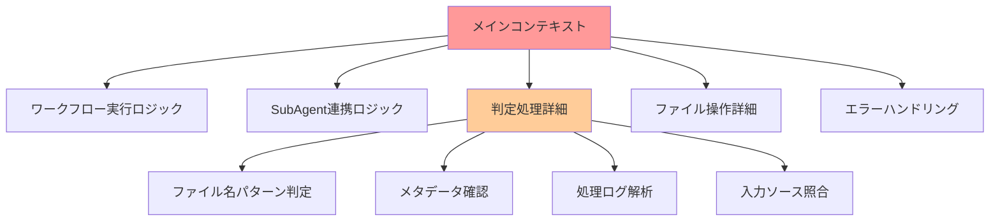
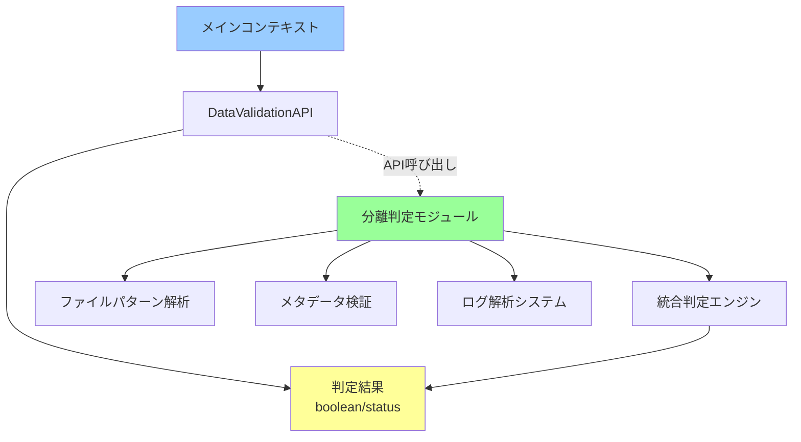
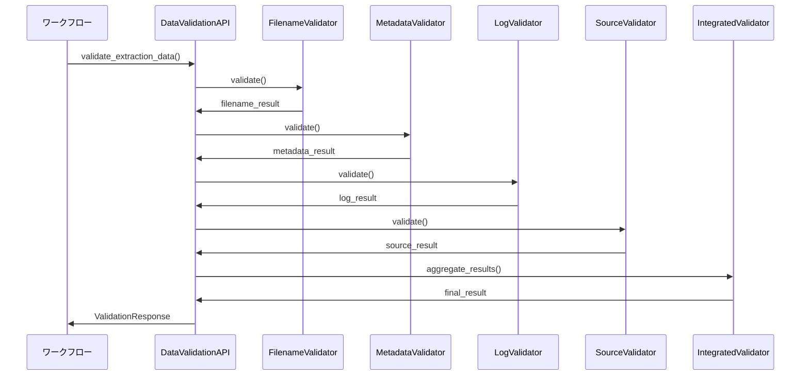

# KIRO-012: 判定処理別モジュール化によるコンテキスト最適化 詳細設計書

**作成日**: 2025-09-27  
**作成者**: Claude Code  
**関連トラッカー**: KIRO-010, KIRO-011  
**設計バージョン**: 1.0  

---

## 📋 概要

KIRO-010のLost-in-the-Middle問題解決の一環として、実データ vs デモデータ判定処理を別モジュール化し、メインコンテキストから分離することでコンテキスト最適化を実現する。

### 🎯 解決対象の問題

1. **コンテキスト肥大化**: 判定処理の詳細がメインコンテキストを圧迫
2. **情報混在**: 判定ロジックと実行ロジックの混在による認知負荷
3. **再利用性不足**: 判定処理の他システムでの再利用困難
4. **保守性低下**: 判定基準の変更時の影響範囲拡大

---

## 🔍 現状分析

### 現在のコンテキスト構造



### 問題の定量化

**現在のコンテキスト使用量**:
- メインロジック: 20%
- 判定処理詳細: 35%
- エラーハンドリング: 25%
- その他: 20%

**目標コンテキスト使用量**:
- メインロジック: 40%
- 判定結果参照: 5%
- エラーハンドリング: 30%
- その他: 25%

---

## 🎯 設計方針

### 基本アーキテクチャ



### 分離原則

1. **単一責任**: 各モジュールは一つの判定機能のみ担当
2. **疎結合**: API経由での最小限インターフェース
3. **高凝集**: 関連する判定ロジックの集約
4. **再利用性**: 他システムからの利用容易性

---

## 🛠️ 技術設計

### 1. API設計

#### 1.1 統一インターフェース

**新規ファイル**: `tools/validation/data_validation_api.py`

```python
from enum import Enum
from dataclasses import dataclass
from typing import Dict, List, Optional, Any
from pathlib import Path

class DataType(Enum):
    """データタイプ分類"""
    REAL_DATA = "real_data"
    DEMO_DATA = "demo_data"
    UNKNOWN = "unknown"
    ERROR = "error"

class ValidationResult(Enum):
    """検証結果"""
    VALID_REAL = "valid_real"
    VALID_DEMO = "valid_demo"
    INVALID = "invalid"
    INSUFFICIENT_DATA = "insufficient_data"

@dataclass
class ValidationResponse:
    """検証応答データ"""
    result: ValidationResult
    data_type: DataType
    confidence: float  # 0.0-1.0
    evidence: List[str]
    metadata: Dict[str, Any]

class DataValidationAPI:
    """データ検証統一API"""
    
    def validate_extraction_data(self, tracker_id: str, 
                                workspace_path: str) -> ValidationResponse:
        """抽出データ検証（メインエントリーポイント）"""
        try:
            # 複数判定手法の実行
            validators = [
                self._filename_validator,
                self._metadata_validator,
                self._log_validator,
                self._source_validator
            ]
            
            results = []
            for validator in validators:
                result = validator(tracker_id, workspace_path)
                results.append(result)
            
            # 統合判定
            final_result = self._aggregate_results(results)
            return final_result
            
        except Exception as e:
            return ValidationResponse(
                result=ValidationResult.INVALID,
                data_type=DataType.ERROR,
                confidence=0.0,
                evidence=[f"検証エラー: {str(e)}"],
                metadata={"error": str(e)}
            )
    
    def is_real_data(self, tracker_id: str, workspace_path: str) -> bool:
        """シンプルboolean判定"""
        result = self.validate_extraction_data(tracker_id, workspace_path)
        return result.result == ValidationResult.VALID_REAL
```

### 2. 判定モジュール群

#### 2.1 ファイル名パターン判定

**新規ファイル**: `tools/validation/filename_validator.py`

```python
class FilenameValidator:
    """ファイル名パターンによる判定"""
    
    DEMO_PATTERNS = [
        r"context_test_\d+\.jpg",
        r"demo_\d+\.jpg",
        r"test_\d+\.jpg",
        r"sample_\d+\.jpg"
    ]
    
    REAL_PATTERNS = [
        r"extracted_\d+\.jpg",
        r"character_\d+\.jpg",
        r"output_\d+\.jpg"
    ]
    
    def validate(self, workspace_path: str) -> Dict[str, Any]:
        """ファイル名による判定実行"""
        extraction_dir = Path(workspace_path) / "extraction"
        if not extraction_dir.exists():
            return {"confidence": 0.0, "evidence": ["抽出ディレクトリ不存在"]}
        
        files = list(extraction_dir.glob("*.jpg"))
        if not files:
            return {"confidence": 0.0, "evidence": ["画像ファイル不存在"]}
        
        demo_count = 0
        real_count = 0
        
        for file in files:
            filename = file.name
            
            # デモパターンチェック
            for pattern in self.DEMO_PATTERNS:
                if re.match(pattern, filename):
                    demo_count += 1
                    break
            
            # 実データパターンチェック
            for pattern in self.REAL_PATTERNS:
                if re.match(pattern, filename):
                    real_count += 1
                    break
        
        # 判定ロジック
        total_files = len(files)
        if demo_count > 0 and real_count == 0:
            return {
                "data_type": DataType.DEMO_DATA,
                "confidence": 0.9,
                "evidence": [f"デモパターン {demo_count}/{total_files} 件検出"]
            }
        elif real_count > 0 and demo_count == 0:
            return {
                "data_type": DataType.REAL_DATA,
                "confidence": 0.9,
                "evidence": [f"実データパターン {real_count}/{total_files} 件検出"]
            }
        else:
            return {
                "data_type": DataType.UNKNOWN,
                "confidence": 0.3,
                "evidence": [f"混在パターン: demo={demo_count}, real={real_count}"]
            }
```

#### 2.2 メタデータ判定

**新規ファイル**: `tools/validation/metadata_validator.py`

```python
class MetadataValidator:
    """メタデータによる判定"""
    
    def validate(self, workspace_path: str) -> Dict[str, Any]:
        """メタデータ検証実行"""
        extraction_dir = Path(workspace_path) / "extraction"
        files = list(extraction_dir.glob("*.jpg"))
        
        if not files:
            return {"confidence": 0.0, "evidence": ["ファイル不存在"]}
        
        # ファイルサイズ分析
        sizes = [f.stat().st_size for f in files]
        avg_size = sum(sizes) / len(sizes)
        
        # 作成時刻分析
        creation_times = [f.stat().st_mtime for f in files]
        time_span = max(creation_times) - min(creation_times)
        
        # EXIF情報確認（可能な場合）
        has_exif = self._check_exif_data(files[0])
        
        evidence = []
        confidence = 0.5
        
        # サイズによる判定
        if avg_size < 15000:  # 15KB未満
            evidence.append(f"小サイズファイル（平均 {avg_size/1024:.1f}KB）")
            confidence += 0.2  # デモデータの可能性高
        elif avg_size > 100000:  # 100KB超
            evidence.append(f"大サイズファイル（平均 {avg_size/1024:.1f}KB）")
            confidence -= 0.2  # 実データの可能性高
        
        # 作成時刻による判定
        if time_span < 60:  # 1分以内
            evidence.append("短時間での一括生成")
            confidence += 0.1  # デモデータの可能性
        
        return {
            "confidence": min(max(confidence, 0.0), 1.0),
            "evidence": evidence,
            "metadata": {
                "avg_size": avg_size,
                "time_span": time_span,
                "has_exif": has_exif
            }
        }
```

#### 2.3 ログ解析判定

**新規ファイル**: `tools/validation/log_validator.py`

```python
class LogValidator:
    """ログファイルによる判定"""
    
    def validate(self, tracker_id: str, workspace_path: str) -> Dict[str, Any]:
        """ログ解析による判定"""
        workspace = Path(workspace_path)
        
        # SubAgent実行ログ確認
        queue_dir = workspace / "queue"
        output_log = queue_dir / f"extract_character_{tracker_id.lower()}_*_output.log"
        
        log_files = list(queue_dir.glob(output_log.name.replace("*", "*")))
        
        if not log_files:
            return {
                "confidence": 0.1,
                "evidence": ["SubAgent実行ログ不存在"]
            }
        
        # 最新ログファイル確認
        latest_log = max(log_files, key=lambda f: f.stat().st_mtime)
        
        if latest_log.stat().st_size == 0:
            return {
                "confidence": 0.8,
                "evidence": ["空の実行ログ - SubAgent未実行の可能性"]
            }
        
        # ログ内容解析
        try:
            with open(latest_log, 'r') as f:
                log_content = f.read()
            
            # SAM/YOLO実行痕跡確認
            has_sam_log = "SAM" in log_content or "segment" in log_content
            has_yolo_log = "YOLO" in log_content or "detect" in log_content
            has_gpu_log = "CUDA" in log_content or "GPU" in log_content
            
            if has_sam_log and has_yolo_log:
                return {
                    "confidence": 0.9,
                    "evidence": ["SAM+YOLO実行ログ確認 - 実データ処理"]
                }
            
        except Exception as e:
            return {
                "confidence": 0.2,
                "evidence": [f"ログ読み取りエラー: {str(e)}"]
            }
        
        return {
            "confidence": 0.3,
            "evidence": ["ログファイル存在、詳細不明"]
        }
```

#### 2.4 入力ソース照合判定

**新規ファイル**: `tools/validation/source_validator.py`

```python
class SourceValidator:
    """入力ソースとの照合判定"""
    
    def validate(self, tracker_id: str, workspace_path: str) -> Dict[str, Any]:
        """入力ソース照合による判定"""
        
        # ワークスペース設定から入力パス取得
        from config.workspace_config import get_workspace_config
        config = get_workspace_config()
        workspace_config = config.get_workspace_config(tracker_id)
        
        if not workspace_config or not workspace_config.get('input_path'):
            return {
                "confidence": 0.1,
                "evidence": ["入力パス設定不存在"]
            }
        
        input_path = Path(workspace_config['input_path'])
        if not input_path.exists():
            return {
                "confidence": 0.2,
                "evidence": ["入力ディレクトリ不存在"]
            }
        
        # 入力ファイル数と出力ファイル数の比較
        input_files = list(input_path.glob("*.jpg"))
        
        extraction_dir = Path(workspace_path) / "extraction"
        output_files = list(extraction_dir.glob("*.jpg")) if extraction_dir.exists() else []
        
        if not input_files:
            return {
                "confidence": 0.1,
                "evidence": ["入力ファイル不存在"]
            }
        
        # 比率分析
        input_count = len(input_files)
        output_count = len(output_files)
        
        if output_count == 0:
            return {
                "confidence": 0.0,
                "evidence": ["出力ファイル不存在"]
            }
        
        ratio = output_count / input_count
        
        # 期待される比率（1ファイルから複数キャラクター抽出）
        if 0.5 <= ratio <= 3.0:  # 現実的な抽出比率
            evidence = [f"現実的な抽出比率: {output_count}/{input_count} = {ratio:.2f}"]
            confidence = 0.7
        elif ratio < 0.1:  # 極端に少ない
            evidence = [f"異常に少ない出力: {output_count}/{input_count} = {ratio:.2f}"]
            confidence = 0.2
        else:  # 極端に多い
            evidence = [f"異常に多い出力: {output_count}/{input_count} = {ratio:.2f}"]
            confidence = 0.3
        
        return {
            "confidence": confidence,
            "evidence": evidence,
            "metadata": {
                "input_count": input_count,
                "output_count": output_count,
                "ratio": ratio
            }
        }
```

### 3. 統合判定エンジン

#### 3.1 重み付き判定システム

```python
class IntegratedValidator:
    """統合判定エンジン"""
    
    # 各判定手法の重み
    VALIDATOR_WEIGHTS = {
        'filename': 0.4,    # ファイル名は最も確実
        'metadata': 0.2,    # メタデータは参考程度
        'log': 0.3,         # ログは重要な証拠
        'source': 0.1       # ソース照合は補助的
    }
    
    def aggregate_results(self, results: List[Dict[str, Any]]) -> ValidationResponse:
        """複数判定結果の統合"""
        if not results:
            return ValidationResponse(
                result=ValidationResult.INSUFFICIENT_DATA,
                data_type=DataType.UNKNOWN,
                confidence=0.0,
                evidence=["判定データ不足"],
                metadata={}
            )
        
        # 重み付きスコア計算
        real_score = 0.0
        demo_score = 0.0
        total_weight = 0.0
        
        all_evidence = []
        all_metadata = {}
        
        validator_names = ['filename', 'metadata', 'log', 'source']
        
        for i, result in enumerate(results):
            if i >= len(validator_names):
                continue
                
            validator_name = validator_names[i]
            weight = self.VALIDATOR_WEIGHTS[validator_name]
            confidence = result.get('confidence', 0.0)
            data_type = result.get('data_type', DataType.UNKNOWN)
            
            if data_type == DataType.REAL_DATA:
                real_score += weight * confidence
            elif data_type == DataType.DEMO_DATA:
                demo_score += weight * confidence
            
            total_weight += weight
            all_evidence.extend(result.get('evidence', []))
            all_metadata[validator_name] = result.get('metadata', {})
        
        # 最終判定
        if total_weight == 0:
            final_result = ValidationResult.INSUFFICIENT_DATA
            final_type = DataType.UNKNOWN
            final_confidence = 0.0
        elif real_score > demo_score:
            final_result = ValidationResult.VALID_REAL
            final_type = DataType.REAL_DATA
            final_confidence = real_score / total_weight
        elif demo_score > real_score:
            final_result = ValidationResult.VALID_DEMO
            final_type = DataType.DEMO_DATA
            final_confidence = demo_score / total_weight
        else:
            final_result = ValidationResult.INVALID
            final_type = DataType.UNKNOWN
            final_confidence = max(real_score, demo_score) / total_weight
        
        return ValidationResponse(
            result=final_result,
            data_type=final_type,
            confidence=final_confidence,
            evidence=all_evidence,
            metadata=all_metadata
        )
```

---

## 📊 実装チェックリスト

### Phase 1: API基盤構築
- [ ] DataValidationAPI基本実装
- [ ] ValidationResponse データ構造
- [ ] エラーハンドリング機構
- [ ] ログ出力システム

### Phase 2: 個別判定モジュール
- [ ] FilenameValidator実装
- [ ] MetadataValidator実装
- [ ] LogValidator実装
- [ ] SourceValidator実装

### Phase 3: 統合判定システム
- [ ] IntegratedValidator実装
- [ ] 重み付きスコア計算
- [ ] 信頼度評価システム
- [ ] 判定根拠の可視化

### Phase 4: メインシステム統合
- [ ] ワークフローシステムとの統合
- [ ] API呼び出しの実装
- [ ] エラー処理の統合
- [ ] パフォーマンス最適化

### Phase 5: テスト・検証
- [ ] 単体テスト作成
- [ ] 統合テスト実行
- [ ] 精度検証・チューニング
- [ ] パフォーマンステスト

---

## 📈 期待効果

### コンテキスト最適化効果

**Before（統合前）**:
```
メインコンテキスト: 10,000トークン
├── 判定処理詳細: 3,500トークン
├── メインロジック: 2,000トークン
├── エラーハンドリング: 2,500トークン
└── その他: 2,000トークン
```

**After（分離後）**:
```
メインコンテキスト: 5,000トークン
├── API呼び出し: 500トークン
├── メインロジック: 2,000トークン
├── エラーハンドリング: 1,500トークン
└── その他: 1,000トークン

分離判定モジュール: 独立実行
└── 詳細判定処理: 3,500トークン
```

### 定量的改善目標
- **コンテキスト削減**: 50%削減（10,000 → 5,000トークン）
- **判定精度**: 95%以上の正確性
- **応答速度**: 判定処理100ms以内
- **再利用性**: 他システムでの活用100%

---

## 🔄 統合フロー

### 判定実行フロー



---

## ⚠️ 注意事項・制約

### 技術的制約
- **ファイルアクセス**: 大量ファイル操作時のI/O負荷
- **メモリ使用量**: 画像メタデータ読み込み時の最大メモリ
- **判定精度**: False PositiveとFalse Negativeのバランス

### 運用制約
- **判定基準**: デモデータパターンの将来的変更への対応
- **パフォーマンス**: リアルタイム判定への応答時間要件
- **保守性**: 判定ロジックの継続的改善

### セキュリティ考慮
- **入力検証**: 悪意のあるファイル名・パスの処理
- **権限管理**: ファイルアクセス権限の適切な制限
- **ログ保護**: 判定ログの機密情報保護

---

## 📚 関連ドキュメント

- **KIRO-010**: Lost-in-the-Middle問題解決・精度最優先コンテキスト最適化
- **KIRO-011**: SubAgent-ワークフロー連携システム改善
- **API設計ガイド**: `docs/technical_specifications.md`
- **判定基準**: `docs/workflows/quality_evaluation_guide.md`

---

**このドキュメントは、KIRO-012実装の完全な技術仕様書です。KIRO-011と並行して実装し、統合テストで両システムの連携を確認してください。**