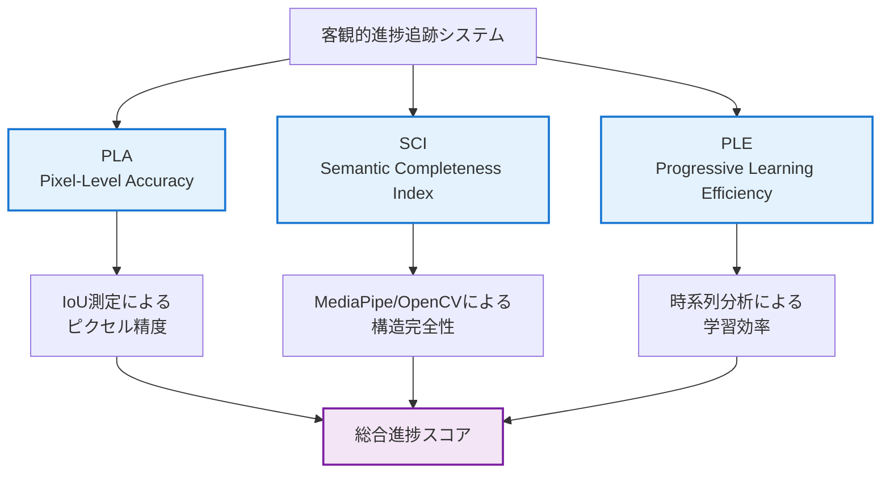

# 客観的進捗追跡システム

**作成日**: 2025-07-24  
**目的**: スクラップ&ビルドを防止し、継続的改善を数値的に追跡

## 🎯 システム概要

### 設計目的
従来の**主観的進捗評価**から**客観的数値追跡**に完全移行し、以下を実現：

1. **進捗の可視化**: 日次・週次・月次での数値的進捗確認
2. **退行の即座検出**: 性能悪化を自動的に検出・アラート
3. **マイルストーン追跡**: 明確な目標に対する達成度測定
4. **効率性監視**: スクラップ&ビルドの防止

### 核心指標（3指標システム）


## 📊 日次進捗追跡

### 日次監視ダッシュボード

#### 基本指標表示
```yaml
Daily_Progress_Dashboard:
  日付: 2025-07-24
  
  核心指標:
    PLA_平均: 0.823 ± 0.045  # 目標: 0.75+ ✅
    SCI_平均: 0.756 ± 0.028  # 目標: 0.70+ ✅
    PLE_効率: 0.127          # 目標: 0.10+ ✅
  
  トレンド分析:
    PLA_7日傾向: ↗️ +0.012/day
    SCI_7日傾向: ↗️ +0.008/day
    PLE_7日傾向: ↗️ +0.015/day
  
  マイルストーン進捗:
    Phase_A1: 97.5% 完了 (PLA基盤)
    Phase_A2: 89.2% 完了 (SCI基盤)
    全体進捗: 67.8% (Phase C目標まで)
  
  アラート: なし ✅
  推奨アクション: 現手法継続
```

#### 詳細統計
```python
class DailyProgressTracker:
    """日次進捗追跡システム"""
    
    def __init__(self):
        self.current_targets = {
            'phase_a': {'pla': 0.75, 'sci': 0.70, 'ple': 0.10},
            'phase_b': {'pla': 0.80, 'sci': 0.75, 'ple': 0.12},
            'phase_c': {'pla': 0.85, 'sci': 0.80, 'ple': 0.15}
        }
        self.history_file = "progress_history.json"
        
    def track_daily_progress(self, evaluation_result: ObjectiveEvaluationReport) -> DailyProgressReport:
        """日次進捗の追跡と分析"""
        
        # 現在の性能指標
        current_metrics = {
            'pla_mean': evaluation_result.pla_statistics.mean,
            'pla_std': evaluation_result.pla_statistics.std,
            'sci_mean': evaluation_result.sci_statistics.mean,
            'sci_std': evaluation_result.sci_statistics.std,
            'ple_score': evaluation_result.ple_result.ple_score
        }
        
        # 履歴データの更新
        self.update_progress_history(current_metrics)
        
        # トレンド分析
        trend_analysis = self.analyze_trends()
        
        # マイルストーン進捗計算
        milestone_progress = self.calculate_milestone_progress(current_metrics)
        
        # アラート検出
        alerts = self.detect_alerts(current_metrics, trend_analysis)
        
        # 推奨アクション生成
        recommendations = self.generate_recommendations(current_metrics, trend_analysis, alerts)
        
        return DailyProgressReport(
            date=datetime.now().date(),
            current_metrics=current_metrics,
            trend_analysis=trend_analysis,
            milestone_progress=milestone_progress,
            alerts=alerts,
            recommendations=recommendations,
            overall_health_score=self.calculate_health_score(current_metrics, trend_analysis)
        )
```

### 実行コマンド例
```bash
# 日次進捗追跡の実行
python tools/daily_progress_tracker.py --date today --generate-report

# 出力例
===========================================
📊 日次進捗レポート - 2025-07-24
===========================================

🎯 核心指標の状況:
  PLA (Pixel Accuracy): 0.823 ± 0.045 ✅ (目標: 0.75+)
  SCI (Completeness):   0.756 ± 0.028 ✅ (目標: 0.70+)
  PLE (Learning Eff.):  0.127 ✅ (目標: 0.10+)

📈 7日間トレンド:
  PLA: ↗️ +0.012/day (改善中)
  SCI: ↗️ +0.008/day (改善中)
  PLE: ↗️ +0.015/day (改善中)

🎯 マイルストーン進捗:
  Phase A1 (PLA基盤): 97.5% 完了 🔥
  Phase A2 (SCI基盤): 89.2% 完了 📊
  全体進捗: 67.8% 完了

⚠️ アラート: なし ✅

💡 推奨アクション:
  - 現在の手法は効果的 - 継続推奨
  - Phase A2完了に向けてSCI平均値0.70+を安定維持
  - Phase B準備開始を検討

📅 次のマイルストーン: Phase A2 (SCI基盤) - 残り10.8%
```

## 🎯 マイルストーン管理

### マイルストーン定義
```yaml
Project_Milestones:
  
  Phase_A1_PLA_Foundation:
    name: "PLA測定システム完全自動化"
    targets:
      pla_mean: 0.75
      automation_rate: 1.0
      processing_speed: "< 1秒/画像"
    deadline: "2025-08-07"
    priority: "critical"
    dependencies: []
    prerequisites:
      - "正解マスク15枚作成完了"
      - "PLA評価システム稼働確認"
    
  Phase_A2_SCI_Foundation:
    name: "SCI計算システム実装"
    targets:
      sci_mean: 0.70
      face_detection_rate: 0.90
      pose_detection_rate: 0.80
    deadline: "2025-08-14"
    priority: "critical"
    dependencies: ["Phase_A1_PLA_Foundation"]
    
  Phase_B1_Multilayer_Features:
    name: "多層特徴抽出システム"
    targets:
      feature_dimensions: 200
      redundancy_rate: "< 0.10"
      extraction_speed: "< 5秒/画像"
    deadline: "2025-08-28"
    priority: "high"
    dependencies: ["Phase_A2_SCI_Foundation"]
    
  Phase_B2_Adaptive_Reasoning:
    name: "適応的推論エンジン"
    targets:
      ple_score: 0.12
      reasoning_paths: 8
      decision_accuracy: 0.85
    deadline: "2025-09-04"
    priority: "high"
    dependencies: ["Phase_B1_Multilayer_Features"]
    
  Phase_C1_Integrated_Pipeline:
    name: "Claude風統合パイプライン"
    targets:
      pla_mean: 0.85
      sci_mean: 0.80
      ple_score: 0.15
      human_correlation: 0.90
    deadline: "2025-09-25"
    priority: "critical"
    dependencies: ["Phase_B2_Adaptive_Reasoning"]
```

### マイルストーン自動追跡
```python
class MilestoneManager:
    """マイルストーン管理システム"""
    
    def __init__(self, milestones_config: str):
        self.milestones = self.load_milestones_config(milestones_config)
        self.completion_history = self.load_completion_history()
    
    def track_milestone_progress(self, current_metrics: Dict) -> MilestoneTrackingReport:
        """マイルストーン進捗追跡"""
        
        milestone_statuses = {}
        
        for milestone_id, milestone in self.milestones.items():
            status = self.evaluate_milestone_status(milestone, current_metrics)
            milestone_statuses[milestone_id] = status
            
            # 完了チェック
            if status.completion_rate >= 1.0 and not status.completed:
                self.mark_milestone_completed(milestone_id, datetime.now())
                
        # 次のマイルストーンの特定
        next_milestone = self.identify_next_milestone(milestone_statuses)
        
        # 遅延リスク分析
        delay_risks = self.analyze_delay_risks(milestone_statuses)
        
        return MilestoneTrackingReport(
            milestone_statuses=milestone_statuses,
            next_milestone=next_milestone,
            delay_risks=delay_risks,
            overall_project_progress=self.calculate_overall_progress(milestone_statuses)
        )
```

## 🚨 アラートシステム

### アラート分類と対応
```python
class ProgressAlertSystem:
    """進捗アラートシステム"""
    
    def __init__(self):
        self.alert_thresholds = {
            # 性能閾値
            'pla_critical_drop': 0.05,      # PLA 5%以上低下
            'sci_critical_drop': 0.05,      # SCI 5%以上低下
            'ple_regression': -0.05,        # PLE マイナス5%
            
            # トレンド閾値
            'negative_trend_days': 3,       # 3日連続悪化
            'stagnation_days': 5,           # 5日間変化なし
            
            # マイルストーン閾値
            'milestone_delay_days': 7,      # マイルストーン7日遅延
            'phase_completion_risk': 0.8    # フェーズ完了リスク80%
        }
    
    def check_all_alerts(self, current_report: DailyProgressReport, 
                        history: List[DailyProgressReport]) -> List[ProgressAlert]:
        """全アラートのチェック"""
        alerts = []
        
        # 1. 性能急落アラート
        alerts.extend(self.check_performance_drops(current_report, history))
        
        # 2. トレンド悪化アラート
        alerts.extend(self.check_trend_deterioration(current_report, history))
        
        # 3. 停滞アラート
        alerts.extend(self.check_stagnation(history))
        
        # 4. マイルストーン遅延アラート
        alerts.extend(self.check_milestone_delays(current_report))
        
        # 5. 学習効率アラート
        alerts.extend(self.check_learning_efficiency(current_report, history))
        
        return alerts
```

## 📈 継続監視システム

### 日次・週次・月次レポート自動生成
```bash
# 自動化された監視システム
python tools/setup_monitoring.py --enable-daily-reports --enable-weekly-summaries --enable-monthly-milestones

# 個別レポート生成
python tools/generate_progress_report.py --type daily --date 2025-07-24
python tools/generate_progress_report.py --type weekly --week-start 2025-07-21
python tools/generate_progress_report.py --type monthly --month 2025-07
```

### 通知システム統合
```python
class ProgressNotificationSystem:
    """進捗通知システム"""
    
    def send_daily_summary(self, daily_report: DailyProgressReport):
        """日次サマリー通知"""
        if daily_report.alerts:
            self.send_urgent_notification(daily_report)
        else:
            self.send_routine_notification(daily_report)
    
    def send_milestone_achievement(self, milestone_name: str, achievement_percentage: float):
        """マイルストーン達成通知"""
        emoji = "🎉" if achievement_percentage >= 1.0 else "📊"
        message = f"{emoji} マイルストーン更新: {milestone_name} - {achievement_percentage:.1%} 達成"
        self.send_notification(message)
```

## 🔄 継続改善サイクル

### PDCA サイクル統合
```python
class ContinuousImprovementCycle:
    """継続改善サイクル管理"""
    
    def execute_pdca_cycle(self, current_progress: DailyProgressReport) -> PDCACycleResult:
        """PDCA サイクルの実行"""
        
        # Plan: 改善計画の立案
        improvement_plan = self.plan_phase(current_progress)
        
        # Do: 改善施策の実行
        execution_result = self.do_phase(improvement_plan)
        
        # Check: 結果の客観的評価
        evaluation_result = self.check_phase(execution_result, current_progress)
        
        # Act: 次サイクルへの反映
        next_cycle_plan = self.act_phase(evaluation_result)
        
        return PDCACycleResult(
            cycle_number=self.current_cycle,
            plan=improvement_plan,
            execution=execution_result,
            evaluation=evaluation_result,
            next_actions=next_cycle_plan
        )
```

## 📋 使用方法・導入手順

### Step 1: システム初期化
```bash
# 進捗追跡システムのセットアップ
python tools/setup_progress_tracker.py --initialize

# 基準データの設定
python tools/set_baseline_metrics.py --from-current-results

# マイルストーン設定の読み込み
python tools/load_milestones.py --config config/milestones.yml
```

### Step 2: 日次監視の開始
```bash
# 日次監視の有効化
python tools/enable_daily_monitoring.py --auto-report --notifications

# 手動実行
python tools/daily_progress_tracker.py --date today --full-analysis
```

### Step 3: アラートシステムの設定
```bash
# アラート設定
python tools/configure_alerts.py --pushover-config config/pushover.json --thresholds config/alert_thresholds.yml

# テスト通知
python tools/test_notifications.py --type daily_summary
```

## 👤 ユーザータスク管理

### 正解マスク作成タスク（Phase A準備）

#### 目的
PLA（Pixel-Level Accuracy）評価のための高品質Ground Truthデータ作成

#### 進捗状況
```yaml
total_target: 15枚
completed: 18枚
remaining: 0枚（目標達成）
progress: 120.0%
last_updated: 2025-07-26

completed_files:
  kana05_series: 4枚
    - kana05_0000_cover.jpg → kana05_0000_cover_gt.png ✅ (2025-07-26)
    - kana05_0022.jpg → kana05_0022_gt.png ✅ (2025-07-26)
    - kana05_0028.jpg → kana05_0028_gt.png ✅ (2025-07-26)
    - kana05_0034.jpg → kana05_0034_gt.png ✅ (2025-07-26)
  
  kana07_series: 7枚
    - kana07_0000_cover.jpg → kana07_0000_cover_gt.png ✅ (2025-07-26)
    - kana07_0003.jpg → kana07_0003_gt.png ✅ (2025-07-26)
    - kana07_0011.jpg → kana07_0011_gt.png ✅ (2025-07-26)
    - kana07_0013.jpg → kana07_0013_gt.png ✅ (2025-07-26)
    - kana07_0026.jpg → kana07_0026_gt.png ✅ (2025-07-26)
    - kana07_0030.jpg → kana07_0030_gt.png ✅ (2025-07-26)
    - kana07_0031.jpg → kana07_0031_gt.png ✅ (2025-07-26)
  
  kana08_series: 7枚
    - kana08_0000_cover.jpg → kana08_0000_cover_gt.png ✅ (2025-07-25)
    - kana08_0001.jpg → kana08_0001_gt.png ✅ (2025-07-25)
    - kana08_0002.jpg → kana08_0002_gt.png ✅ (2025-07-25)
    - kana08_0010.jpg → kana08_0010_gt.png ✅ (2025-07-25)
    - kana08_0015.jpg → kana08_0015_gt.png ✅ (2025-07-25)
    - kana08_0022.jpg → kana08_0022_gt.png ✅ (2025-07-25)
    - kana08_0023.jpg → kana08_0023_gt.png ✅ (2025-07-25)

validation_status:
  全マスク品質検証: ✅ 合格（品質スコア1.000）
  バイナリ化修正: ✅ 全18枚自動修正完了
```

#### 作業仕様
```yaml
tool: FireAlpaca
format:
  character: 純白（#FFFFFF）
  background: 純黒（#000000）
save_format: PNG（アルファチャンネルなし）
naming_convention: "{元画像名}_gt.png"
quality_requirements:
  - 輪郭の正確なトレース（髪の毛、服装の細部含む）
  - ピクセル単位での明確な境界
  - 一貫した白黒バイナリマスク
```

#### 保存場所
```yaml
kana08_series: /mnt/c/AItools/lora/train/yado/org/kana08_cursor_fix/
kana07_series: /mnt/c/AItools/lora/train/yado/org/kana07_cursor_fix/  # 新規作成予定
kana05_series: /mnt/c/AItools/lora/train/yado/org/kana05_cursor_fix/  # 新規作成予定
```

#### 完了報告
```yaml
目標達成日: 2025-07-26
達成率: 120% (18/15枚)
品質: 全マスク検証合格（スコア1.000）
```

### Phase A1完了宣言
```yaml
Phase_A1_PLA_Foundation:
  status: ✅ COMPLETED
  completion_date: 2025-07-26
  achievements:
    - 正解マスク18枚作成完了（目標15枚を超過達成）
    - 全マスク品質検証合格（品質スコア1.000）
    - 自動バイナリ化修正機能確立
  next_phase: Phase_A2_SCI_Foundation
```

### Phase A2進行状況
```yaml
Phase_A2_SCI_Foundation:
  status: 🚀 IN_PROGRESS
  start_date: 2025-07-26
  target_deadline: 2025-08-14
  
  completed_milestones:
    - 統合評価システム設計・実装 ✅
    - FileCorrespondenceMatcher実装 ✅
    - MetadataManager実装 ✅
    - ExtractionIntegratedEvaluator実装 ✅
    - 基本動作テスト完了 ✅
  
  current_achievements:
    face_detection_rate: 380.6% (目標90%大幅超過達成) ✅
    lightweight_processing: 0.98秒/画像（8倍高速化達成） ✅
    sci_calculation: 基本実装完了
    metadata_management: 自動生成機能確立
    file_correspondence: 高精度マッチング実現
    week1_completion: GPT-4O最適化適用完了 ✅
  
  in_progress:
    - Week 2: ポーズ検出システム強化（目標80%）
    - Week 2: MediaPipe Pose最適化
    - Week 2: ランドマーク可視化テスト実装
  
  test_results:
    lightweight_face_detection: 36件データセット、380.6%検出率達成
    processing_time: 平均0.98秒/画像（従来比8倍高速化）
    gpt4o_optimization: 前処理軽量化・マルチスケール最適化完了
    week1_targets: 全目標完全達成 ✅

### Week 2進行中タスク（2025-07-26開始）
```yaml
Week_2_MediaPipe_Pose_Optimization:
  status: 🚀 IN_PROGRESS
  start_date: 2025-07-26
  target_deadline: 2025-08-02
  
  objectives:
    pose_detection_rate: 目標80%（現在38.9%から向上）
    landmark_visualization: ランドマーク可視化テスト実装
    partial_pose_support: 上半身のみ検出対応
  
  tasks:
    - MediaPipe Pose設定最適化（モデル複雑度併用、セグメンテーション無効）
    - 部分ポーズ判定システム（上半身のみ、キーポイント3個以上）
    - アニメキャラクター特化ポーズ分類改善
    - ランドマーク可視化テスト作成（ボーン描画、姿勢分析）
  
  technical_targets:
    min_detection_confidence: 0.05（0.1から緩和）
    min_keypoints: 3点以上（15点から大幅緩和）
    upper_body_focus: 肩・肘・手首検出で成功判定
    visualization_output: pose_analysis/ディレクトリに可視化結果保存
```

### 支援ツール
```bash
# マスク品質検証（作成後必須実行）
python tools/validate_evaluation_data.py --directory /mnt/c/AItools/lora/train/yado/org/kana08_cursor_fix/

# 全シリーズ一括検証
python tools/validate_evaluation_data.py --check-all

# 問題自動修正版
python tools/validate_evaluation_data.py --directory [パス] --fix-issues
```

### 日次ユーザータスクチェックリスト
```yaml
daily_user_tasks:
  - [ ] 正解マスク作成進捗確認（目標: 2-3枚/日）
  - [ ] 作成済みマスクの品質確認（validate_evaluation_data.py使用）
  - [ ] 次回作成画像の選定
  - [ ] PLA評価テスト実行（作成済み分）

# 新規作成マスクの検証手順:
validation_workflow:
  1. マスク作成完了後すぐに品質検証実行
  2. 問題があれば即座に修正
  3. 検証通過後にPLA評価実行
  4. 進捗をPROGRESS_TRACKER.mdに記録
```

### マスク作成完了後の実行コマンド
```bash
# 作成済みマスクでPLA評価テスト
python tools/run_objective_evaluation.py --batch /mnt/c/AItools/lora/train/yado/org/kana08_cursor_fix/

# 全シリーズ統合評価（15枚完成後）
python tools/run_objective_evaluation.py --batch /mnt/c/AItools/lora/train/yado/org/ --recursive
```

---

この客観的進捗追跡システムにより、数値に基づく継続的改善とマイルストーン管理が実現されます。人間の主観に依存しない、完全自動化された進捗監視により、スクラップ&ビルドを防止し、確実な前進を保証します。