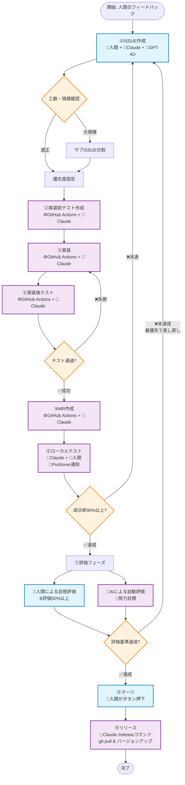

# AI-人間協調ワークフロー

**バージョン**: [../../spec.md](../../spec.md) を参照  
**最終更新**: 2025-07-21

## 📋 概要

このドキュメントは、人間とAI（Claude Code、GPT-4O、Gemini）が協調して最善策を導き出し、自動的にPDCAサイクルを回すワークフローを定義しています。継続的な品質改善とプロジェクトの持続的発展を目指します。

## 🔄 ワークフロー全体図

## 🎯 各フェーズの詳細

### ①ISSUE作成フェーズ
**責任者**: 👤人間 + 🤖Claude Code + 🧠GPT-4O  
**目標**: 曖昧な要求を具体的なタスクに変換

#### プロセス
1. **人間の役割**
   - 評価・フィードバックの提供
   - 要件定義・発案
   - 最終採決（LGTM判定）

2. **AI協議プロセス**
   - Claude Code と GPT-4O が協議してベストプラクティスを導出
   - APIリミット時は Gemini や他モデルで継続
   - **議事録必須**: token消費量とリミット対策

3. **成果物**
   - メリット・デメリット・工数の明示
   - 複数案からの人間による採決
   - PROGRESS_TRACKER.md への追記
   - 英語版ISSUE文（GitHub用）

#### 判断基準
- **大規模案件**: サブISSUE・サブフォルダで体系化
- **タスク粒度**: 1つずつ実行可能なレベル

### ②実装前テスト作成
**責任者**: ⚙️GitHub Actions + 🤖Claude Code  
**目標**: テストファーストでの品質保証

- 機能追加に対応するテスト作成
- バグ発生時の再発防止テスト追加
- 既存 `test_environment_spec.py` との整合性確保

### ③実装
**責任者**: ⚙️GitHub Actions + 🤖Claude Code  
**目標**: ISSUE要件の確実な実装

- PROGRESS_TRACKER.md の優先順位に従って実行
- 既存テンプレート（[batch_extraction_template.md](./batch_extraction_template.md)）の活用
- [spec.md](../../spec.md) 準拠の実装

### ④実装後テスト
**責任者**: ⚙️GitHub Actions + 🤖Claude Code  
**目標**: 実装品質の確認

#### 検証内容
1. **動作検証**: 画像抽出〜出力まで完全実行
2. **UnitTest実行**: 毎回必須
3. **エラー時対応**: 実装フェーズへ自動戻し

### ⑤MR（Pull Request）作成
**責任者**: ⚙️GitHub Actions + 🤖Claude Code  
**目標**: レビュー準備の完了

- 自動的なPR作成
- テスト結果の添付
- [update-spec.yml](./.github/workflows/update-spec.yml) による自動検証

### ⑥Windowsローカルテスト
**責任者**: 🤖Claude Code + 👤人間  
**目標**: 実環境での動作確認

#### 人間の作業
1. `git pull` でブランチ取得
2. ブランチ切り替え
3. input_path, output_path の指定

#### 自動化部分
- バックグラウンドでのバッチ処理実行
- Pushover によるスマホ通知
- 進捗状況の自動記録

#### 成功判定基準
**出力成功率 90% 以上**
- 例: 入力100枚 → 90枚以上の抽出成功

### ⑦評価フェーズ
**目標**: 品質の最終確認

#### 👤人間による目視評価（必須）
**判定基準**: **B評価が全体の50%以上**
- 例: 90枚出力 → 45枚以上がB判定
- 評価基準: [quality_evaluation_guide.md](./quality_evaluation_guide.md) 準拠
- **差し戻し時**: ①ISSUE作成へ最優先で戻す

#### 🧠AIによる自動評価（努力目標）
- GPT-4O または Gemini での自動評価
- APIリミット時はエラー出力後に継続
- あくまで **補助的評価** として位置付け

### ⑧マージ
**責任者**: 👤人間  
**目標**: 品質確認済み機能の本流取り込み

⑦評価成功時のみ人間がマージボタンを押下

### ⑨リリース
**責任者**: 🤖Claude Code  
**目標**: バージョン管理とリリース準備

1. `main` ブランチへ checkout
2. `git pull` で最新取り込み
3. `/release` コマンドでバージョンアップ
4. リリースノート自動生成

## 📊 重要な数値基準

| 項目 | 基準 | 測定方法 |
|------|------|----------|
| **ローカルテスト成功率** | 90%以上 | 出力画像数 ÷ 入力画像数 |
| **人間評価基準** | B評価50%以上 | B以上評価数 ÷ 総出力数 |
| **タスク粒度** | 1つずつ実行 | PROGRESS_TRACKER管理 |
| **AI協議記録** | 100%記録 | 議事録必須作成 |

## 🔗 関連ドキュメント

### 既存ワークフロー文書
- [バッチ抽出テンプレート](./batch_extraction_template.md) - ⑥ローカルテストで使用
- [品質評価ガイド](./quality_evaluation_guide.md) - ⑦評価フェーズで参照
- [トラブルシューティング](./troubleshooting_guide.md) - 全フェーズのエラー対処
- [進捗追跡テンプレート](./progress_tracking_template.md) - 進捗管理基礎

### 新規作成文書
- [ISSUE管理ガイド](./issue_management_guide.md) - ①フェーズ詳細
- [PROGRESS_TRACKER.md](./PROGRESS_TRACKER.md) - 優先度管理
- [自動評価フレームワーク](./automated_evaluation_framework.md) - ⑦AI評価詳細
- [リリースプロセスガイド](./release_process_guide.md) - ⑨リリース手順

## 🚨 重要なポリシー

### 品質優先
- 基準未達時は確実に差し戻し
- 人間の最終判定を最優先
- AI評価は努力目標レベル

### 継続性確保
- API制限時も議事録で継続可能
- 各フェーズでの明確な成功/失敗基準
- 自動化とマニュアル作業の適切な分担

### 効率性重視
- 人間の作業を最小化
- 自動化可能な部分は積極的に自動化
- 明確な責任分界点

## 🎉 このワークフローの効果

1. **品質の継続的向上**: 人間とAIの協調による最適解導出
2. **効率的なリソース活用**: 適材適所の役割分担
3. **持続可能な運営**: API制限やエラー時の対応策
4. **透明性のある意思決定**: 明確な基準と記録

---

このワークフローにより、プロジェクトは継続的に品質向上し、人間とAIの最適な協働を実現できます。