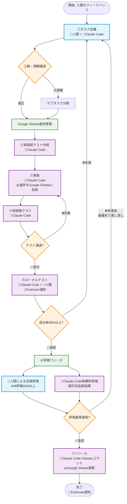

# AI-人間協調ワークフロー（現在仕様版）

**バージョン**: [../../docs/technical/specifications/system_spec.md](../../docs/technical/specifications/system_spec.md) を参照  
**最終更新**: 2025-07-27  
**重要変更**: GitHub Action仕様から現在のlocalhost Claude Code仕様に全面更新

## 📋 概要

このドキュメントは、人間と Claude Code が協調して最善策を導き出し、継続的に品質改善を行うワークフローを定義しています。localhost環境でのClaude Codeを中心とした実用的な開発プロセスを提供します。

## 🔄 ワークフロー全体図


```mermaid
flowchart TB
    Start([開始: 人間のフィードバック]) --> Issue[①タスク定義<br/>👤人間 + 🤖Claude Code]
    Issue --> Check{工数・規模確認}
    Check -->|大規模| SubIssue[サブタスク分割]
    Check -->|適正| Priority[Google Sheets進捗管理]
    SubIssue --> Priority
    Priority --> TestFirst[②実装前テスト作成<br/>🤖Claude Code]
    TestFirst --> Impl[③実装<br/>🤖Claude Code<br/>📊進捗をGoogle Sheetsに反映]
    Impl --> TestAfter[④実装後テスト<br/>🤖Claude Code]
    TestAfter --> TestPass{テスト通過?}
    TestPass -->|❌失敗| Impl
    TestPass -->|✅成功| LocalTest[⑤ローカルテスト<br/>🤖Claude Code + 👤人間<br/>🔔Pushover通知]
    LocalTest --> Success{成功率90%以上?}
    Success -->|❌未達| Issue
    Success -->|✅達成| Evaluation[⑥評価フェーズ]

    Evaluation --> AutoEval[🤖Claude Code客観的評価<br/>統計的品質指標]
    Evaluation --> HumanEval[👤人間による目視評価<br/>A/B評価50%以上]

    HumanEval --> EvalPass{評価基準達成?}
    AutoEval --> EvalPass
    EvalPass -->|❌未達成<br/>最優先で差し戻し| Issue
    EvalPass -->|✅達成| Release[⑦リリース<br/>🤖Claude Code /releaseコマンド<br/>📊Google Sheets更新]
    Release --> End([完了<br/>🔔Pushover通知])

    %% スタイル定義
    classDef humanTask fill:#e1f5fe,stroke:#0277bd,stroke-width:2px
    classDef claudeTask fill:#f3e5f5,stroke:#7b1fa2,stroke-width:2px
    classDef sheetsTask fill:#e8f5e8,stroke:#2e7d32,stroke-width:2px
    classDef decision fill:#fff3e0,stroke:#f57c00,stroke-width:2px

    class Issue,HumanEval humanTask
    class TestFirst,Impl,TestAfter,LocalTest,AutoEval,Release claudeTask
    class Priority,Evaluation sheetsTask
    class Check,TestPass,Success,EvalPass decision
```

## 🎯 各フェーズの詳細

### ①タスク定義フェーズ

**責任者**: 👤 人間 + 🤖Claude Code  
**目標**: 曖昧な要求を具体的なタスクに変換

#### プロセス

1. **人間の役割**
   - 評価・フィードバックの提供
   - 要件定義・発案
   - 最終採決（LGTM 判定）

2. **Claude Code の役割**
   - 要求分析と技術的実現可能性評価
   - **実装前調査・リスク評価**（必須）
   - 実装計画の策定
   - Google Sheetsへのタスク登録

3. **成果物**
   - メリット・デメリット・工数の明示
   - 複数案からの人間による採決
   - Google Sheetsへの進捗登録
   - 実装計画書の作成

#### 判断基準

- **大規模案件**: サブタスク・フェーズで体系化
- **タスク粒度**: 1 つずつ実行可能なレベル
- **Google Sheets管理**: 進捗・品質指標の可視化

### 🔍 実装前調査・リスク評価（必須プロセス）

**目的**: 実装済み機能の重複実装とデグレード防止

#### 必須調査チェックリスト

**実装前に必ず実行する4項目**:

1. **✅ 既存実装確認**
   ```bash
   # 同機能の実装済みチェック
   grep -r "機能名\|クラス名" features/ tools/ --include="*.py"
   
   # 類似機能との差分確認  
   find . -name "*関連キーワード*" -type f
   
   # 廃止済み機能の確認
   grep -r "TODO\|FIXME\|deprecated" . --include="*.py" | grep "機能名"
   
   # QUAL-033: 厳密パス検証対応確認
   python3 features/extraction/commands/extract_character.py --help | grep strict-validation
   ```

2. **✅ 影響範囲分析**
   ```bash
   # 修正対象ファイルの特定
   find . -name "*.py" -exec grep -l "修正対象クラス\|関数" {} \;
   
   # 依存関係の洗い出し
   grep -r "import.*修正モジュール" . --include="*.py"
   
   # テスト対象範囲の確定
   find tests/ -name "*関連テスト*" -type f
   ```

3. **✅ リスク評価**
   
   **大リスク（システム全体影響）**:
   - core/、features/common/ の変更
   - データモデル・API仕様変更
   - 既存テストの大幅修正が必要
   
   **中リスク（特定モジュール影響）**:
   - features/ 内の特定機能修正
   - 新しいAPI追加・既存拡張
   - 設定ファイル・ワークフロー変更
   
   **小リスク（局所的変更）**:
   - 新機能追加（既存に影響なし）
   - バグ修正・最適化
   - ドキュメント・テスト追加のみ

4. **✅ 予防策策定**
   - **大リスク**: 段階的実装・広範囲テスト・ロールバック計画必須
   - **中リスク**: 関連機能テスト・影響確認必須  
   - **小リスク**: 基本テスト・動作確認

#### 調査結果記録テンプレート

```markdown
## 実装前調査結果 [{タスクID}]

### ✅ 既存実装確認
- **既存機能**: あり/なし - 詳細
- **類似機能**: [機能名] - 差分内容
- **廃止機能**: [機能名] - 復活の妥当性

### ✅ 影響範囲分析  
- **修正ファイル**: N個（具体的パス）
- **依存関係**: [モジュール名] - 影響内容
- **テスト範囲**: [テストファイル名]

### ✅ リスク評価
- **リスクレベル**: 大/中/小
- **主要リスク**: 具体的懸念事項
- **成功条件**: 明確な判定基準

### ✅ 予防策・テスト計画
- **予防策**: 具体的対策
- **テスト戦略**: テスト項目・順序
- **ロールバック手順**: 問題時の対応
```

#### 実装可否判定

- **実装OK**: 全チェック完了・リスク許容範囲・予防策確立
- **実装NG**: 重複機能・リスク過大・予防策不十分
- **要再検討**: 要件見直し・アプローチ変更が必要

### ② 実装前テスト作成

**責任者**: 🤖Claude Code  
**目標**: テストファーストでの品質保証

- 機能追加に対応するテスト作成
- バグ発生時の再発防止テスト追加
- 既存テストスイートとの整合性確保
- pytest形式での統一的なテスト実装

### ③ 実装

**責任者**: 🤖Claude Code  
**目標**: タスク要件の確実な実装

**前提条件**: [実装前調査・リスク評価](#-実装前調査リスク評価必須プロセス)の完了

- Google Sheetsの優先順位に従って実行
- **調査結果に基づく安全な実装**（重複回避・デグレード防止）
- 既存テンプレート（[batch_extraction_template.md](./batch_extraction_template.md)）の活用
- [docs/technical/specifications/system_spec.md](../../docs/technical/specifications/system_spec.md) 準拠の実装
- PHS-006で実装されたスケーラビリティ改善の活用

#### 🤖 Claude Code の実装責任範囲

1. **コード実装**: 新しいコード、関数、クラスの作成
2. **ファイル修正**: 既存ファイルの編集・改変
3. **新規ファイル作成**: 実装目的でのファイル新規作成
4. **直接的なバグ修正**: コードレベルでの修正作業
5. **テスト作成**: 実装に対応するテストコードの作成
6. **ドキュメント更新**: 実装内容に応じた文書更新
7. **進捗更新**: Google Sheetsでの進捗状況反映

### ④ 実装後テスト

**責任者**: 🤖Claude Code  
**目標**: 実装品質の確認

#### 検証内容

1. **動作検証**: 画像抽出〜出力まで完全実行
2. **UnitTest 実行**: pytest実行、毎回必須
3. **品質チェック**: linter.sh による品質確認
4. **エラー時対応**: 実装フェーズへ自動戻し

### ⑤ローカルテスト

**責任者**: 🤖Claude Code + 👤 人間  
**目標**: 実環境での動作確認

#### 人間の作業

1. 必要に応じて入力データの準備
2. 抽出パイプラインの開始指示
3. 結果の最終確認

#### Claude Code による自動化

- 抽出パイプラインの実行管理
- PHS-006並列処理システムの活用
- Pushover によるスマホ通知（処理開始・完了時）
- Google Sheetsでの進捗状況リアルタイム更新

#### 成功判定基準

**出力成功率 90% 以上**

- 例: 入力 100 枚 → 90 枚以上の抽出成功

### ⑥ 評価フェーズ

**目標**: 品質の最終確認

#### 🤖 Claude Code による客観的評価（メイン）

**判定基準**: **統計的品質指標による総合評価**

> **詳細**: [`docs/technical_specifications.md`](../technical_specifications.md) を参照

- **Current Score**: 現在品質スコア
- **BaseLine Score**: ベースライン品質スコア  
- **p値**: 統計的有意性検定結果
- **効果サイズ (Cohen's d)**: 改善効果の大きさ
- **改善率**: ベースラインからの改善パーセンテージ
- **統計的有意性**: 有意/非有意の判定
- 統合品質チェッカーによる自動評価実行

#### 👤 人間による目視評価（最終確認）

**判定基準**: **A/B 評価が全体の 50%以上**

- 例: 90 枚出力 → 45 枚以上が A/B 判定
- 評価基準: [quality_evaluation_guide.md](./quality_evaluation_guide.md) 準拠
- **差し戻し時**: ①タスク定義へ最優先で戻す

### ⑦ リリース

**責任者**: 🤖Claude Code  
**目標**: バージョン管理とリリース準備

1. `/release` コマンドでバージョンアップ
2. リリースノート自動生成
3. Google Sheetsでの最終ステータス更新
4. Pushover通知によるリリース完了報告

## 📊 重要な数値基準

| 項目                     | 基準               | 測定方法                    |
| ------------------------ | ------------------ | --------------------------- |
| **ローカルテスト成功率** | 90%以上            | 出力画像数 ÷ 入力画像数     |
| **人間評価基準**         | A/B 評価 50%以上   | A/B 評価数 ÷ 総出力数       |
| **客観的品質指標**       | p値≤0.05, |効果サイズ|≥0.2 | 統合品質チェッカーによる測定 |
| **タスク粒度**           | 1 つずつ実行       | Google Sheets 管理          |
| **進捗可視性**           | リアルタイム更新   | Google Sheets 自動反映      |

## 🔗 関連ドキュメント

### 現在運用中の文書

- [バッチ抽出テンプレート](./batch_extraction_template.md) - ⑤ ローカルテストで使用
- [品質評価ガイド](./quality_evaluation_guide.md) - ⑥ 評価フェーズで参照
- [トラブルシューティング](./troubleshooting_guide.md) - 全フェーズのエラー対処
- [Google Sheets セットアップ](./google_sheets_setup.md) - 進捗管理システム設定（詳細: [`docs/google_sheets_reference.md`](../google_sheets_reference.md) を参照）

### タスク管理文書

- [タスク管理ガイド](./issue_management_guide.md) - ① フェーズ詳細
- [Google Sheets 進捗管理](./PROGRESS_TRACKER.md) - 優先度・進捗管理
- [客観的評価フレームワーク](./automated_evaluation_framework.md) - ⑥Claude評価詳細
- [リリースプロセスガイド](./release_process_guide.md) - ⑦ リリース手順

## 🚨 重要なポリシー

### 品質優先

- 基準未達時は確実に差し戻し
- 統計的指標（Current/BaseLine比較・p値・効果サイズ）による定量評価
- 人間の最終判定を最優先

### 可視性確保

- Google Sheetsによるリアルタイム進捗管理
- Pushover通知による重要イベント報告
- 明確な成功/失敗基準と測定方法

### 効率性重視

- Claude Codeによる高度な自動化
- PHS-006並列処理システムの活用
- 人間の作業を重要な判断・評価に集中

### 継続性確保

- localhost環境での安定した開発
- エラー時の自動復旧とフォールバック
- 明確な責任分界点

## 🎫 タスク起票システム

### 起票プロセス定義

**目的**: 新規タスクをGoogle Spreadsheetsに登録し、体系的にプロジェクト管理を行う

#### 必須要素
1. **トラッカーID採番**
   - 形式: `{Phase}-{連番3桁}` (例: PHS-001, TETETETETETETETETET-010)
   - 重複防止: 自動チェック機能

2. **優先度設定**
   - デフォルト: 「優先度中」
   - 選択肢: 優先度最高/高/中/低

3. **登録日付記述**
   - 形式: YYYY-MM-DD
   - 自動設定: 起票時の日付

4. **概要の記述**
   - 内容: タスクの目的と期待成果を明記
   - 文字数: 100文字以内推奨

#### 起票手順
```bash
# 単一タスク起票
python tools/task_ticket.py \
  --tracker-id "PHS-014" \
  --priority "優先度高" \
  --description "設定ファイル管理システムの実装"

# 一括タスク起票（CSVファイルから）
python tools/batch_task_ticketing.py \
  --csv remaining_tasks.csv \
  --default-priority "優先度中"

# インタラクティブ起票
python tools/task_ticket.py --interactive
```

#### 起票後の自動処理
1. Google Sheets登録（重複チェック済み）
2. ステータス「着手前」設定
3. Pushover通知（オプション）
4. 起票履歴ログ記録

### タスク定義時の必須ルール

1. **起票前チェックリスト**
   - [ ] タスクの粒度は1つずつ実行可能なレベルか
   - [ ] 依存関係は明確か
   - [ ] 成功条件は定量的に定義されているか
   - [ ] 優先度は適切に設定されているか

2. **起票テンプレート**
```yaml
tracker_id: PHS-014
priority: 優先度中
title: 設定ファイル管理システムの実装
description: |
  各種設定ファイルの一元管理システムを実装し、
  設定変更の追跡可能性を確保する
success_criteria:
  - 設定ファイルの統一フォーマット定義
  - バージョン管理機能の実装
  - 設定変更履歴の可視化
estimated_hours: 8
dependencies: [PHS-013]
```

3. **禁止事項**
   - 曖昧なタスク説明
   - 測定不可能な成功条件
   - 依存関係の未記載
   - 優先度未設定での起票

## 🎉 このワークフローの効果

1. **品質の継続的向上**: 客観的指標による定量的品質管理
2. **効率的なリソース活用**: Claude Codeによる高度自動化
3. **透明性のある運営**: Google Sheetsによるリアルタイム可視化
4. **持続可能な開発**: localhost環境での安定性と継続性
5. **体系的タスク管理**: 起票システムによる完全な進捗追跡

---

このワークフローにより、プロジェクトは継続的に品質向上し、人間とClaude Codeの最適な協働を実現できます。
