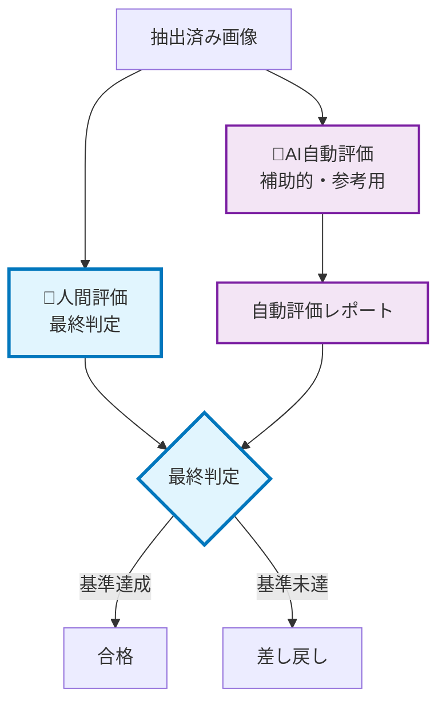
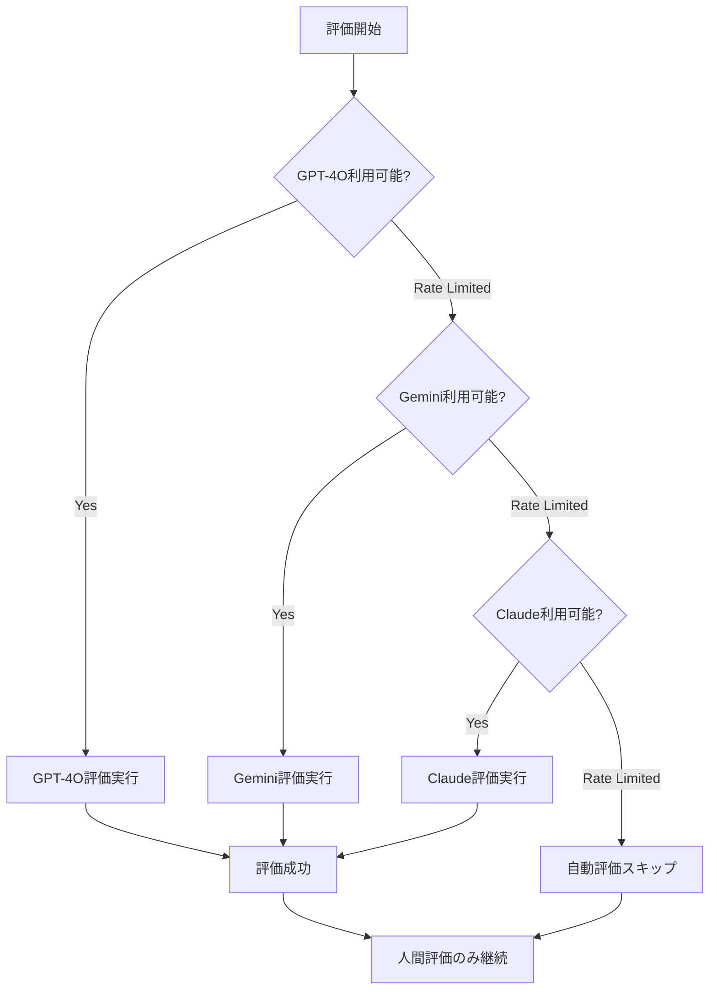

# 自動評価フレームワーク

**参照**: [AI-人間協調ワークフロー](./README.md) - ⑦評価フェーズ  
**基礎**: [品質評価ガイド](./quality_evaluation_guide.md)  
**最終更新**: 2025-07-21

## 📋 概要

GPT-4O、Gemini、その他AIモデルによる画像品質自動評価システム。API制限に対応した堅牢な評価フレームワークを提供し、人間評価をサポートします。

**重要**: 自動評価は**努力目標**であり、最終判定は人間が行います。

## 🎯 評価フレームワークの位置づけ

### 評価の役割分担


## 🤖 対応AI評価システム

### 優先順位付きAPI利用
1. **GPT-4O** (第一選択)
2. **Gemini Pro Vision** (第二選択)  
3. **Claude-3.5-Sonnet** (第三選択)
4. **その他Vision API** (拡張用)

### API制限対応フロー


## 📊 評価システム仕様

### 統一評価基準（A-F評価）

#### 評価項目とウェイト
```yaml
評価項目:
  キャラクター完全性: 40%  # 顔・手足の欠損チェック
  境界精度: 25%           # 抽出境界の品質
  背景除去: 20%           # 不要要素の除去度
  全体品質: 15%           # 構図・色彩の保持
```

#### グレード定義
- **A (0.8-1.0)**: 優秀 - そのまま使用可能
- **B (0.6-0.79)**: 良好 - 軽微な問題のみ
- **C (0.4-0.59)**: 普通 - 中程度の問題
- **D (0.2-0.39)**: 要改善 - 重大な問題
- **E (0.1-0.19)**: 不良 - 複数の重大問題
- **F (0.0-0.09)**: 失敗 - 使用不可能

### プロンプトテンプレート

#### GPT-4O用プロンプト
```markdown
あなたは画像抽出品質の専門評価者です。
この画像はアニメキャラクターの自動抽出結果です。以下の基準で評価してください。

**評価基準:**
- A: 優秀な抽出（そのまま使用可能）
- B: 良好な抽出（軽微な問題あり）
- C: 普通の抽出（中程度の問題あり） 
- D: 問題のある抽出（重大な問題あり）
- E: 悪い抽出（複数の重大問題）
- F: 失敗した抽出（使用不可能）

**チェックポイント:**
1. キャラクターの顔・手足が完全に抽出されているか
2. 境界線が自然で正確か
3. 背景や不要要素が適切に除去されているか
4. 全体的な品質が保持されているか

**出力形式（JSON）:**
{
  "grade": "<A-Fの評価>",
  "score": <0.0-1.0の数値スコア>,
  "issues": ["<問題分類>"],
  "comments": "<具体的評価理由>",
  "confidence": <0.0-1.0の評価信頼度>
}
```

#### Gemini用プロンプト
```markdown
画像品質評価タスクです。アニメキャラクター抽出結果を評価してください。

評価基準（A-F）:
・A: 完璧な抽出
・B: 良好（軽微な不具合）
・C: 普通（中程度の不具合）
・D: 問題あり（重要部位の欠損等）
・E: 不良（複数の重大問題）  
・F: 失敗（使用不可）

確認項目:
1. 顔・手足の完全性
2. 境界線の正確性
3. 背景除去の適切性
4. 全体品質の保持

JSON形式で回答:
{"grade": "X", "score": 0.0, "issues": [], "comments": "評価詳細"}
```

## ⚙️ 実装アーキテクチャ

### 評価システムクラス構造
```python
class AutomatedEvaluationFramework:
    """自動評価フレームワーク"""
    
    def __init__(self):
        self.evaluators = [
            GPT4OEvaluator(),
            GeminiEvaluator(), 
            ClaudeEvaluator()
        ]
    
    async def evaluate_batch(self, image_paths: List[str]) -> EvaluationResult:
        """バッチ評価実行"""
        results = []
        
        for image_path in image_paths:
            result = await self.evaluate_single(image_path)
            results.append(result)
            
        return EvaluationResult(results)
    
    async def evaluate_single(self, image_path: str) -> SingleEvaluation:
        """単一画像評価（フォールバック付き）"""
        
        for evaluator in self.evaluators:
            try:
                result = await evaluator.evaluate(image_path)
                if result.success:
                    return result
                    
            except RateLimitError:
                continue
            except Exception as e:
                logger.warning(f"{evaluator.name} failed: {e}")
                
        # 全て失敗した場合
        return SingleEvaluation(
            grade="N/A",
            score=0.0,
            error="All evaluators failed",
            skipped=True
        )
```

### エラーハンドリング戦略

#### API制限レスポンス処理
```python
class RateLimitHandler:
    """API制限対応ハンドラー"""
    
    def __init__(self):
        self.retry_delays = {
            'openai': 60,      # GPT-4O: 1分待機
            'google': 30,      # Gemini: 30秒待機  
            'anthropic': 120   # Claude: 2分待機
        }
    
    async def handle_rate_limit(self, api_name: str, error: Exception):
        """制限時の対応処理"""
        
        delay = self.retry_delays.get(api_name, 60)
        logger.info(f"{api_name} rate limited, waiting {delay}s")
        
        # 非ブロッキング待機
        await asyncio.sleep(delay)
        
        # 制限状況をログ記録
        self.log_rate_limit_event(api_name, error)
```

## 📈 評価レポート生成

### バッチ評価レポート形式
```json
{
  "evaluation_summary": {
    "total_images": 26,
    "evaluated_images": 24,
    "skipped_images": 2,
    "evaluation_rate": 92.3,
    "average_score": 0.742,
    "grade_distribution": {
      "A": 8,
      "B": 12, 
      "C": 3,
      "D": 1,
      "E": 0,
      "F": 0
    }
  },
  "api_usage": {
    "gpt4o_calls": 20,
    "gpt4o_rate_limits": 0,
    "gemini_calls": 4,
    "gemini_rate_limits": 1,
    "claude_calls": 0,
    "total_cost_estimate": "$2.40"
  },
  "individual_results": [
    {
      "image_path": "image_001.jpg",
      "grade": "A",
      "score": 0.89,
      "api_used": "gpt4o",
      "issues": [],
      "comments": "完璧な抽出。境界線が自然で手足も完全。",
      "confidence": 0.95
    }
  ],
  "quality_metrics": {
    "meets_human_standard": true,
    "b_grade_percentage": 76.9,
    "human_review_required": false
  }
}
```

### Markdown形式レポート
```markdown
# 自動評価レポート - YYYY-MM-DD

## 📊 評価サマリー
- **総画像数**: 26枚
- **評価完了**: 24枚 (92.3%)
- **平均スコア**: 0.742
- **B評価以上**: 20枚 (76.9%)

## 🎯 品質判定
- **人間基準達成**: ✅ YES (B評価50%以上クリア)
- **推奨アクション**: そのままマージ可能

## 📈 評価分布
| グレード | 枚数 | 割合 |
|----------|------|------|
| A | 8枚 | 30.8% |
| B | 12枚 | 46.2% |
| C | 3枚 | 11.5% |
| D | 1枚 | 3.8% |

## ⚙️ API使用状況
- **GPT-4O**: 20回 ($1.60)
- **Gemini**: 4回 ($0.20)  
- **制限発生**: 1回 (Gemini)
```

## 🔧 設定とカスタマイズ

### 評価パラメータ調整
```yaml
# config/evaluation.yml
evaluation_settings:
  # 基本設定
  timeout_per_image: 30  # 30秒タイムアウト
  max_retries: 3
  batch_size: 5
  
  # 品質基準
  grade_thresholds:
    A: 0.8
    B: 0.6
    C: 0.4
    D: 0.2
    E: 0.1
  
  # API設定
  apis:
    gpt4o:
      enabled: true
      priority: 1
      max_requests_per_minute: 20
      
    gemini:
      enabled: true  
      priority: 2
      max_requests_per_minute: 60
      
    claude:
      enabled: false
      priority: 3
      max_requests_per_minute: 10
```

### カスタム評価器の追加
```python
class CustomVisionEvaluator(BaseEvaluator):
    """カスタム評価器の実装例"""
    
    def __init__(self, api_key: str):
        super().__init__("custom-vision")
        self.api_key = api_key
    
    async def evaluate(self, image_path: str) -> SingleEvaluation:
        """カスタム評価ロジック"""
        # 独自の評価処理
        pass
```

## 📱 通知システム統合

### Pushover通知設定
```python
class EvaluationNotifier:
    """評価完了通知システム"""
    
    async def send_batch_completion(self, results: EvaluationResult):
        """バッチ評価完了通知"""
        
        message = f"""
        🎯 自動評価完了
        
        📊 結果: {results.b_grade_percentage:.1f}%がB評価以上
        ⚙️ API使用: {results.api_calls_made}回
        🎭 人間判定: {'不要' if results.meets_standard else '必要'}
        """
        
        await self.push_notification(message)
```

## 🔄 継続的改善

### 評価精度の監視
```python
class EvaluationAccuracyTracker:
    """評価精度追跡システム"""
    
    def track_human_vs_ai(self, ai_grade: str, human_grade: str):
        """AI評価 vs 人間評価の精度測定"""
        
        accuracy = self.calculate_grade_similarity(ai_grade, human_grade)
        self.metrics.record_accuracy(accuracy)
        
        # 精度が低下した場合のアラート
        if self.metrics.recent_accuracy < 0.7:
            self.alert_low_accuracy()
```

### モデル性能比較
```markdown
## AI評価器性能比較（月次）

| モデル | 呼び出し回数 | 成功率 | 人間一致率 | 平均レスポンス時間 |
|--------|-------------|--------|------------|-------------------|
| GPT-4O | 245回 | 98.4% | 78.2% | 3.2秒 |
| Gemini | 67回 | 94.0% | 71.8% | 2.1秒 |
| Claude | 12回 | 100% | 82.1% | 4.8秒 |
```

---

**使用方法**:
1. バッチ評価: `python3 tools/auto_evaluation.py --batch /path/to/images`
2. 単一評価: `python3 tools/auto_evaluation.py --image image.jpg`  
3. 設定確認: `python3 tools/auto_evaluation.py --config`

**関連ドキュメント**:
- [品質評価ガイド](./quality_evaluation_guide.md) - 評価基準詳細
- [AI-人間協調ワークフロー](./README.md) - 全体プロセス
- [既存の評価実装](../features/evaluation/image_evaluation_mcp.py)