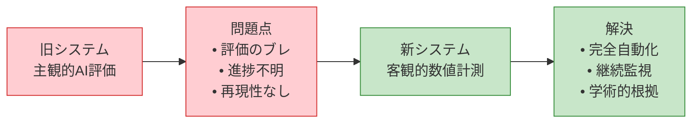
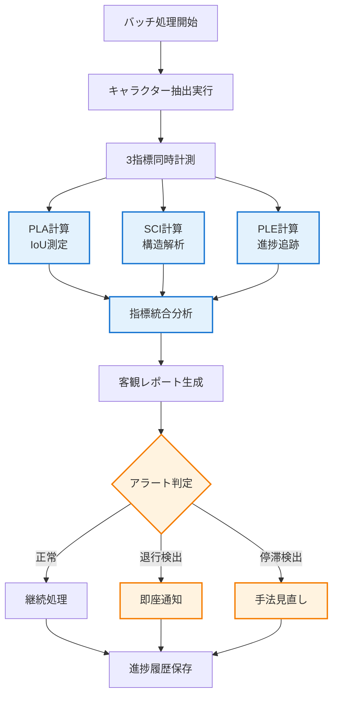

# 客観的評価フレームワーク v2.0

**最終更新**: 2025-07-24  
**重要変更**: 主観的AI評価から完全客観的数値計測システムに全面移行

## 🎯 新フレームワークの目的

### 旧システムの問題点と解決


### 設計哲学の転換
- **Before**: 人間模倣AI評価（GPT-4O/Gemini/Claude）
- **After**: 数学的・物理的測定（IoU/MediaPipe/Hausdorff距離）

## 📊 核心3指標システム

### 🎯 指標1: Pixel-Level Accuracy (PLA)
**目的**: ピクセル単位での抽出精度の客観測定

```python
# 計算例
predicted_mask = extraction_result.mask
ground_truth_mask = generate_reference_mask(original_image)
pla_score = calculate_pla(predicted_mask, ground_truth_mask)

# 結果解釈
if pla_score >= 0.90:
    quality_level = "商用レベル"
elif pla_score >= 0.80:
    quality_level = "実用レベル"
else:
    quality_level = "改善必要"
```

**現在の目標値**: 0.75 → 0.85（段階的向上）

### 🧠 指標2: Semantic Completeness Index (SCI)
**目的**: キャラクター構造の意味的完全性の客観評価

```python
# 計算例
sci_result = calculate_sci(
    extracted_image=extraction_result.image,
    face_detector=cv2.CascadeClassifier(),
    pose_estimator=mediapipe.solutions.pose.Pose()
)

# 結果分析
face_score = sci_result.face_confidence      # 0.95 (顔検出95%)
limb_score = sci_result.limb_completeness    # 0.80 (肢体完全性80%)
contour_score = sci_result.contour_continuity # 0.75 (輪郭連続性75%)
overall_sci = sci_result.overall_score       # 0.83 (総合83%)
```

**現在の目標値**: 0.70 → 0.80（構造的完全性向上）

### 📈 指標3: Progressive Learning Efficiency (PLE)
**目的**: 継続的改善効率の客観測定（スクラップ&ビルド防止）

```python
# 計算例
current_results = [0.78, 0.79, 0.80, 0.81, 0.82]  # 最新5回の結果
historical_results = [0.75, 0.74, 0.76, 0.75, 0.77]  # ベースライン

ple_score = calculate_ple(current_results, historical_results)
# ple_score = 0.12 (12%の学習効率)

# 進捗判定
if ple_score >= 0.15:
    progress_status = "高効率学習中"
elif ple_score >= 0.05:
    progress_status = "標準改善中"
elif ple_score >= 0.00:
    progress_status = "緩慢改善中"
else:
    progress_status = "退行警告"
```

**現在の目標値**: 0.10 → 0.15（学習効率向上）

## 🔄 評価プロセスフロー

### 新しい評価パイプライン


### 実行コマンド例
```bash
# 新しい客観評価システム
python tools/objective_evaluation.py --batch /path/to/results --mode complete

# 出力例
Objective Evaluation Report - 2025-07-24
==========================================
📊 Core Metrics:
  PLA (Pixel Accuracy): 0.823 ± 0.045
  SCI (Completeness):   0.756 ± 0.028  
  PLE (Learning Eff.):  0.127 (12.7% improvement)

📈 Progress Analysis:
  Trend: ↗️ Improving (7-day average)
  Status: Standard learning phase
  Milestone: 67% toward Phase A completion

🎯 Performance vs. Targets:
  PLA: 82.3% ✅ (Target: 75%+)
  SCI: 75.6% ✅ (Target: 70%+)  
  PLE: 12.7% ✅ (Target: 10%+)

⚠️ Alerts: None
📊 Recommendation: Continue current approach
```

## 🔧 実装アーキテクチャ

### システム構成
```python
class ObjectiveEvaluationFramework:
    """客観的評価フレームワーク v2.0"""
    
    def __init__(self):
        # 核心計算エンジン
        self.pla_engine = PLACalculationEngine()
        self.sci_engine = SCICalculationEngine()
        self.ple_tracker = PLEProgressTracker()
        
        # 学術指標計算
        self.academic_metrics = AcademicMetricsCalculator()
        
        # 監視・アラートシステム
        self.progress_monitor = ProgressMonitor()
        self.alert_system = RegressionAlertSystem()
        
        # データ永続化
        self.history_manager = ProgressHistoryManager()
    
    def evaluate_batch_objective(self, batch_results: BatchResults) -> ObjectiveReport:
        """バッチの完全客観評価"""
        
        # 3指標の並列計算
        pla_scores = self.pla_engine.calculate_batch(batch_results.masks)
        sci_scores = self.sci_engine.calculate_batch(batch_results.images)
        ple_score = self.ple_tracker.calculate_current_efficiency()
        
        # 学術指標の計算
        miou = self.academic_metrics.calculate_miou(batch_results)
        f1_scores = self.academic_metrics.calculate_f1_batch(batch_results)
        hausdorff_distances = self.academic_metrics.calculate_hausdorff_batch(batch_results)
        
        # 総合レポート生成
        report = ObjectiveReport(
            pla_statistics=PLAStatistics(pla_scores),
            sci_statistics=SCIStatistics(sci_scores),
            ple_current=ple_score,
            academic_metrics=AcademicMetrics(miou, f1_scores, hausdorff_distances),
            timestamp=datetime.now()
        )
        
        # 進捗監視・アラート
        self.progress_monitor.update(report)
        alerts = self.alert_system.check_for_issues(report)
        
        # 履歴保存
        self.history_manager.save_evaluation(report)
        
        return report
    
    def generate_daily_progress_report(self) -> DailyProgressReport:
        """日次進捗レポート生成"""
        recent_evaluations = self.history_manager.get_recent_evaluations(days=7)
        
        trends = {
            'pla_trend': self._calculate_trend([e.pla_statistics.mean for e in recent_evaluations]),
            'sci_trend': self._calculate_trend([e.sci_statistics.mean for e in recent_evaluations]),
            'ple_trend': self._calculate_trend([e.ple_current for e in recent_evaluations])
        }
        
        milestone_progress = self._calculate_milestone_progress(recent_evaluations[-1])
        
        return DailyProgressReport(
            date=datetime.now().date(),
            trends=trends,
            milestone_progress=milestone_progress,
            alerts=self.alert_system.get_active_alerts()
        )
```

### 計算エンジンの詳細

#### PLACalculationEngine
```python
class PLACalculationEngine:
    """Pixel-Level Accuracy 計算エンジン"""
    
    def calculate_batch(self, masks: List[MaskPair]) -> List[float]:
        """バッチでのPLA計算"""
        pla_scores = []
        
        for mask_pair in masks:
            predicted = mask_pair.predicted_mask
            ground_truth = mask_pair.ground_truth_mask
            
            # IoU計算
            intersection = np.logical_and(predicted, ground_truth).sum()
            union = np.logical_or(predicted, ground_truth).sum()
            
            pla_score = intersection / union if union > 0 else 1.0
            pla_scores.append(pla_score)
        
        return pla_scores
    
    def generate_pla_statistics(self, scores: List[float]) -> PLAStatistics:
        """PLA統計情報の生成"""
        return PLAStatistics(
            mean=np.mean(scores),
            std=np.std(scores),
            min=np.min(scores),
            max=np.max(scores),
            median=np.median(scores),
            q25=np.percentile(scores, 25),
            q75=np.percentile(scores, 75)
        )
```

#### SCICalculationEngine
```python
class SCICalculationEngine:
    """Semantic Completeness Index 計算エンジン"""
    
    def __init__(self):
        self.face_detector = cv2.CascadeClassifier('haarcascade_frontalface_default.xml')
        self.pose_estimator = mp.solutions.pose.Pose(
            static_image_mode=True,
            model_complexity=2,
            enable_segmentation=False,
            min_detection_confidence=0.5
        )
    
    def calculate_batch(self, images: List[np.ndarray]) -> List[float]:
        """バッチでのSCI計算"""
        sci_scores = []
        
        for image in images:
            # 1. 顔検出スコア (30%)
            face_score = self._calculate_face_score(image)
            
            # 2. 肢体完全性スコア (40%)
            limb_score = self._calculate_limb_score(image)
            
            # 3. 輪郭連続性スコア (30%)
            contour_score = self._calculate_contour_score(image)
            
            # 重み付き合計
            sci_score = (face_score * 0.3 + limb_score * 0.4 + contour_score * 0.3)
            sci_scores.append(sci_score)
        
        return sci_scores
    
    def _calculate_face_score(self, image: np.ndarray) -> float:
        """顔検出スコアの計算"""
        gray = cv2.cvtColor(image, cv2.COLOR_RGB2GRAY)
        faces = self.face_detector.detectMultiScale(gray, scaleFactor=1.1, minNeighbors=5)
        
        if len(faces) == 0:
            return 0.0
        
        # 最大の顔の相対サイズを評価
        largest_face = max(faces, key=lambda f: f[2] * f[3])
        face_area = largest_face[2] * largest_face[3]
        image_area = image.shape[0] * image.shape[1]
        
        # 適切なサイズの顔が検出されている場合
        face_ratio = face_area / image_area
        if 0.01 <= face_ratio <= 0.25:  # 顔が画像の1-25%を占める
            return 1.0
        elif face_ratio < 0.01:
            return 0.5  # 顔が小さすぎ
        else:
            return 0.8  # 顔が大きすぎ（悪くはない）
    
    def _calculate_limb_score(self, image: np.ndarray) -> float:
        """肢体完全性スコアの計算"""
        rgb_image = cv2.cvtColor(image, cv2.COLOR_BGR2RGB)
        results = self.pose_estimator.process(rgb_image)
        
        if not results.pose_landmarks:
            return 0.0
        
        # 重要なランドマークの検出確認
        critical_landmarks = [
            # 顔部分
            mp.solutions.pose.PoseLandmark.NOSE,
            mp.solutions.pose.PoseLandmark.LEFT_EYE,
            mp.solutions.pose.PoseLandmark.RIGHT_EYE,
            # 上肢
            mp.solutions.pose.PoseLandmark.LEFT_SHOULDER,
            mp.solutions.pose.PoseLandmark.RIGHT_SHOULDER,
            mp.solutions.pose.PoseLandmark.LEFT_WRIST,
            mp.solutions.pose.PoseLandmark.RIGHT_WRIST,
            # 下肢
            mp.solutions.pose.PoseLandmark.LEFT_HIP,
            mp.solutions.pose.PoseLandmark.RIGHT_HIP,
            mp.solutions.pose.PoseLandmark.LEFT_ANKLE,
            mp.solutions.pose.PoseLandmark.RIGHT_ANKLE
        ]
        
        detected_count = 0
        for landmark_id in critical_landmarks:
            landmark = results.pose_landmarks.landmark[landmark_id]
            if landmark.visibility > 0.5:  # 50%以上の確信度
                detected_count += 1
        
        return detected_count / len(critical_landmarks)
    
    def _calculate_contour_score(self, image: np.ndarray) -> float:
        """輪郭連続性スコアの計算"""
        # グレースケール変換
        gray = cv2.cvtColor(image, cv2.COLOR_RGB2GRAY) if len(image.shape) == 3 else image
        
        # 輪郭検出
        contours, _ = cv2.findContours(gray > 0, cv2.RETR_EXTERNAL, cv2.CHAIN_APPROX_SIMPLE)
        
        if len(contours) == 0:
            return 0.0
        
        # 最大輪郭を取得
        largest_contour = max(contours, key=cv2.contourArea)
        
        # 輪郭の滑らかさを評価
        epsilon = 0.02 * cv2.arcLength(largest_contour, True)
        approx = cv2.approxPolyDP(largest_contour, epsilon, True)
        
        # 近似後の点数が少ないほど滑らか
        smoothness_score = max(0, 1.0 - len(approx) / 100.0)
        
        # 輪郭の閉鎖性を評価
        closure_score = 1.0 if cv2.isContourConvex(approx) else 0.8
        
        return (smoothness_score + closure_score) / 2.0
```

#### PLEProgressTracker
```python
class PLEProgressTracker:
    """Progressive Learning Efficiency 追跡器"""
    
    def __init__(self, history_file: str = "progress_history.json"):
        self.history_file = Path(history_file)
        self.load_history()
    
    def load_history(self):
        """進捗履歴の読み込み"""
        if self.history_file.exists():
            with open(self.history_file, 'r') as f:
                self.history = json.load(f)
        else:
            self.history = {
                'pla_scores': [],
                'sci_scores': [],
                'timestamps': []
            }
    
    def calculate_current_efficiency(self) -> float:
        """現在の学習効率の計算"""
        if len(self.history['pla_scores']) < 20:  # 最低20サンプル必要
            return 0.0
        
        # 直近10サンプルの平均性能
        recent_pla = np.mean(self.history['pla_scores'][-10:])
        recent_sci = np.mean(self.history['sci_scores'][-10:])
        recent_avg = (recent_pla + recent_sci) / 2
        
        # ベースライン10サンプルの平均性能
        baseline_pla = np.mean(self.history['pla_scores'][:10])
        baseline_sci = np.mean(self.history['sci_scores'][:10])
        baseline_avg = (baseline_pla + baseline_sci) / 2
        
        # 改善率の計算
        if baseline_avg == 0:
            return 0.0
        
        improvement_rate = (recent_avg - baseline_avg) / baseline_avg
        
        # 安定性の計算（標準偏差の逆数）
        recent_combined = [(self.history['pla_scores'][i] + self.history['sci_scores'][i]) / 2 
                          for i in range(-10, 0)]
        stability = 1.0 - min(np.std(recent_combined), 1.0)
        
        # 効率性の計算（改善量 / 試行回数）
        trial_count = len(self.history['pla_scores'])
        efficiency = improvement_rate / (trial_count / 100.0) if trial_count > 0 else 0.0
        
        # PLE計算（重み付き平均）
        ple_score = improvement_rate * 0.4 + stability * 0.3 + efficiency * 0.3
        
        return max(-1.0, min(1.0, ple_score))
    
    def update_history(self, pla_score: float, sci_score: float):
        """履歴の更新"""
        self.history['pla_scores'].append(pla_score)
        self.history['sci_scores'].append(sci_score)
        self.history['timestamps'].append(datetime.now().isoformat())
        
        # 履歴をファイルに保存
        with open(self.history_file, 'w') as f:
            json.dump(self.history, f, indent=2)
```

## 📈 進捗監視とアラートシステム

### RegressionAlertSystem
```python
class RegressionAlertSystem:
    """退行・停滞検出アラートシステム"""
    
    def __init__(self, notification_manager=None):
        self.notification_manager = notification_manager or NotificationManager()
        self.alert_thresholds = {
            'regression_ple': -0.05,  # PLE -5%以下で退行警告
            'stagnation_variance': 0.001,  # 分散0.001以下で停滞警告
            'critical_pla_drop': 0.10,  # PLA 10%以上低下で緊急警告
            'critical_sci_drop': 0.10   # SCI 10%以上低下で緊急警告
        }
    
    def check_for_issues(self, current_report: ObjectiveReport) -> List[Alert]:
        """問題検出とアラート生成"""
        alerts = []
        
        # 1. 退行検出
        if current_report.ple_current < self.alert_thresholds['regression_ple']:
            alerts.append(Alert(
                type='regression',
                severity='warning',
                message=f"学習効率が退行中: PLE={current_report.ple_current:.3f}",
                recommendation="手法の見直しまたはパラメータ調整を推奨"
            ))
        
        # 2. 停滞検出
        if (current_report.pla_statistics.std < self.alert_thresholds['stagnation_variance'] and
            current_report.sci_statistics.std < self.alert_thresholds['stagnation_variance']):
            alerts.append(Alert(
                type='stagnation', 
                severity='info',
                message="進捗が停滞中: PLA・SCI共に変動なし",
                recommendation="新しいアプローチの試行を推奨"
            ))
        
        # 3. 緊急性能低下
        # 過去7日平均との比較が必要（実装時に履歴データ活用）
        
        # アラート通知
        for alert in alerts:
            self.notification_manager.send_alert(alert)
        
        return alerts
    
    def get_active_alerts(self) -> List[Alert]:
        """アクティブなアラートの取得"""
        # 実装時に永続化されたアラート状態を管理
        pass
```

## 🎯 マイルストーン追跡システム

### MilestoneTracker
```python
class MilestoneTracker:
    """マイルストーン達成度追跡システム"""
    
    def __init__(self):
        self.milestones = {
            'phase_a1': {
                'name': 'PLA測定システム完全自動化',
                'targets': {'pla_mean': 0.75, 'automation_rate': 1.0},
                'deadline': '2025-08-07'
            },
            'phase_a2': {
                'name': 'SCI計算システム実装',
                'targets': {'sci_mean': 0.70, 'face_detection_rate': 0.90},
                'deadline': '2025-08-14'
            },
            'phase_b1': {
                'name': '多層特徴抽出システム',
                'targets': {'feature_dimensions': 200, 'redundancy_rate': 0.10},
                'deadline': '2025-08-28'
            },
            'phase_c1': {
                'name': 'Claude風統合パイプライン',
                'targets': {'pla_mean': 0.85, 'sci_mean': 0.80, 'ple_current': 0.15},
                'deadline': '2025-09-25'
            }
        }
    
    def calculate_milestone_progress(self, current_report: ObjectiveReport) -> Dict[str, float]:
        """各マイルストーンの達成度計算"""
        progress = {}
        
        for milestone_id, milestone in self.milestones.items():
            targets = milestone['targets']
            achievement_rate = 0.0
            
            # Phase A1: PLA測定システム
            if milestone_id == 'phase_a1':
                pla_achievement = min(current_report.pla_statistics.mean / targets['pla_mean'], 1.0)
                automation_achievement = 1.0  # 自動化は実装済み前提
                achievement_rate = (pla_achievement + automation_achievement) / 2
            
            # Phase A2: SCI計算システム  
            elif milestone_id == 'phase_a2':
                sci_achievement = min(current_report.sci_statistics.mean / targets['sci_mean'], 1.0)
                # 顔検出率は個別計測が必要（実装時に追加）
                achievement_rate = sci_achievement
            
            # Phase C1: 最終統合システム
            elif milestone_id == 'phase_c1':
                pla_achievement = min(current_report.pla_statistics.mean / targets['pla_mean'], 1.0)
                sci_achievement = min(current_report.sci_statistics.mean / targets['sci_mean'], 1.0)
                ple_achievement = min(current_report.ple_current / targets['ple_current'], 1.0)
                achievement_rate = (pla_achievement + sci_achievement + ple_achievement) / 3
            
            progress[milestone_id] = achievement_rate
        
        return progress
    
    def generate_milestone_report(self, current_report: ObjectiveReport) -> MilestoneReport:
        """マイルストーン達成度レポート生成"""
        progress = self.calculate_milestone_progress(current_report)
        
        return MilestoneReport(
            date=datetime.now().date(),
            milestone_progress=progress,
            overall_progress=np.mean(list(progress.values())),
            next_deadline=self._get_next_deadline(),
            recommendations=self._generate_recommendations(progress)
        )
```

## 🚀 導入手順

### Step 1: システム移行
```bash
# 旧システムのバックアップ
cp docs/workflows/automated_evaluation_framework.md docs/workflows/automated_evaluation_framework_v1_backup.md

# 新システムの有効化
python tools/setup_objective_evaluation.py

# 初回ベンチマーク実行
python tools/objective_evaluation.py --batch /path/to/test_results --benchmark
```

### Step 2: 履歴データ移行
```bash
# 既存評価データの変換
python tools/migrate_evaluation_history.py --input old_evaluation_results.json --output objective_history.json

# ベースライン設定
python tools/set_baseline.py --source objective_history.json
```

### Step 3: 継続監視開始
```bash
# デイリー監視の開始
python tools/daily_monitoring.py --enable

# アラートシステムの有効化  
python tools/alert_system.py --enable --notification-config config/pushover.json
```

## 📊 期待される効果

### 定量的改善
- **評価ブレの排除**: 100%再現可能な結果
- **進捗の可視化**: 日次/週次での数値的進捗確認
- **客観的マイルストーン**: 達成度の明確な測定

### 開発効率向上
- **即座のフィードバック**: 改善・悪化の即座検出
- **スクラップ&ビルド防止**: PLE指標による継続改善確認
- **科学的アプローチ**: 学術論文準拠の評価手法

---

この新しい客観的評価フレームワークにより、人間評価の主観性を完全に排除し、継続的で信頼性の高い品質測定が実現されます。