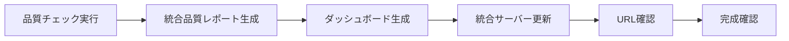

# ダッシュボード管理ガイド

**最終更新**: 2025-08-02  
**目的**: ダッシュボード関連情報の一元管理  
**対象**: segment-anything プロジェクト全参加者

> ⚠️ **重要**: このファイルは旧版です。最新のダッシュボード情報は **[ダッシュボード統合管理ガイド](./dashboard_management_unified.md)** を参照してください。

## 📊 概要

**統合管理版への移行**: 全てのダッシュボード関連情報は `dashboard_management_unified.md` に一元化されました。このファイルの情報は参考として残されていますが、最新情報・統一アクセス方法・完成条件については統合版を参照してください。

## 🎯 ダッシュボード完成条件

### ✅ **完成判定基準**

ダッシュボードが正しく完成したと判定する条件：

1. **URL アクセス可能**: `http://localhost:8088/tracker/{トラッカーID}` が表示される
2. **HTMLファイル存在**: `workspace/{トラッカーID}/dashboard/dashboard.html` が生成されている
3. **統合サーバー稼働**: 統合ダッシュボードサーバーが正常に稼働中
4. **データ表示**: 品質指標・グラフ・チャートが正しく表示される

### 🔍 **確認手順**

```bash
# 1. HTMLファイル確認
ls -la /mnt/c/AItools/lora/train/yado/tracker-workspace/{トラッカーID}/dashboard/

# 2. サーバー稼働確認
curl -s http://localhost:8088/tracker/{トラッカーID} | head -5

# 3. ブラウザ確認
# http://localhost:8088/tracker/{トラッカーID} にアクセス
```

## 🚀 ダッシュボード生成フロー

### **標準ワークフロー**



### **実行順序**

#### **ステップ1: 品質チェック実行**
```bash
# 統合品質チェック実行
python3 tools/unified_quality_checker.py \
  --results /mnt/c/AItools/lora/train/yado/tracker-workspace/{トラッカーID}/extraction_result.json
```

#### **ステップ2: ダッシュボード生成**
```bash
# 品質ダッシュボード生成  
python3 tools/quality_dashboard.py \
  --report /mnt/c/AItools/lora/train/yado/tracker-workspace/{トラッカーID}/unified_quality_report.json

# 出力パス指定の場合
python3 tools/quality_dashboard.py \
  --report unified_quality_report.json \
  --output /mnt/c/AItools/lora/train/yado/tracker-workspace/{トラッカーID}/dashboard/
```

#### **ステップ3: 統合サーバー更新**
```bash
# 統合ダッシュボードサーバー再起動（必要に応じて）
python3 integrated_dashboard_server.py --restart

# サーバー状態確認
python3 integrated_dashboard_server.py --status
```

## 📈 品質ダッシュボードシステム

### **システム構成**

#### **A. 統合品質チェック（主軸）**
- **ファイル**: `tools/unified_quality_checker.py`
- **機能**: 抽出結果JSONから10指標の品質評価実行
- **出力**: 統合品質レポート（JSON形式）

#### **B. 品質ダッシュボード（可視化）**
- **ファイル**: `tools/quality_dashboard.py`
- **機能**: 品質レポートからHTMLダッシュボード生成
- **出力**: インタラクティブな品質可視化

#### **C. 統合サーバー（表示）**
- **ファイル**: `integrated_dashboard_server.py`
- **機能**: 複数トラッカーのダッシュボード統合表示
- **URL**: `http://localhost:8088/tracker/{トラッカーID}`

### **品質指標**

```yaml
評価指標_4項目:
  - balanced_evaluation: バランス重視評価
  - confidence_priority: 信頼度優先評価
  - size_priority: サイズ優先評価
  - fullbody_priority: 全身検出優先評価

マスク品質_3項目:
  - mask_coverage: マスクカバレッジ
  - edge_quality: エッジ品質
  - shape_consistency: 形状一貫性

客観指標_3項目:
  - PLA: Pixel-Level Accuracy（ピクセル精度）
  - SCI: Semantic Completeness Index（意味的完全性）
  - PLE: Progressive Learning Efficiency（継続学習効率）
```

## 🔧 実行コマンド

### **基本コマンド**

```bash
# 単体実行
python3 tools/quality_dashboard.py --report path/to/report.json

# 静音モード
python3 tools/quality_dashboard.py --report path/to/report.json --quiet

# 詳細デバッグモード
python3 tools/quality_dashboard.py --report path/to/report.json --verbose
```

### **実用例**

```bash
# OPT-030 ダッシュボード生成
python3 tools/quality_dashboard.py \
  --report /mnt/c/AItools/lora/train/yado/tracker-workspace/OPT-030/unified_quality_report.json

# 最新レポートの自動検出
python3 tools/quality_dashboard.py \
  --report $(ls -t unified_quality_report_*.json | head -1)
```

### **統合サーバー管理**

```bash
# サーバー起動
python3 integrated_dashboard_server.py

# バックグラウンド起動
nohup python3 integrated_dashboard_server.py &

# サーバー停止
pkill -f "integrated_dashboard_server.py"

# ポート確認
netstat -tulpn | grep :8088
```

## 📁 出力ディレクトリ構造

### **標準ワークスペース構造**

```
/mnt/c/AItools/lora/train/yado/tracker-workspace/
├── {トラッカーID}/                    # 各トラッカーID別ディレクトリ
│   ├── extraction/                    # 抽出パイプライン結果
│   │   ├── extraction_result.json
│   │   └── extracted_images/
│   ├── quality/                       # 品質評価結果
│   │   ├── unified_quality_report.json
│   │   └── metrics_history.json
│   ├── dashboard/                     # 📊 可視化ダッシュボード
│   │   ├── dashboard.html            # メインダッシュボード
│   │   ├── radar_chart.png           # レーダーチャート
│   │   ├── category_bar_chart.png    # カテゴリ別合格率
│   │   ├── metrics_comparison.png    # 指標詳細比較
│   │   ├── status_distribution.png   # ステータス分布
│   │   └── improvement_priority.png  # 改善優先度
│   ├── tests/                         # テスト結果
│   │   ├── unit_test_results.json
│   │   └── integration_test_log.txt
│   └── improvement_report.json        # 改善効果測定結果
```

### **出力ファイル仕様**

```yaml
ダッシュボードファイル:
  メイン: 
    - dashboard.html              # インタラクティブHTML
    - quality_monitoring_dashboard.html  # OPT-030監視用

  グラフ画像:
    - radar_chart.png            # 総合指標レーダーチャート
    - category_bar_chart.png     # カテゴリ別合格率
    - metrics_comparison.png     # 指標詳細比較
    - status_distribution.png    # ステータス分布円グラフ
    - improvement_priority.png   # 改善優先度ランキング

  データファイル:
    - dashboard_data.json        # ダッシュボード用データ
    - chart_config.json          # グラフ設定情報
```

## 🌐 アクセス方法

### **URL パターン**

```yaml
基本URL: http://localhost:8088/tracker/{トラッカーID}

例:
  - OPT-030: http://localhost:8088/tracker/OPT-030
  - PHS-012: http://localhost:8088/tracker/PHS-012
  - OPT-023: http://localhost:8088/tracker/OPT-023

統合ビュー: http://localhost:8088/
全トラッカー一覧: http://localhost:8088/list
```

### **アクセス確認手順**

```bash
# 1. サーバー稼働確認
curl -I http://localhost:8088/

# 2. 特定トラッカー確認
curl -I http://localhost:8088/tracker/{トラッカーID}

# 3. HTMLレスポンス確認
curl -s http://localhost:8088/tracker/{トラッカーID} | grep "<title>"
```

## 🛠 トラブルシューティング

### **よくある問題と解決方法**

#### **1. URL にアクセスできない**

**症状**: `http://localhost:8088/tracker/{トラッカーID}` が表示されない

**原因と対処**:
```bash
# サーバー稼働確認
ps aux | grep integrated_dashboard_server
netstat -tulpn | grep :8088

# サーバー再起動
pkill -f "integrated_dashboard_server.py"
python3 integrated_dashboard_server.py &

# ポート変更（競合時）
python3 integrated_dashboard_server.py --port 8089
```

#### **2. ダッシュボードが空白表示**

**症状**: URLにアクセスできるが内容が空白

**対処方法**:
```bash
# HTMLファイル確認
ls -la workspace/{トラッカーID}/dashboard/
cat workspace/{トラッカーID}/dashboard/dashboard.html | head -10

# ダッシュボード再生成
python3 tools/quality_dashboard.py --report report.json 2>&1 | grep ERROR

# データファイル確認
ls -la workspace/{トラッカーID}/quality/
```

#### **3. グラフ画像が表示されない**

**症状**: HTMLは表示されるがグラフ画像が欠けている

**対処方法**:
```bash
# 画像ファイル確認
ls -la workspace/{トラッカーID}/dashboard/*.png

# matplotlib設定確認
python3 -c "import matplotlib; print(matplotlib.get_backend())"

# 再生成（フォース）
python3 tools/quality_dashboard.py --report report.json --force-regenerate
```

#### **4. 統合品質レポートがない**

**症状**: unified_quality_report.json が存在しない

**対処方法**:
```bash
# 品質チェック実行
python3 tools/unified_quality_checker.py --results extraction_result.json

# 抽出結果確認
ls -la workspace/{トラッカーID}/extraction/

# 品質チェッカー設定確認
python3 tools/unified_quality_checker.py --check-config
```

### **デバッグコマンド**

```bash
# ダッシュボード詳細ログ
python3 tools/quality_dashboard.py --report report.json --debug

# サーバーデバッグモード
python3 integrated_dashboard_server.py --debug

# 依存関係確認
python3 -c "
import matplotlib, numpy, pandas
print('Dependencies OK')
"
```

## 🔗 関連ツール

### **関連ファイル**

```yaml
ダッシュボード生成:
  - tools/quality_dashboard.py         # メインダッシュボード生成
  - tools/unified_quality_checker.py   # 品質レポート生成
  - integrated_dashboard_server.py     # 統合サーバー

品質評価:
  - features/evaluation/objective_metrics.py  # 客観指標テスト
  - features/common/quality_monitoring.py     # OPT-030監視システム

設定・設計:
  - features/common/output_path_manager.py    # 出力パス管理
  - config/workspace_config.py               # ワークスペース設定
```

### **関連ドキュメント**

- **[AI-人間協調ワークフロー](./README.md)** - ⑥評価フェーズでのダッシュボード位置づけ
- **[品質評価ガイド](./quality_evaluation_guide.md)** - 客観的品質指標詳細
- **[統合品質チェックガイド](./integrated_quality_check_guide.md)** - 品質チェック実行方法
- **[進捗管理](./PROGRESS_TRACKER.md)** - ワークスペース管理・実装完了報告

### **コマンド一覧**

```bash
# クイックスタート
python3 tools/quality_dashboard.py --report latest_report.json

# 完全再生成
python3 tools/unified_quality_checker.py --results extraction_result.json && \
python3 tools/quality_dashboard.py --report unified_quality_report.json

# サーバー管理
python3 integrated_dashboard_server.py &     # 起動
curl http://localhost:8088/tracker/{ID}      # 確認
pkill -f "integrated_dashboard_server.py"   # 停止
```

---

**使用方法**: このガイドを参照して、統一された手順でダッシュボードの生成・管理・アクセスを行ってください。問題発生時は[トラブルシューティング](#🛠-トラブルシューティング)セクションを参照してください。

**重要**: `http://localhost:8088/tracker/{トラッカーID}` が表示されることがダッシュボード完成の絶対条件です。