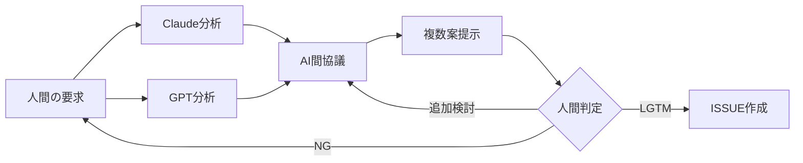
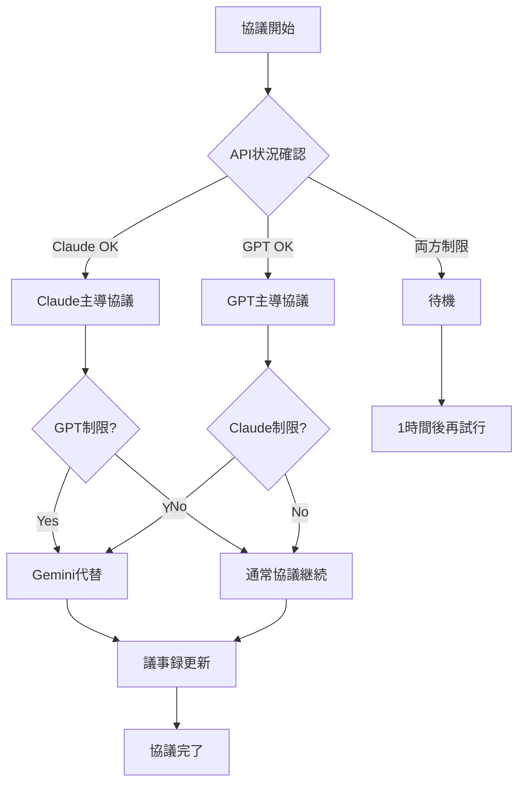

# ISSUE 管理ガイド

**参照**: [AI-人間協調ワークフロー](./README.md) - ①ISSUE 作成フェーズ  
**最終更新**: 2025-07-21

## 📋 概要

人間からの曖昧な要求やフィードバックを、Claude Code と GPT-4O（または Gemini）が協議して具体的なタスクに変換するプロセスを定義します。

## 🎯 ISSUE 作成の目標

1. **言語化・具体化**: 人間の曖昧な要求を明確なタスクに変換
2. **最適解導出**: 複数 AI による協議でベストプラクティスを抽出
3. **工数見積り**: メリット・デメリット・工数の定量化
4. **体系化**: 大規模タスクの適切な分割

## 👥 プレイヤーと役割

### 👤 人間の役割

- **要求提示**: 評価・フィードバック・要件定義の提供
- **最終判断**: AI 提案に対する LGTM/NG 判定
- **優先度決定**: タスクの重要度・緊急度の指定

### 🤖Claude Code の役割

- **要求分析**: 人間の意図を技術的観点から分析
- **実装可能性評価**: 技術的制約・リスクの評価
- **文書化**: PROGRESS_TRACKER.md への追記

### 🧠GPT-4O/Gemini の役割

- **代替案提示**: 複数のアプローチ案の提案
- **品質評価**: 各案のメリット・デメリット分析
- **工数算出**: 開発工数・テスト工数の見積り

## 📝 ISSUE 作成プロセス

### Step 1: 人間からの入力受付

#### 入力の種類

```markdown
# よくある入力パターン

1. 品質改善要求
   例: "抽出精度がもうちょっと上がらない？"

2. 機能追加要求  
   例: "新しい画像形式に対応してほしい"

3. エラー報告
   例: "メモリ不足で処理が止まる"

4. パフォーマンス要求
   例: "処理速度をもっと速くしたい"
```

### Step 2: AI 協議プロセス

#### 議事録テンプレート（必須）

```markdown
# AI 協議議事録

**日時**: YYYY-MM-DD HH:MM  
**参加 AI**: Claude Code, GPT-4O/Gemini  
**議題**: [人間からの要求]

## 要求分析

- **Claude 分析**: [技術的観点からの解釈]
- **GPT 分析**: [ユーザビリティ観点からの解釈]

## 提案案

### 案 1: [Claude 提案]

- **概要**:
- **メリット**:
- **デメリット**:
- **工数**: X 人日

### 案 2: [GPT 提案]

- **概要**:
- **メリット**:
- **デメリット**:
- **工数**: Y 人日

## 協議結果

- **推奨案**: 案 X
- **理由**:
- **代替案**: 案 Y（条件: Z 時）

## API リミット状況

- **Claude**: 正常/制限中/エラー
- **GPT-4O**: 正常/制限中/エラー
- **次回引き継ぎ事項**: [制限時の引き継ぎ内容]
```

#### 協議フロー



### Step 3: 提案内容の構造化

#### 標準的な提案フォーマット

```markdown
## 提案: [タイトル]

### 概要

[何を、なぜ、どのように実現するか]

### 期待効果

- **品質向上**: [具体的指標]
- **効率改善**: [具体的指標]
- **その他**: [付随効果]

### 実装方針

1. **Phase 1**: [基本実装]
2. **Phase 2**: [拡張実装]
3. **Phase 3**: [最適化実装]

### リスクと対策

| リスク     | 影響度   | 対策       |
| ---------- | -------- | ---------- |
| [リスク 1] | 高/中/低 | [対策内容] |

### 工数見積り

- **開発工数**: X 人日
- **テスト工数**: Y 人日
- **ドキュメント**: Z 人日
- **総工数**: (X+Y+Z) 人日

### 判定基準

- **成功条件**: [定量的指標]
- **中止条件**: [リスク発生時の条件]
```

### Step 4: 規模判定と分割

#### 大規模案件の識別

```yaml
大規模案件の基準:
  総工数: "> 5 人日"
  影響範囲: "複数モジュール"
  リスク: "高"
  依存関係: "複雑"
```

#### サブ ISSUE 分割方法

```markdown
# メイン ISSUE: [大項目名]

## サブ ISSUE 構成

├── Sub-001: [基盤実装]
│ ├── 工数: 2 人日
│ └── 依存: なし
├── Sub-002: [機能実装 A]
│ ├── 工数: 3 人日
│ └── 依存: Sub-001
└── Sub-003: [機能実装 B]
├── 工数: 2 人日  
 └── 依存: Sub-001
```

### Step 5: PROGRESS_TRACKER.md への登録

#### 登録フォーマット

```markdown
## [YYYY-MM-DD] 新規 ISSUE 追加

### ISSUE-XXX: [タイトル]

- **優先度**: 高/中/低
- **工数**: X 人日
- **担当 AI**: Claude Code
- **期限**: YYYY-MM-DD
- **依存**: ISSUE-YYY
- **ステータス**: 待機中

### 関連ファイル

- 議事録: `docs/issues/issue-xxx-discussion.md`
- 仕様書: `docs/issues/issue-xxx-spec.md`
```

## 🌐 英語版 ISSUE 生成

### GitHub ISSUE 用テンプレート

```markdown
# English Issue Template

## Title

[Concise issue title]

## Description

[Detailed description of the requirement]

## Expected Behavior

[What should happen]

## Current Behavior

[What actually happens]

## Proposed Solution

[AI-recommended approach]

## Acceptance Criteria

- [ ] [Specific criterion 1]
- [ ] [Specific criterion 2]
- [ ] [Specific criterion 3]

## Estimated Effort

- Development: X person-days
- Testing: Y person-days
- Documentation: Z person-days

## Priority

- [ ] High
- [ ] Medium
- [ ] Low

## Labels

`enhancement`, `bug`, `performance`, `documentation`
```

## 🚨 API リミット対策

### 制限発生時の対処フロー



### 引き継ぎ手順

1. **現状記録**: どこまで協議が進んだか
2. **論点整理**: 未解決の検討項目
3. **暫定結論**: 途中での合意事項
4. **次回予定**: 継続時の開始点

## 📊 品質管理指標

### ISSUE 品質の測定基準

| 指標             | 目標値   | 測定方法           |
| ---------------- | -------- | ------------------ |
| **要求明確化率** | 90%以上  | 実装時の追加質問数 |
| **工数予測精度** | ±20%以内 | 実績工数との差     |
| **実装成功率**   | 85%以上  | 一発実装成功の割合 |
| **議事録完成率** | 100%     | 全協議の記録保持率 |

### 継続改善プロセス

- **月次レビュー**: ISSUE 品質指標の確認
- **プロセス改善**: ボトルネック分析と対策
- **テンプレート更新**: より良いフォーマットへの改良

---

**関連ドキュメント**:

- [PROGRESS_TRACKER.md](./PROGRESS_TRACKER.md) - 優先度管理
- [AI-人間協調ワークフロー](./README.md) - 全体フロー
- [spec.md](../../spec.md) - 技術仕様参照
