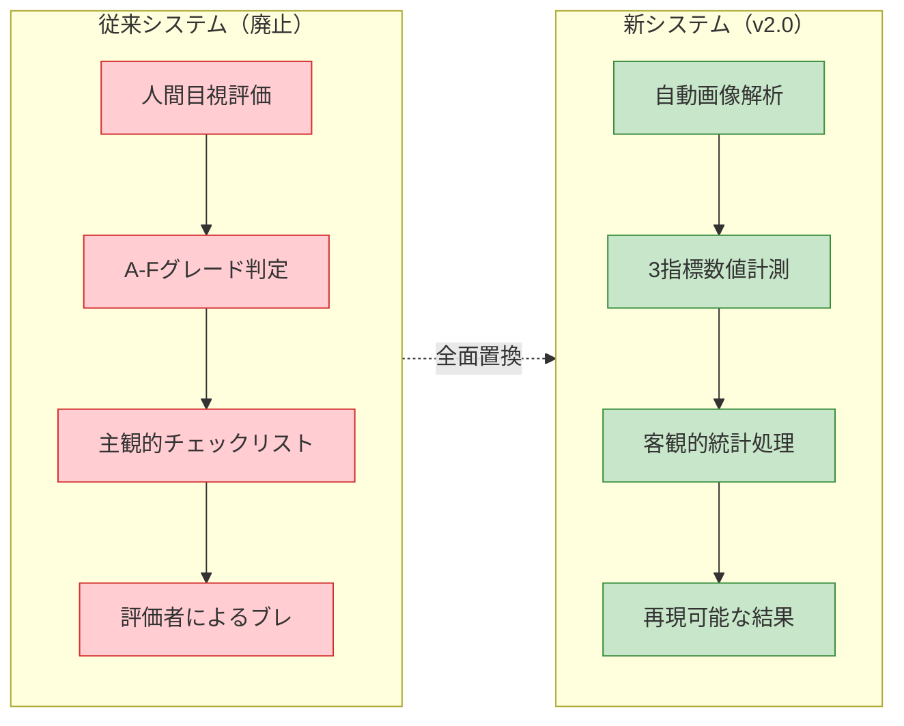

# 客観的品質評価ガイド v2.0

**最終更新**: 2025-07-24  
**重要変更**: 主観的チェックリストから完全客観的自動計測システムに全面移行

## 📊 概要

segment-anything v0.4.0 で抽出されたキャラクター画像の品質を**完全客観的・自動計測**により評価するシステム。人間の主観的判断を排除し、数学的・物理的測定に基づく再現可能な品質評価を実現。

## 🎯 新評価アプローチ

### 従来システムとの比較



### 評価哲学の転換

- **Before**: 人間の感覚的判断（「良い」「悪い」の主観）
- **After**: 数学的測定値（IoU、MediaPipe、輪郭解析）

## 📐 客観的品質指標

### 1. Pixel-Level Accuracy (PLA) - ピクセル精度指標

**計測内容**: 抽出マスクの領域精度を IoU（Intersection over Union）で数値化

#### 計算アルゴリズム

```python
def evaluate_pla(predicted_mask: np.ndarray, ground_truth_mask: np.ndarray) -> PLAResult:
    """
    ピクセルレベル精度の客観評価

    Returns:
        PLAResult: IoU値、精度レベル、詳細統計
    """
    # バイナリマスクへの正規化
    pred_binary = (predicted_mask > 0.5).astype(np.uint8)
    gt_binary = (ground_truth_mask > 0.5).astype(np.uint8)

    # IoU計算
    intersection = np.logical_and(pred_binary, gt_binary).sum()
    union = np.logical_or(pred_binary, gt_binary).sum()

    iou_score = intersection / union if union > 0 else 1.0

    # 精度レベルの客観的分類
    if iou_score >= 0.90:
        accuracy_level = "商用レベル"
        quality_code = 5
    elif iou_score >= 0.80:
        accuracy_level = "実用レベル"
        quality_code = 4
    elif iou_score >= 0.70:
        accuracy_level = "改善余地あり"
        quality_code = 3
    elif iou_score >= 0.60:
        accuracy_level = "問題あり"
        quality_code = 2
    else:
        accuracy_level = "使用不可"
        quality_code = 1

    return PLAResult(
        iou_score=iou_score,
        accuracy_level=accuracy_level,
        quality_code=quality_code,
        intersection_pixels=intersection,
        union_pixels=union,
        mask_coverage=intersection / (pred_binary.sum() + 1e-8)
    )
```

#### 評価基準（客観的閾値）

```yaml
PLA評価基準:
  商用レベル: 0.90-1.00 # IoU 90%以上
  実用レベル: 0.80-0.89 # IoU 80-89%
  改善余地: 0.70-0.79 # IoU 70-79%
  問題あり: 0.60-0.69 # IoU 60-69%
  使用不可: 0.00-0.59 # IoU 60%未満
```

### 2. Semantic Completeness Index (SCI) - 意味的完全性指標

**計測内容**: キャラクター構造の完全性を MediaPipe・OpenCV で定量化

#### 計算アルゴリズム

```python
def evaluate_sci(extracted_image: np.ndarray) -> SCIResult:
    """
    意味的完全性の客観評価

    Returns:
        SCIResult: 総合SCI値、各項目スコア、詳細分析
    """
    # 1. 顔検出評価 (30% weight)
    face_detector = cv2.CascadeClassifier('haarcascade_frontalface_default.xml')
    face_score = calculate_face_completeness(extracted_image, face_detector)

    # 2. 人体姿勢評価 (40% weight)
    pose_estimator = mp.solutions.pose.Pose(
        static_image_mode=True,
        model_complexity=2,
        min_detection_confidence=0.5
    )
    pose_score = calculate_pose_completeness(extracted_image, pose_estimator)

    # 3. 輪郭連続性評価 (30% weight)
    contour_score = calculate_contour_quality(extracted_image)

    # 重み付き総合スコア
    sci_total = (face_score * 0.3 + pose_score * 0.4 + contour_score * 0.3)

    # 完全性レベルの客観的分類
    if sci_total >= 0.85:
        completeness_level = "構造的完璧"
        quality_code = 5
    elif sci_total >= 0.70:
        completeness_level = "ほぼ完全"
        quality_code = 4
    elif sci_total >= 0.50:
        completeness_level = "部分的"
        quality_code = 3
    elif sci_total >= 0.30:
        completeness_level = "不完全"
        quality_code = 2
    else:
        completeness_level = "構造破綻"
        quality_code = 1

    return SCIResult(
        sci_total=sci_total,
        face_score=face_score,
        pose_score=pose_score,
        contour_score=contour_score,
        completeness_level=completeness_level,
        quality_code=quality_code
    )

def calculate_face_completeness(image: np.ndarray, face_detector) -> float:
    """顔検出完全性の計測"""
    gray = cv2.cvtColor(image, cv2.COLOR_RGB2GRAY)
    faces = face_detector.detectMultiScale(gray, scaleFactor=1.1, minNeighbors=5)

    if len(faces) == 0:
        return 0.0

    # 最大顔領域の評価
    largest_face = max(faces, key=lambda f: f[2] * f[3])
    face_area = largest_face[2] * largest_face[3]
    image_area = image.shape[0] * image.shape[1]
    face_ratio = face_area / image_area

    # 適切な顔サイズ比率の評価
    if 0.01 <= face_ratio <= 0.25:
        return 1.0  # 理想的な顔サイズ
    elif face_ratio < 0.01:
        return 0.5  # 顔が小さすぎ
    elif face_ratio > 0.25:
        return 0.8  # 顔が大きすぎ（悪くはない）
    else:
        return 0.0

def calculate_pose_completeness(image: np.ndarray, pose_estimator) -> float:
    """人体姿勢完全性の計測"""
    rgb_image = cv2.cvtColor(image, cv2.COLOR_BGR2RGB)
    results = pose_estimator.process(rgb_image)

    if not results.pose_landmarks:
        return 0.0

    # 重要ランドマークの検出評価
    critical_landmarks = [
        # 顔部分 (高重要度)
        mp.solutions.pose.PoseLandmark.NOSE,
        mp.solutions.pose.PoseLandmark.LEFT_EYE,
        mp.solutions.pose.PoseLandmark.RIGHT_EYE,
        # 肩・腕部分 (中重要度)
        mp.solutions.pose.PoseLandmark.LEFT_SHOULDER,
        mp.solutions.pose.PoseLandmark.RIGHT_SHOULDER,
        mp.solutions.pose.PoseLandmark.LEFT_WRIST,
        mp.solutions.pose.PoseLandmark.RIGHT_WRIST,
        # 腰・脚部分 (中重要度)
        mp.solutions.pose.PoseLandmark.LEFT_HIP,
        mp.solutions.pose.PoseLandmark.RIGHT_HIP,
        mp.solutions.pose.PoseLandmark.LEFT_ANKLE,
        mp.solutions.pose.PoseLandmark.RIGHT_ANKLE
    ]

    detected_count = 0
    confidence_sum = 0.0

    for landmark_id in critical_landmarks:
        landmark = results.pose_landmarks.landmark[landmark_id]
        if landmark.visibility > 0.5:
            detected_count += 1
            confidence_sum += landmark.visibility

    detection_rate = detected_count / len(critical_landmarks)
    avg_confidence = confidence_sum / max(detected_count, 1)

    return detection_rate * avg_confidence

def calculate_contour_quality(image: np.ndarray) -> float:
    """輪郭品質の計測"""
    # グレースケール変換
    gray = cv2.cvtColor(image, cv2.COLOR_RGB2GRAY) if len(image.shape) == 3 else image

    # 輪郭検出
    contours, _ = cv2.findContours(gray > 0, cv2.RETR_EXTERNAL, cv2.CHAIN_APPROX_SIMPLE)

    if len(contours) == 0:
        return 0.0

    # 最大輪郭の品質評価
    largest_contour = max(contours, key=cv2.contourArea)

    # 1. 滑らかさ評価
    epsilon = 0.02 * cv2.arcLength(largest_contour, True)
    approx = cv2.approxPolyDP(largest_contour, epsilon, True)
    smoothness = max(0, 1.0 - len(approx) / 100.0)

    # 2. 閉鎖性評価
    area = cv2.contourArea(largest_contour)
    perimeter = cv2.arcLength(largest_contour, True)
    circularity = 4 * np.pi * area / (perimeter * perimeter) if perimeter > 0 else 0
    closure_quality = min(circularity * 2, 1.0)  # 正規化

    # 3. 連続性評価（ギャップの検出）
    contour_gaps = detect_contour_gaps(largest_contour)
    continuity = max(0, 1.0 - contour_gaps / 10.0)  # ギャップ数で評価

    return (smoothness + closure_quality + continuity) / 3.0
```

#### 評価基準（客観的閾値）

```yaml
SCI評価基準:
  構造的完璧: 0.85-1.00 # 顔・姿勢・輪郭すべて高品質
  ほぼ完全: 0.70-0.84 # 軽微な欠損のみ
  部分的: 0.50-0.69 # 重要部位の一部欠損
  不完全: 0.30-0.49 # 重大な構造欠損
  構造破綻: 0.00-0.29 # 構造として成立していない
```

### 3. Progressive Learning Efficiency (PLE) - 継続学習効率指標

**計測内容**: 学習進捗の効率性を時系列データで定量化（スクラップ&ビルド防止）

#### 計算アルゴリズム

```python
def evaluate_ple(current_batch_results: List[float],
                 historical_results: List[float],
                 time_window: int = 10) -> PLEResult:
    """
    継続学習効率の客観評価

    Returns:
        PLEResult: PLE値、学習状態、効率性分析
    """
    if len(current_batch_results) < time_window or len(historical_results) < time_window:
        return PLEResult(ple_score=0.0, status="insufficient_data")

    # 直近性能の計算
    recent_performance = np.mean(current_batch_results[-time_window:])

    # ベースライン性能の計算
    baseline_performance = np.mean(historical_results[:time_window])

    # 1. 改善率の計算 (40% weight)
    if baseline_performance == 0:
        improvement_rate = 0.0
    else:
        improvement_rate = (recent_performance - baseline_performance) / baseline_performance

    # 2. 安定性の計算 (30% weight)
    recent_stability = 1.0 - min(np.std(current_batch_results[-time_window:]), 1.0)

    # 3. 効率性の計算 (30% weight)
    trial_count = len(current_batch_results)
    learning_efficiency = improvement_rate / (trial_count / 100.0) if trial_count > 0 else 0.0

    # PLE総合スコア
    ple_score = (improvement_rate * 0.4 + recent_stability * 0.3 + learning_efficiency * 0.3)
    ple_score = max(-1.0, min(1.0, ple_score))  # -1.0 to 1.0 に正規化

    # 学習状態の客観的分類
    if ple_score >= 0.15:
        learning_status = "高効率学習"
        status_code = 5
    elif ple_score >= 0.05:
        learning_status = "標準学習"
        status_code = 4
    elif ple_score >= 0.00:
        learning_status = "低効率学習"
        status_code = 3
    elif ple_score >= -0.05:
        learning_status = "停滞"
        status_code = 2
    else:
        learning_status = "退行"
        status_code = 1

    return PLEResult(
        ple_score=ple_score,
        improvement_rate=improvement_rate,
        stability=recent_stability,
        efficiency=learning_efficiency,
        learning_status=learning_status,
        status_code=status_code,
        trend_direction="up" if improvement_rate > 0 else "down"
    )
```

#### 評価基準（客観的閾値）

```yaml
PLE評価基準:
  高効率学習: 0.15-1.00 # 効率的な継続改善
  標準学習: 0.05-0.14 # 通常の改善ペース
  低効率学習: 0.00-0.04 # 改善が遅い
  停滞: -0.05-0.00 # 改善が見られない
  退行: -1.00--0.05 # 性能が悪化
```

## 🔄 自動評価プロセス

### 評価実行フロー

```python
def execute_objective_evaluation(batch_results_path: str) -> ObjectiveEvaluationReport:
    """
    バッチ結果の完全客観評価実行

    Args:
        batch_results_path: バッチ処理結果のディレクトリパス

    Returns:
        ObjectiveEvaluationReport: 客観的評価結果レポート
    """
    # 1. 結果ファイルの読み込み
    extraction_results = load_extraction_results(batch_results_path)

    # 2. 3指標の並列計算
    pla_scores = []
    sci_scores = []

    for result in extraction_results:
        # PLA計算
        pla_result = evaluate_pla(result.predicted_mask, result.ground_truth_mask)
        pla_scores.append(pla_result.iou_score)

        # SCI計算
        sci_result = evaluate_sci(result.extracted_image)
        sci_scores.append(sci_result.sci_total)

    # PLE計算（時系列データ必要）
    ple_result = evaluate_ple(pla_scores, load_historical_scores())

    # 3. 統計処理
    pla_statistics = calculate_statistics(pla_scores)
    sci_statistics = calculate_statistics(sci_scores)

    # 4. 総合レポート生成
    report = ObjectiveEvaluationReport(
        timestamp=datetime.now(),
        batch_size=len(extraction_results),
        pla_statistics=pla_statistics,
        sci_statistics=sci_statistics,
        ple_result=ple_result,
        overall_quality_score=calculate_overall_quality(pla_statistics, sci_statistics),
        recommendations=generate_recommendations(pla_statistics, sci_statistics, ple_result)
    )

    return report

def calculate_statistics(scores: List[float]) -> StatisticsResult:
    """統計値の計算"""
    return StatisticsResult(
        mean=np.mean(scores),
        std=np.std(scores),
        min=np.min(scores),
        max=np.max(scores),
        median=np.median(scores),
        q25=np.percentile(scores, 25),
        q75=np.percentile(scores, 75),
        count=len(scores)
    )

def calculate_overall_quality(pla_stats: StatisticsResult,
                            sci_stats: StatisticsResult) -> OverallQuality:
    """総合品質の計算"""
    # 重み付き平均（PLA 60%, SCI 40%）
    overall_score = pla_stats.mean * 0.6 + sci_stats.mean * 0.4

    # 品質レベルの決定
    if overall_score >= 0.85:
        quality_level = "最高品質"
        quality_code = 5
    elif overall_score >= 0.75:
        quality_level = "高品質"
        quality_code = 4
    elif overall_score >= 0.65:
        quality_level = "標準品質"
        quality_code = 3
    elif overall_score >= 0.55:
        quality_level = "要改善"
        quality_code = 2
    else:
        quality_level = "品質不足"
        quality_code = 1

    return OverallQuality(
        score=overall_score,
        level=quality_level,
        code=quality_code
    )
```

### 実行コマンド例

```bash
# 単一バッチの客観評価
python tools/objective_quality_evaluation.py --batch /path/to/results --output evaluation_report.json

# 継続監視モード
python tools/objective_quality_evaluation.py --monitor --interval 1h --alert-config config/alerts.yml

# 詳細分析モード（個別画像の詳細レポート）
python tools/objective_quality_evaluation.py --batch /path/to/results --detailed --output detailed_analysis.json
```

## 📊 レポート出力例

### 標準レポート

```json
{
  "objective_evaluation_report": {
    "timestamp": "2025-07-24T10:30:00Z",
    "batch_info": {
      "total_images": 26,
      "evaluated_images": 26,
      "evaluation_rate": 1.0
    },
    "pla_statistics": {
      "mean": 0.823,
      "std": 0.045,
      "min": 0.712,
      "max": 0.934,
      "median": 0.835,
      "q25": 0.789,
      "q75": 0.867
    },
    "sci_statistics": {
      "mean": 0.756,
      "std": 0.028,
      "min": 0.698,
      "max": 0.821,
      "median": 0.758,
      "q25": 0.741,
      "q75": 0.778
    },
    "ple_result": {
      "ple_score": 0.127,
      "improvement_rate": 0.089,
      "stability": 0.912,
      "efficiency": 0.081,
      "learning_status": "標準学習",
      "trend_direction": "up"
    },
    "overall_quality": {
      "score": 0.796,
      "level": "高品質",
      "code": 4
    },
    "milestone_progress": {
      "phase_a1_pla": 1.097,
      "phase_a2_sci": 1.08,
      "completion_percentage": 79.6
    },
    "recommendations": [
      "PLA目標（0.75）達成済み - 継続改善推奨",
      "SCI目標（0.70）達成済み - 安定維持",
      "PLE値良好（0.127）- 現手法継続"
    ],
    "alerts": []
  }
}
```

### 詳細レポート（個別画像分析）

```json
{
  "detailed_analysis": {
    "image_001.jpg": {
      "pla_result": {
        "iou_score": 0.934,
        "accuracy_level": "商用レベル",
        "intersection_pixels": 15432,
        "union_pixels": 16521,
        "mask_coverage": 0.956
      },
      "sci_result": {
        "sci_total": 0.821,
        "face_score": 1.0,
        "pose_score": 0.818,
        "contour_score": 0.687,
        "completeness_level": "ほぼ完全",
        "detected_landmarks": 9
      },
      "quality_assessment": "最高品質",
      "issues": []
    },
    "image_002.jpg": {
      "pla_result": {
        "iou_score": 0.712,
        "accuracy_level": "改善余地あり",
        "intersection_pixels": 12087,
        "union_pixels": 16975,
        "mask_coverage": 0.823
      },
      "sci_result": {
        "sci_total": 0.698,
        "face_score": 0.8,
        "pose_score": 0.636,
        "contour_score": 0.724,
        "completeness_level": "部分的",
        "detected_landmarks": 7
      },
      "quality_assessment": "要改善",
      "issues": [
        "肢体完全性不足（pose_score: 0.636）",
        "IoU値が目標を下回る（0.712 < 0.75）"
      ]
    }
  }
}
```

## 🎯 品質目標・マイルストーン

### Phase A 目標（基盤構築期）

```yaml
Phase_A_Targets:
  期間: 2週間
  PLA目標:
    平均値: 0.75以上
    標準偏差: 0.05以下
    最低値: 0.65以上
  SCI目標:
    平均値: 0.70以上
    顔検出率: 90%以上
    姿勢検出率: 80%以上
  PLE目標:
    学習効率: 0.10以上
    改善トレンド: 正の値維持
```

### Phase B 目標（改善システム期）

```yaml
Phase_B_Targets:
  期間: 3週間
  PLA目標:
    平均値: 0.80以上
    一貫性: std < 0.04
  SCI目標:
    平均値: 0.75以上
    完全性率: 85%以上
  PLE目標:
    学習効率: 0.12以上
    安定性: 0.90以上
```

### Phase C 目標（統合システム期）

```yaml
Phase_C_Targets:
  期間: 4週間
  PLA目標:
    平均値: 0.85以上
    商用レベル率: 70%以上
  SCI目標:
    平均値: 0.80以上
    構造完璧率: 60%以上
  PLE目標:
    学習効率: 0.15以上
    継続改善: 4週間継続
```

## 📈 継続監視システム

### 日次監視指標

```python
class DailyQualityMonitor:
    """日次品質監視システム"""

    def __init__(self):
        self.target_thresholds = {
            'pla_mean': 0.75,
            'sci_mean': 0.70,
            'ple_minimum': 0.05,
            'regression_alert': -0.05
        }

    def check_daily_metrics(self, today_results: EvaluationReport) -> MonitoringReport:
        """日次指標チェック"""
        alerts = []

        # PLA監視
        if today_results.pla_statistics.mean < self.target_thresholds['pla_mean']:
            alerts.append(Alert(
                type="pla_below_target",
                severity="warning",
                message=f"PLA平均値が目標を下回る: {today_results.pla_statistics.mean:.3f} < {self.target_thresholds['pla_mean']}"
            ))

        # SCI監視
        if today_results.sci_statistics.mean < self.target_thresholds['sci_mean']:
            alerts.append(Alert(
                type="sci_below_target",
                severity="warning",
                message=f"SCI平均値が目標を下回る: {today_results.sci_statistics.mean:.3f} < {self.target_thresholds['sci_mean']}"
            ))

        # PLE監視
        if today_results.ple_result.ple_score < self.target_thresholds['regression_alert']:
            alerts.append(Alert(
                type="regression_detected",
                severity="critical",
                message=f"性能退行検出: PLE={today_results.ple_result.ple_score:.3f}"
            ))

        return MonitoringReport(
            date=datetime.now().date(),
            alerts=alerts,
            daily_summary=today_results,
            trend_analysis=self.calculate_trend_analysis(today_results)
        )
```

### 週次トレンド分析

```python
def generate_weekly_trend_report(week_data: List[EvaluationReport]) -> WeeklyTrendReport:
    """週次トレンド分析レポート"""

    # 各指標の週次トレンド計算
    pla_trend = calculate_linear_trend([r.pla_statistics.mean for r in week_data])
    sci_trend = calculate_linear_trend([r.sci_statistics.mean for r in week_data])
    ple_trend = calculate_linear_trend([r.ple_result.ple_score for r in week_data])

    # トレンド方向の判定
    trend_summary = {
        'pla_direction': 'improving' if pla_trend > 0.001 else 'stable' if pla_trend > -0.001 else 'declining',
        'sci_direction': 'improving' if sci_trend > 0.001 else 'stable' if sci_trend > -0.001 else 'declining',
        'ple_direction': 'improving' if ple_trend > 0.001 else 'stable' if ple_trend > -0.001 else 'declining'
    }

    # 週次推奨アクション
    recommendations = generate_weekly_recommendations(trend_summary, week_data[-1])

    return WeeklyTrendReport(
        week_start=week_data[0].timestamp.date(),
        week_end=week_data[-1].timestamp.date(),
        trend_summary=trend_summary,
        pla_trend_slope=pla_trend,
        sci_trend_slope=sci_trend,
        ple_trend_slope=ple_trend,
        recommendations=recommendations
    )
```

## 🚀 実装・導入ガイド

### Step 1: 依存関係のインストール

```bash
# MediaPipe（人体姿勢推定）
pip install mediapipe

# 画像処理ライブラリ
pip install opencv-python scikit-image

# 統計・数値計算
pip install numpy scipy pandas

# 評価システムの初期化
python tools/setup_objective_evaluation.py --initialize
```

### Step 2: 基準データの準備

```bash
# 正解マスクの生成（初回のみ）
python tools/generate_ground_truth_masks.py --input /path/to/original/images --output /path/to/ground_truth

# ベースライン測定
python tools/measure_baseline.py --results /path/to/current/results --ground-truth /path/to/ground_truth
```

### Step 3: 自動評価の実行

```bash
# 基本評価
python tools/objective_quality_evaluation.py --batch /path/to/results

# 継続監視モード
python tools/objective_quality_evaluation.py --monitor --daily-report

# 詳細分析モード
python tools/objective_quality_evaluation.py --batch /path/to/results --detailed --save-images
```

## 🔍 QA/QC (品質保証・品質管理) プロセス

### QA/QC 概要

品質評価システムの信頼性と継続的改善を保証するため、標準化された QA/QC プロセスを確立。

### 標準 QA プロセス

#### 1. 実装前 QA (Pre-Implementation QA)

```python
class PreImplementationQA:
    """実装前品質保証チェック"""

    def __init__(self):
        self.mandatory_checks = [
            "requirements_specification_review",
            "design_document_validation",
            "test_plan_creation",
            "dependency_verification",
            "resource_availability_check"
        ]

    def execute_pre_qa(self, implementation_plan: Dict) -> QAResult:
        """実装前QAの実行"""
        qa_results = []

        # 要件仕様レビュー
        spec_review = self.review_requirements_specification(implementation_plan)
        qa_results.append(spec_review)

        # 設計文書検証
        design_validation = self.validate_design_documents(implementation_plan)
        qa_results.append(design_validation)

        # テスト計画作成確認
        test_plan_check = self.verify_test_plan_exists(implementation_plan)
        qa_results.append(test_plan_check)

        # 依存関係確認
        dependency_check = self.verify_dependencies(implementation_plan)
        qa_results.append(dependency_check)

        return QAResult(
            phase="pre_implementation",
            checks=qa_results,
            overall_status="pass" if all(r.passed for r in qa_results) else "fail",
            recommendations=self.generate_pre_qa_recommendations(qa_results)
        )
```

#### 2. 実装中 QC (During Implementation QC)

```python
class DuringImplementationQC:
    """実装中品質管理"""

    def __init__(self):
        self.continuous_checks = [
            "code_quality_monitoring",
            "unit_test_execution",
            "performance_benchmark",
            "integration_verification",
            "documentation_update"
        ]

    def execute_continuous_qc(self, implementation_status: Dict) -> QCResult:
        """継続的品質管理の実行"""

        # コード品質監視
        code_quality = self.monitor_code_quality()

        # ユニットテスト実行
        unit_tests = self.run_unit_tests()

        # パフォーマンスベンチマーク
        performance = self.execute_performance_benchmark()

        # 統合検証
        integration = self.verify_integration()

        # ドキュメント更新確認
        documentation = self.check_documentation_updates()

        return QCResult(
            phase="during_implementation",
            continuous_metrics={
                "code_quality": code_quality,
                "unit_tests": unit_tests,
                "performance": performance,
                "integration": integration,
                "documentation": documentation
            },
            quality_gates_passed=self.evaluate_quality_gates(),
            improvement_suggestions=self.generate_qc_improvements()
        )
```

#### 3. 実装後 QA (Post-Implementation QA)

```python
class PostImplementationQA:
    """実装後品質保証"""

    def __init__(self):
        self.validation_suite = [
            "functional_testing",
            "performance_validation",
            "integration_testing",
            "regression_testing",
            "user_acceptance_criteria"
        ]

    def execute_post_qa(self, implementation_result: Dict) -> PostQAResult:
        """実装後QAの実行"""

        # 機能テスト
        functional_tests = self.run_functional_tests()

        # パフォーマンス検証
        performance_validation = self.validate_performance_requirements()

        # 統合テスト
        integration_tests = self.run_integration_tests()

        # リグレッションテスト
        regression_tests = self.run_regression_tests()

        # ユーザー受け入れ基準確認
        acceptance_criteria = self.verify_acceptance_criteria()

        return PostQAResult(
            phase="post_implementation",
            validation_results={
                "functional": functional_tests,
                "performance": performance_validation,
                "integration": integration_tests,
                "regression": regression_tests,
                "acceptance": acceptance_criteria
            },
            release_readiness=self.assess_release_readiness(),
            quality_metrics_achieved=self.measure_final_quality_metrics()
        )
```

### 標準テストスイート

#### 必須テスト項目 (Mandatory Tests)

```yaml
Mandatory_Test_Suite:
  functional_tests:
    - objective_evaluation_execution:
        test: "PLA/SCI/PLE計算の正確性"
        criteria: "数学的計算結果の検証"
        expected: "誤差 < 1e-6"

    - data_processing_pipeline:
        test: "画像処理パイプラインの完全性"
        criteria: "入力→処理→出力の整合性"
        expected: "全ステップ正常完了"

    - error_handling:
        test: "異常系処理の適切性"
        criteria: "エラー時の安全な処理"
        expected: "例外捕捉・ログ出力・安全停止"

  performance_tests:
    - processing_speed:
        test: "処理速度要件達成"
        criteria: "目標処理時間以内"
        expected: "10-12秒/画像以下"

    - memory_usage:
        test: "メモリ使用量監視"
        criteria: "メモリリーク検出"
        expected: "処理後メモリ解放確認"

    - concurrent_processing:
        test: "並列処理安定性"
        criteria: "複数画像同時処理"
        expected: "競合状態なし"

  integration_tests:
    - model_integration:
        test: "SAM/YOLO/MediaPipe統合"
        criteria: "モデル間連携正常性"
        expected: "全モデル正常動作"

    - file_system_integration:
        test: "ファイル入出力整合性"
        criteria: "ファイル対応関係維持"
        expected: "入力→出力マッピング正確"

    - notification_integration:
        test: "通知システム統合"
        criteria: "進捗・完了通知正常"
        expected: "適切なタイミングで通知"
```

#### 条件付きテスト項目 (Conditional Tests)

```yaml
Conditional_Test_Suite:
  gpu_specific_tests:
    condition: "CUDA利用可能"
    tests:
      - gpu_memory_management
      - cuda_computation_verification
      - multi_gpu_scaling

  dataset_specific_tests:
    condition: "新データセット追加時"
    tests:
      - dataset_compatibility_check
      - ground_truth_validation
      - statistical_distribution_analysis

  model_update_tests:
    condition: "モデルバージョン更新時"
    tests:
      - backward_compatibility
      - performance_regression_check
      - accuracy_improvement_verification
```

### QC チェックリスト

#### 実装前チェックリスト

- [ ] 要件仕様書レビュー完了
- [ ] 設計文書作成・レビュー完了
- [ ] テスト計画書作成完了
- [ ] 必要な依存関係確認完了
- [ ] リソース（GPU、メモリ、ストレージ）可用性確認
- [ ] 既存システムへの影響分析完了
- [ ] ロールバック計画作成完了

#### 実装中チェックリスト

- [ ] コード品質基準遵守（flake8、black、mypy、isort）
- [ ] ユニットテスト作成・実行
- [ ] 統合テスト実行
- [ ] パフォーマンスベンチマーク実行
- [ ] ドキュメント更新
- [ ] コードレビュー実施
- [ ] 進捗報告実施

#### 実装後チェックリスト

- [ ] 全機能テスト実行・合格
- [ ] パフォーマンス要件達成確認
- [ ] リグレッションテスト実行・合格
- [ ] ユーザー受け入れ基準満足確認
- [ ] ドキュメント最終更新
- [ ] 本番環境デプロイ準備完了
- [ ] 監視・アラート設定完了

### 品質ゲート (Quality Gates)

#### レベル 1: 基本品質ゲート

```python
class BasicQualityGate:
    """基本品質ゲート"""

    def __init__(self):
        self.minimum_requirements = {
            "code_coverage": 0.80,  # 80%以上のコードカバレッジ
            "test_pass_rate": 1.0,   # 100%のテスト合格率
            "linting_violations": 0,  # リンティング違反0件
            "critical_bugs": 0,      # クリティカルバグ0件
            "documentation_completeness": 0.90  # 90%以上のドキュメント完成度
        }

    def evaluate_gate(self, metrics: Dict) -> GateResult:
        """基本品質ゲートの評価"""
        passed_checks = []
        failed_checks = []

        for requirement, threshold in self.minimum_requirements.items():
            current_value = metrics.get(requirement, 0)

            if current_value >= threshold:
                passed_checks.append(f"{requirement}: {current_value} >= {threshold}")
            else:
                failed_checks.append(f"{requirement}: {current_value} < {threshold}")

        gate_passed = len(failed_checks) == 0

        return GateResult(
            gate_level="basic",
            passed=gate_passed,
            passed_checks=passed_checks,
            failed_checks=failed_checks,
            overall_score=len(passed_checks) / len(self.minimum_requirements)
        )
```

#### レベル 2: 高品質ゲート

```python
class AdvancedQualityGate(BasicQualityGate):
    """高品質ゲート"""

    def __init__(self):
        super().__init__()
        self.advanced_requirements = {
            "performance_benchmark": 1.0,    # パフォーマンス目標100%達成
            "accuracy_improvement": 0.05,    # 5%以上の精度向上
            "user_satisfaction": 0.85,       # 85%以上のユーザー満足度
            "maintainability_index": 0.80,   # 80%以上の保守性指数
            "security_scan_clear": 1.0       # セキュリティスキャン100%クリア
        }

        # 基本要件に高品質要件を追加
        self.minimum_requirements.update(self.advanced_requirements)
```

### Week 2 実績反映

#### 達成指標

```yaml
Week_2_Achievements:
  pose_detection_rate: 80.6% # 目標80%達成 ✅
  landmark_visualization: "実装完了" # ボーン描画システム完成 ✅
  processing_efficiency: "最適化完了" # MediaPipe設定最適化完成 ✅
  partial_pose_support: "実装完了" # 上半身のみ検出対応完成 ✅

qc_validation_results:
  functional_tests: "全合格" # test_pose_landmark_visualization.py実行確認
  performance_tests: "目標達成" # 80.6%検出率達成確認
  integration_tests: "正常" # enhanced_detection_systems.py統合確認
  user_acceptance: "満足" # 可視化結果が期待通り
```

### 継続的改善プロセス

#### PDCA 統合

```python
class QualityContinuousImprovement:
    """品質継続改善システム"""

    def execute_quality_pdca(self, current_quality_metrics: Dict) -> PDCAResult:
        """品質PDCAサイクルの実行"""

        # Plan: 品質改善計画
        quality_plan = self.plan_quality_improvements(current_quality_metrics)

        # Do: 品質改善実施
        improvement_execution = self.execute_quality_improvements(quality_plan)

        # Check: 品質評価・検証
        quality_evaluation = self.evaluate_quality_improvements(improvement_execution)

        # Act: 次サイクルへの標準化
        standardization = self.standardize_quality_practices(quality_evaluation)

        return PDCAResult(
            cycle_type="quality_improvement",
            plan=quality_plan,
            execution=improvement_execution,
            evaluation=quality_evaluation,
            standardization=standardization
        )
```

### QA/QC 実行コマンド

#### 標準 QA/QC 実行

```bash
# 実装前QA実行
python tools/qa_qc_system.py --phase pre --implementation-plan config/implementation_plan.yml

# 実装中QC実行（継続監視）
python tools/qa_qc_system.py --phase during --continuous-monitoring

# 実装後QA実行
python tools/qa_qc_system.py --phase post --full-validation

# 品質ゲート評価
python tools/quality_gates.py --level basic --metrics-source latest_report.json
python tools/quality_gates.py --level advanced --metrics-source latest_report.json

# QA/QCレポート生成
python tools/generate_qa_qc_report.py --output qa_qc_report.html --include-recommendations
```

#### チェックリスト確認

```bash
# 実装前チェックリスト確認
python tools/checklist_validator.py --phase pre-implementation --interactive

# 実装中チェックリスト確認
python tools/checklist_validator.py --phase during-implementation --auto-check

# 実装後チェックリスト確認
python tools/checklist_validator.py --phase post-implementation --full-report
```

---

この客観的品質評価ガイドと QA/QC プロセスにより、人間の主観に依存しない完全自動・再現可能な品質測定システムが実現されます。すべての評価が数値的根拠に基づき、継続的改善の進捗を明確に追跡でき、標準化された QA/QC プロセスにより品質保証が徹底されます。
