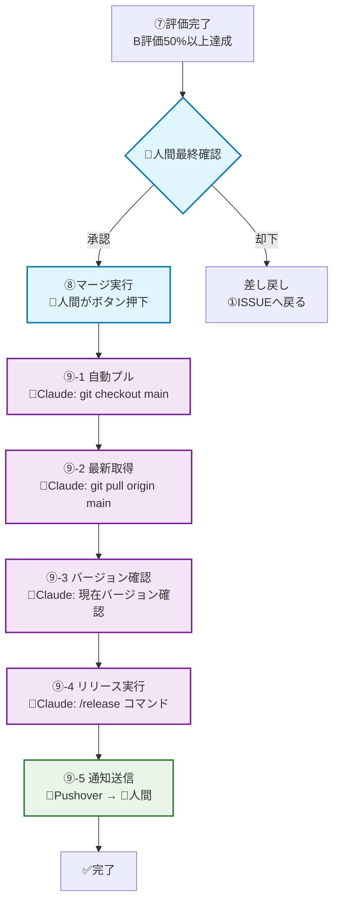

# リリースプロセスガイド

**参照**: [AI-人間協調ワークフロー](./README.md) - ⑧⑨フェーズ  
**最終更新**: 2025-07-21

## 📋 概要

人間によるマージ承認から、Claude Code による自動リリースまでの完全なプロセスを定義します。品質確認済みの機能を安全かつ効率的に本番環境に反映します。

## 🔄 リリースフロー全体図



## ⑧ マージフェーズ（人間）

### 事前チェック項目
人間がマージボタンを押す前の最終確認：

```markdown
## マージ前チェックリスト
- [ ] ⑦評価結果: B評価50%以上達成
- [ ] CI/CDパイプライン: 全テスト通過
- [ ] コードレビュー: 承認済み
- [ ] ドキュメント: 更新済み
- [ ] 既知の問題: なし、または許容可能
- [ ] 影響範囲: 確認済み
```

### マージ実行手順
1. **GitHub PR画面でマージボタン押下**
2. **マージコメント記録**
   ```markdown
   Merge approved after successful evaluation:
   - Success rate: XX%
   - B-grade percentage: XX%  
   - Human evaluation: PASSED
   - AI evaluation: [STATUS]
   ```

### マージ後の自動トリガー
- GitHub Actions による自動テスト再実行
- Claude Code への自動通知
- ⑨リリースフェーズの自動開始

## ⑨ リリースフェーズ（Claude Code）

### ⑨-1 ブランチ切り替え
```bash
# Claude Code が自動実行
git status                    # 現在状態確認
git checkout main            # mainブランチへ切り替え
git status                   # 切り替え確認
```

**エラーハンドリング**:
- 未保存変更がある場合: `git stash` で一時保存
- ブランチ切り替え失敗: 人間に通知してマニュアル対応

### ⑨-2 最新コード取得
```bash  
# Claude Code が自動実行
git fetch origin             # リモート情報更新
git pull origin main         # 最新コード取得
git log --oneline -5         # 最新コミット確認
```

**確認項目**:
- マージコミットの存在確認
- コンフリクトがないことを確認
- 期待するファイル変更の反映確認

### ⑨-3 現在バージョン確認
```python
# Claude Code が自動実行
def check_current_version():
    """現在のバージョンを確認"""
    
    version_files = [
        'version.txt',
        'setup.py',
        'package.json',
        'CLAUDE.md'
    ]
    
    for file_path in version_files:
        if os.path.exists(file_path):
            current_version = extract_version(file_path)
            print(f"Current version: {current_version}")
            return current_version
    
    return "v0.0.0"  # デフォルト
```

### ⑨-4 /releaseコマンド実行
```bash
# Claude Code のカスタムスラッシュコマンド
/release --type minor --message "リリースメッセージ"
```

**リリースタイプ**:
- `--type patch`: バグ修正 (v1.0.0 → v1.0.1)
- `--type minor`: 機能追加 (v1.0.0 → v1.1.0)
- `--type major`: 大幅変更 (v1.0.0 → v2.0.0)

#### /releaseコマンドの内部動作
```python
def execute_release_command(release_type: str, message: str):
    """リリースコマンドの実行"""
    
    # 1. バージョン番号の計算
    current_version = get_current_version()
    new_version = calculate_new_version(current_version, release_type)
    
    # 2. バージョンファイル更新
    update_version_files(new_version)
    
    # 3. CHANGELOG.md 更新
    update_changelog(new_version, message)
    
    # 4. Git コミット＆タグ
    git_commit_and_tag(new_version, message)
    
    # 5. GitHub リリース作成
    create_github_release(new_version, message)
    
    return new_version
```

### ⑨-5 リリース完了通知

#### Pushover通知内容
```python
def send_release_notification(version: str, details: dict):
    """リリース完了通知"""
    
    message = f"""
    🚀 リリース完了: {version}
    
    📊 品質情報:
    ・成功率: {details['success_rate']}%
    ・B評価率: {details['b_grade_rate']}%
    ・処理画像数: {details['image_count']}枚
    
    ⚙️ 技術情報:
    ・コミット: {details['commit_hash'][:8]}
    ・ブランチ: main
    ・リリース時刻: {details['release_time']}
    
    🔗 GitHub: {details['github_release_url']}
    """
    
    push_notification(message, priority=1)
```

#### Slackチャンネル通知（オプション）
```python
def send_slack_notification(version: str, details: dict):
    """Slack通知（設定されている場合）"""
    
    slack_message = {
        "text": f"🎉 New Release: {version}",
        "attachments": [
            {
                "color": "good",
                "fields": [
                    {"title": "Success Rate", "value": f"{details['success_rate']}%", "short": True},
                    {"title": "B-Grade Rate", "value": f"{details['b_grade_rate']}%", "short": True},
                    {"title": "Images Processed", "value": str(details['image_count']), "short": True}
                ]
            }
        ]
    }
```

## 📋 バージョン管理戦略

### セマンティック バージョニング
```yaml
バージョン形式: "vX.Y.Z"
  
X (Major): 
  - 非互換な大幅変更
  - アーキテクチャの根本的変更
  - API破壊的変更
  
Y (Minor):
  - 後方互換性のある新機能
  - 大きな改善・最適化
  - 新しいワークフロー追加
  
Z (Patch):
  - バグ修正
  - 軽微な改善
  - ドキュメント修正
```

### リリース判定基準
```markdown
## リリース可否判定

### Major リリース (vX.0.0)
- [ ] 全機能の包括テスト完了
- [ ] ドキュメント全体更新
- [ ] 移行ガイド作成
- [ ] ユーザー事前告知

### Minor リリース (vX.Y.0)  
- [ ] 新機能のテスト完了
- [ ] 関連ドキュメント更新
- [ ] 既存機能への影響確認
- [ ] パフォーマンス確認

### Patch リリース (vX.Y.Z)
- [ ] バグ修正の動作確認
- [ ] リグレッションテスト
- [ ] 最小限のテスト実行
```

## 🚨 エラー対応とロールバック

### よくあるリリースエラー
1. **Git コンフリクト**
   ```bash
   # 自動解決試行
   git stash
   git pull origin main
   git stash pop
   # 解決不可の場合は人間に通知
   ```

2. **バージョンタグ重複**
   ```bash
   # 既存タグ確認
   git tag -l "v*" | sort -V
   # 重複時は patch バージョンで自動調整
   ```

3. **GitHub API エラー**
   ```python
   # リトライ機構
   @retry(tries=3, delay=30)
   def create_github_release(version, message):
       # GitHub Release API 呼び出し
   ```

### ロールバック手順
```bash
# 緊急時のロールバック（人間判断）
git log --oneline -10                    # 最近のコミット確認
git revert <commit-hash>                 # 問題のあるコミットを取り消し
git push origin main                     # 修正をプッシュ
```

## 📈 リリース後の監視

### 自動監視項目
```python
class PostReleaseMonitor:
    """リリース後監視システム"""
    
    def monitor_release_health(self, version: str):
        """リリース後の健全性監視"""
        
        checks = [
            self.check_system_performance(),
            self.check_error_rates(),
            self.check_user_feedback(),
            self.check_resource_usage()
        ]
        
        for check in checks:
            if not check.is_healthy():
                self.alert_release_issue(version, check.issue)
```

### 成功指標の追跡
```markdown
## リリース成功指標（24時間後）

### システム指標
- [ ] エラー率: <5%
- [ ] レスポンス時間: 前回比±10%以内
- [ ] リソース使用量: 正常範囲内

### ユーザー指標  
- [ ] 処理成功率: 前回比維持
- [ ] 品質スコア: 前回比維持または改善
- [ ] ユーザー報告: 重大問題なし
```

## 🔧 カスタマイズとオプション

### 環境別設定
```yaml
# config/release.yml
release_settings:
  development:
    auto_release: false
    notification: false
    
  staging:
    auto_release: true
    notification: slack_only
    
  production:
    auto_release: true  
    notification: all
    approval_required: true
```

### 通知設定のカスタマイズ
```python
class NotificationConfig:
    """通知設定管理"""
    
    NOTIFICATION_TYPES = {
        'pushover': PushoverNotifier,
        'slack': SlackNotifier,
        'email': EmailNotifier,
        'webhook': WebhookNotifier
    }
    
    def get_enabled_notifiers(self) -> List[BaseNotifier]:
        """有効な通知システムを取得"""
        enabled = self.config.get('enabled_notifications', ['pushover'])
        return [self.NOTIFICATION_TYPES[name]() for name in enabled]
```

## 📚 ドキュメント自動更新

### リリース時の自動更新対象
```python
def update_release_documentation(version: str):
    """リリース時のドキュメント自動更新"""
    
    updates = [
        update_spec_md(version),           # spec.md のバージョン更新
        update_claude_md(version),         # CLAUDE.md の更新
        update_changelog(version),         # CHANGELOG.md の生成
        update_readme_badges(version),     # README.md のバッジ更新
        update_workflow_docs(version)      # ワークフロー文書の更新
    ]
    
    return all(updates)
```

### CHANGELOG.md 自動生成
```markdown
# CHANGELOG

## [v0.5.0] - 2025-07-21

### Added
- 新機能1の追加
- 新機能2の追加

### Changed  
- 既存機能の改善
- パフォーマンス最適化

### Fixed
- バグ修正1
- バグ修正2

### Quality Metrics
- 処理成功率: 96.7%
- B評価率: 76.9%
- 平均処理時間: 8.2秒
```

---

**使用方法**:
1. 人間: 評価完了後にGitHubでマージボタン押下
2. Claude: マージ検出で自動的にリリースプロセス開始
3. 通知: Pushoverで完了通知を受信

**関連ドキュメント**:
- [AI-人間協調ワークフロー](./README.md) - 全体プロセス  
- [PROGRESS_TRACKER.md](./PROGRESS_TRACKER.md) - 進捗管理
- [spec.md](../../spec.md) - バージョン情報参照